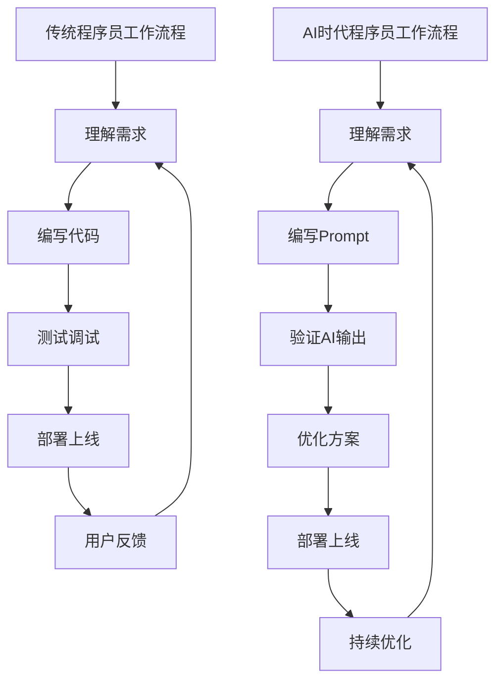
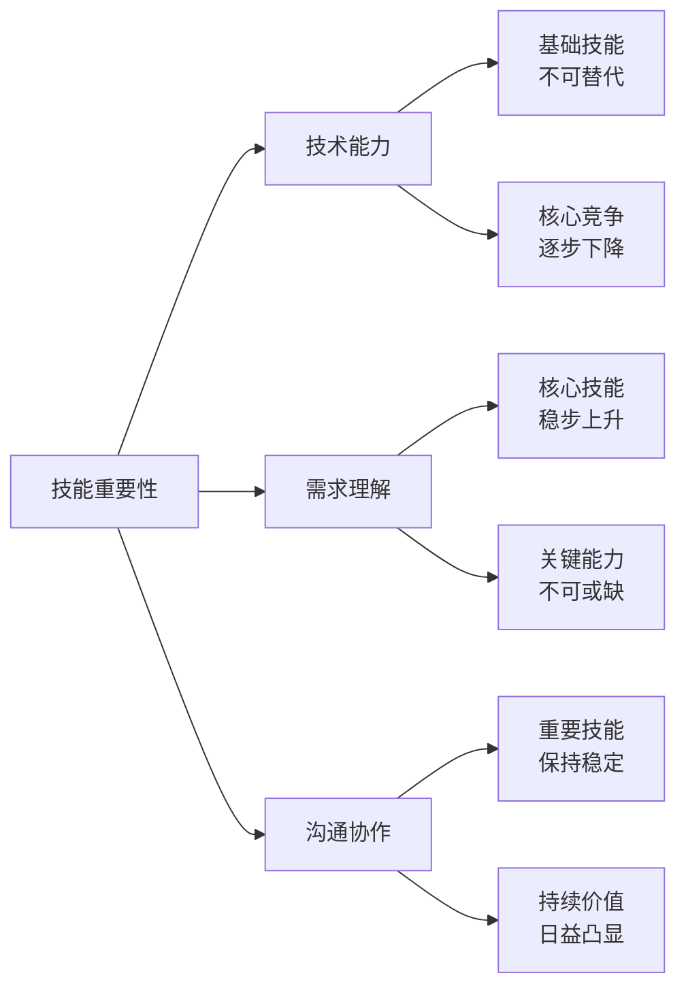
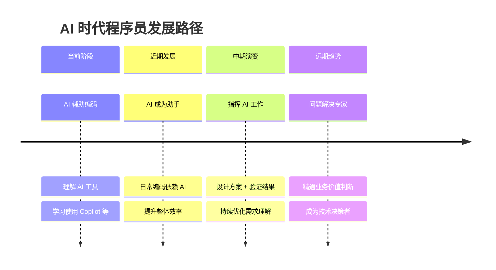

最近很多人都在讨论 AI 会不会取代程序员。说实话，这确实是个值得深思的问题。但仔细想想，我们可能对「编码」和「编程」这两个词的理解有些偏差。AI 时代，编码的重要性并没有降低，只是我们的角色正在发生变化。

过去我们常说「不会写代码就无法在这个行业立足」。这话现在听起来有点像是当年的「没有计算机就找不到工作」。编码本身确实正在变成一种基础技能，就像现在每个人都应该会用 Word 或 Excel 一样。但真正重要的，是知道为什么需要写这段代码，以及这段代码要解决什么问题。

这让我想起了几年前遇到的一个项目。团队里有个资深工程师，技术能力很强，但每次需求沟通都很吃力。产品经理说他「听不懂」，客户觉得他「太技术化」。后来换了个人，话不多，但能很快把客户的需求转化成技术方案，再结合 AI 工具快速实现。结果大家都满意。这个故事让我意识到，在 AI 时代，技术能力还是基础，但「翻译能力」可能更重要。

理解需求从来都不是一件容易的事。它需要你懂业务、懂人、懂沟通。技术可以外包给 AI，但需求理解不行。因为需求本质上是对用户问题的描述，是对业务价值的判断，而这些都需要人的直觉和经验。AI 可以帮你写代码，但无法帮你判断「这个功能是否真的必要」。

我经常看到一些技术讨论，大家都在纠结某个框架好不好、某个语言效率高不高。这些讨论很有价值，但很容易让我们迷失。技术是手段，不是目的。真正重要的是解决问题。当你能清楚地说出「我们要解决什么问题，给谁解决，解决到什么程度」，技术选择就变成了次要问题。

AI 时代的技术发展速度确实很快。昨天还在流行的框架，今天可能就过时了。但「理解需求」的能力是相对稳定的。业务在变，技术也在变，但人解决问题的需求永远都在。重要的不是你用什么工具，而是你是否能准确把握问题的本质。

这并不意味着技术不重要了。相反，技术是理解需求的基础。不懂技术，你无法评估实现的可行性，无法和工程师有效沟通，甚至无法判断 AI 给出的方案是否靠谱。但技术不再是核心竞争力，它更像是现代人的基本素养。

那么，我们该如何提升需求理解能力呢？多和产品经理、设计师、客户交流。多观察真实用户在用什么、遇到什么问题。多思考业务背后的逻辑。多阅读一些非技术类的书籍，比如心理学、社会学、管理学。这些知识能帮你更好地理解人性，理解需求背后的动机。

我特别认同一个观点：「编程不是写作，而是解决问题」。这句话在 AI 时代显得更有意义。AI 可以帮你把代码写出来，但它无法帮你定义问题。而定义问题往往是解决问题的关键一步。当你能清晰地说出「我们遇到了什么困难，这个困难为什么重要，我们可以怎么解决」，你就已经掌握了核心能力。

未来会是什么样子？我猜技术会进一步发展，AI 会变得更聪明。程序员的角色会从「写代码的人」变成「指挥 AI 写代码的人」。这听起来很科幻，但其实离我们并不远。我认识一些团队已经开始用 AI 辅助编码，效率确实提升了不少。但他们的核心问题依然是：「我们要做什么？」、「为什么要做？」、「怎么衡量成功？」。

---

## 程序员角色的演变

传统编程时代和 AI 时代的工作流程有显著差异：

这个流程图展示了两个时代的核心差异：

- **传统模式**：从需求理解到最终部署，每一步都需要人工完成
- **AI 模式**：代码编写被 AI 取代，重点转向需求理解和方案优化

---

## 技能重要性对比

不同技能在 AI 时代的重要性正在发生变化：

从图中可以看出：

- **技术能力**：依然是基础，但不再是核心竞争力
- **需求理解**：随着 AI 进化，重要性持续上升
- **沟通协作**：AI 难以替代人的软技能价值

---

## 未来展望

---

说到底，AI 只是工具。工具再强大，也需要人来使用，需要人来判断，需要人来负责。技术可以帮你更快地实现想法，但无法帮你产生想法。AI 可以帮你优化代码，但无法帮你确定代码的价值。而需求理解，恰恰是决定价值的关键环节。

所以，如果你担心 AI 会取代程序员，不如想想如何让自己变得更「懂需求」。多问几个为什么，多思考用户的真实需求，多理解业务的商业价值。这些能力不会过时，反而会越来越重要。技术可以学，但理解需求的能力，需要时间积累，需要生活阅历，需要对人性的洞察。

这或许就是 AI 时代程序员的新定位：不再只是代码的生产者，而是问题的解决者，是价值的创造者。编码依然重要，但更重要的是知道什么时候需要编码，以及为什么需要编码。

---

**完稿时间**：2026-03-21
