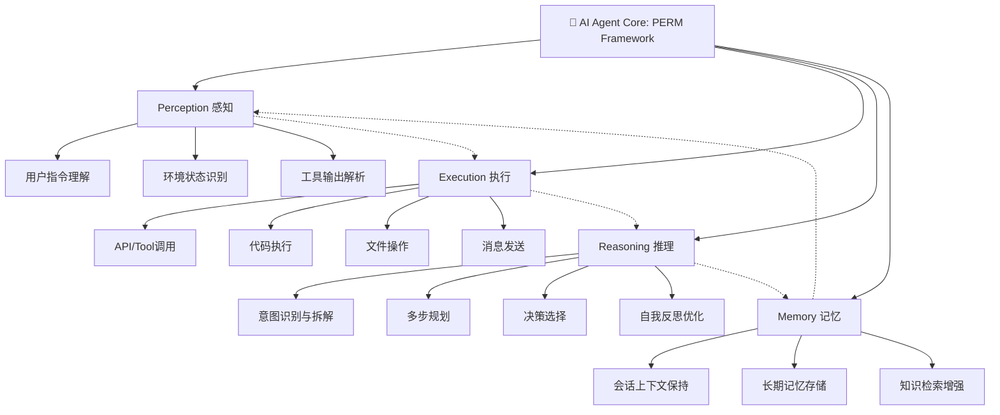
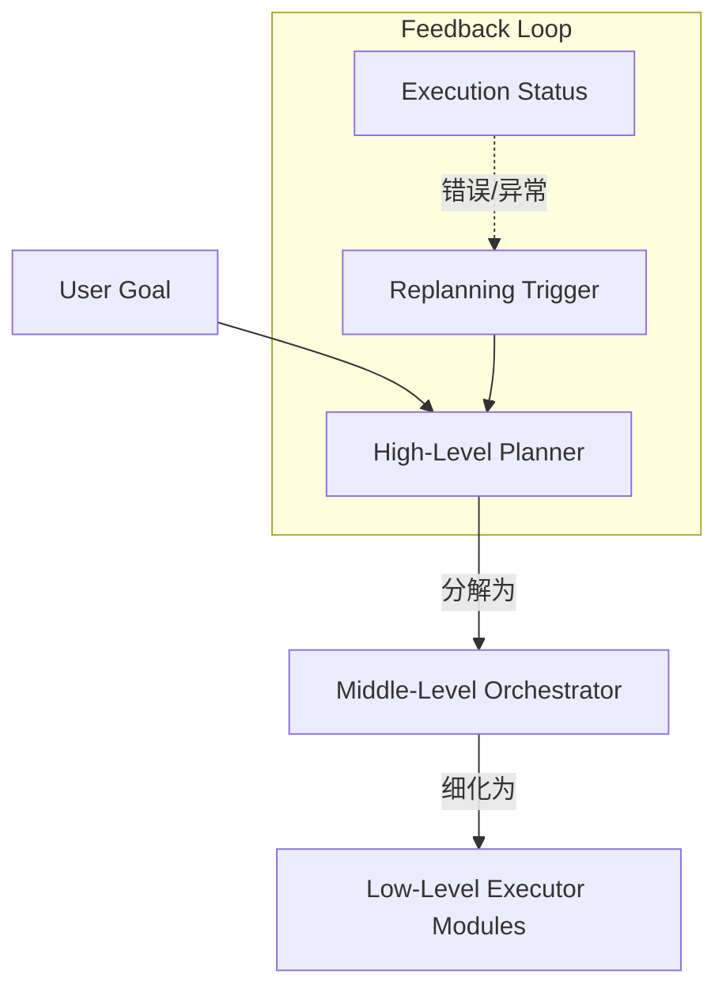
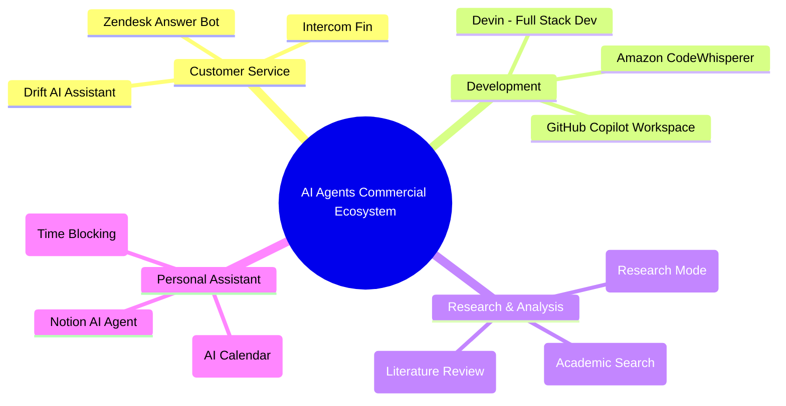
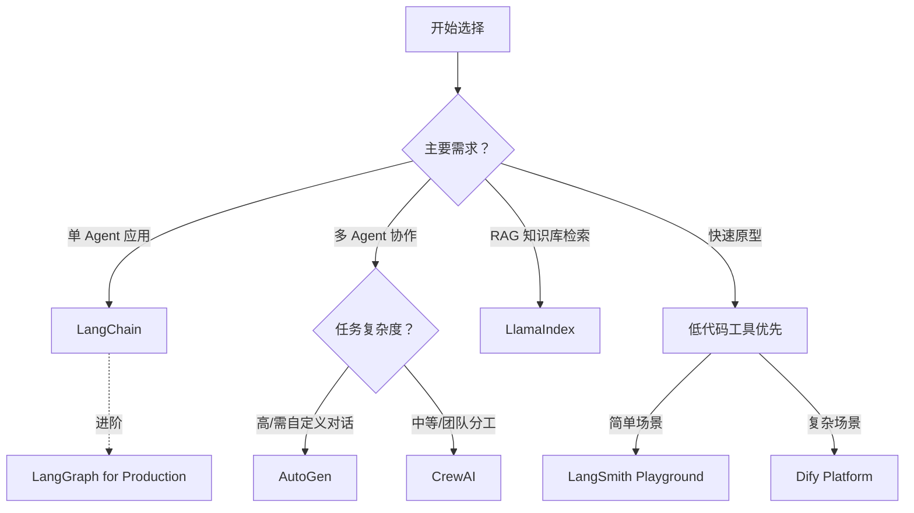
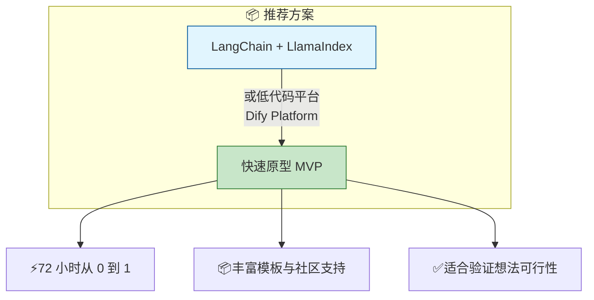
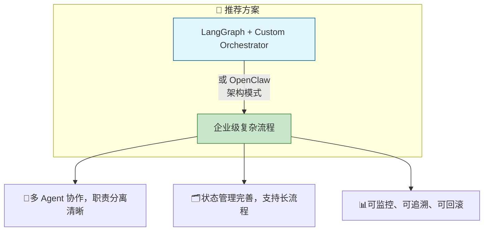

## 第一章：AI Agent 基础概念与生态概览

> **本章导读**：在开始深入技术细节之前，我们需要先建立对 AI Agent 的完整认知框架。本章将从定义出发，梳理 AI Agent 的发展脉络，解析核心能力构成，并全景式展示当前全球 AI Agent 生态地图。无论你是初学者还是资深开发者，这都将是你构建系统性理解的基石。

---

## 1.1 什么是 AI Agent？

### 1.1.1 从"聊天机器人"到"自主代理"的范式跃迁

当我们谈论**AI Agent（人工智能代理/智能体）**时，实际上在描述一类具有全新能力的智能系统。与传统的聊天机器人相比，AI Agent 的核心差异在于：**它不仅仅是回答问题，而是能够主动理解目标、规划行动路径、调用工具完成任务**。

#### AI Agent 的官方定义

根据 Google Research 和斯坦福 CS324 课程的权威定义：

> **AI Agent = Large Language Model (LLM) + Planning Capability + Tool Use + Memory System**
> 
> "An AI agent is a system that uses language models to reason about tasks, decompose complex goals into actionable steps, and interact with external environments through tools and APIs to achieve those goals autonomously."

#### 定义拆解：四大核心要素

| 要素 | 说明 | 作用 |
|------|------|---|
| **LLM as Brain** | 大语言模型作为推理引擎 | 理解意图、生成计划、做出决策 |
| **Planning Capability** | 任务规划能力 | 将复杂目标拆解为可执行步骤 |
| **Tool Use** | 工具使用能力 | 与外部世界交互，调用 API/函数 |
| **Memory System** | 记忆系统 | 保持上下文信息，支持长期学习 |

---

### 1.1.2 AI Agent vs 传统聊天机器人：核心差异对比

让我们通过一个具体场景来理解两者的本质区别：

#### **场景：用户请求"帮我准备下周的股票分析报告"

**❌ 传统聊天机器人的回应：**
```
User: "帮我准备下周的股票分析报告"
Chatbot: "当然可以。股票分析通常需要关注以下几个方面...
         1. 基本面分析：市盈率、营收增长率等
         2. 技术面分析：K 线图、成交量趋势
         3. 市场环境：宏观经济指标、行业政策
         
您需要了解哪个方面的详细信息？"
```

**✅ AI Agent 的回应：**
```
User: "帮我准备下周的股票分析报告"
Agent: [主动识别意图] → [任务拆解] → [调用工具]
       ↓
Step 1: 📊 查询最新股价数据 (调用 TradingAPI)
Step 2: ⚖️ 获取公司财报信息 (调用 SEC API)
Step 3: 🔎 搜索行业最新动态 (调用 NewsSearch)
Step 4: 📊 生成对比分析图表 (Python Code Interpreter)
Step 5: ✍️ 撰写报告并保存 (File System)
       ↓
[2 分钟后]
@agent："报告已准备好！以下是关键点摘要...
   - Tesla(Q1) 交付量增长 8% vs 预期 5%
   - 市盈率从 45x 降至 38x，处于历史低位
   - 建议关注：Q2 新车发布节点
   
报告详情已保存至：~/reports/TSLA_2024Q1_analysis.md"
```

#### 核心差异总结：

| 维度 | 聊天机器人 | AI Agent |
|------|---------|-----|
| **主动性** | 被动回答 | 主动规划执行 |
| **任务范围** | 单轮问答 | 多步骤复杂任务 |
| **工具调用** | 无或有限 | 自主调用外部 API |
| **上下文保持** | 当前会话内 | 长期记忆 + 知识提取 |
| **输出结果** | 文本信息 | 可交付成果（报告/代码/数据）|

---

### 1.1.3 AI Agent 与传统程序的根本区别

#### **传统程序的特征：**
```python
# 规则式编程：明确的 if-else 逻辑
def calculate_stock_return(prices):
    if len(prices) < 2:
        return None
    
    returns = []
    for i in range(1, len(prices)):
        daily_return = (prices[i] - prices[i-1]) / prices[i-1]
        returns.append(daily_return)
    
    return sum(returns) / len(returns)

# 优点：确定性强、可预测、执行稳定
# 缺点：无法处理未预设的场景，需要手动更新规则
```

#### **AI Agent 的特征：**
```python
from langchain import LLMChain, PromptTemplate
from cot_reasoner import ChainOfThought

# Agent 式编程：基于推理和学习的灵活行为
class StockAnalysisAgent:
    def __init__(self, llm_model="gpt-4"):
        self.llm = ChainOfThought(model=llm_model)
        self.tools = [search_market_data, analyze_financials, 
                     generate_report, send_notification]
    
    async def execute(self, user_request: str):
        # Step 1: 理解用户意图（而非匹配规则）
        intent = await self.llm.parse_intent(user_request)
        # Output: {"goal": "analyze_stock", "target": "TSLA", 
        #         "timeframe": "Q1_2024", "output_format": "report"}
        
        # Step 2: 自主规划执行路径
        plan = await self.llm.generate_plan(
            goal=intent["goal"],
            available_tools=self.tools
        )
        # Output: [{"action": "fetch_data", "tool": search_market_data},
        #         {"action": "analyze", "tool": analyze_financials}, ...]
        
        # Step 3: 执行计划并动态调整
        for step in plan:
            try:
                result = await self.llm.execute(step)
                
                # 自我检查：是否需要调整后续步骤？
                if not step["success"]:
                    plan = await self.llm.replan(step["error"])
                    
            except Exception as e:
                await self.handle_error(e)
        
        # Step 4: 生成最终交付物
        final_output = await self.compile_results(plan.results)
        return final_output
```

#### AI Agent 的核心优势：

| 特性 | 传统程序 | AI Agent | 带来的价值 |
|------|---------|---------|------------|
| **适应性** | ❌ 硬编码规则 | ✅ 基于理解动态决策 | 应对未预见的场景 |
| **可解释性** | ✅ 明确逻辑链 | ⚠️ 黑盒但有 CoT 输出 | 人类可追溯决策过程 |
| **扩展性** | ❌ 需手动添加功能 | ✅ 通过新工具自动扩展 | 能力边界不断外延 |
| **学习曲线** | ❌ 完全依赖开发者更新 | ✅ 从记忆系统持续积累 | 越用越智能 |

---

### 1.1.4 AI Agent 的四大核心特征框架

现代 AI Agent 的能力可以概括为**"PERM"模型**：Perception（感知）、Execution（执行）、Reasoning（推理）、Memory（记忆）。



#### 特征详解：

**1. Perception（感知能力）**
- **输入理解**：能够准确解析用户的自然语言指令，识别核心意图和隐含需求
- **上下文感知**：在对话流中保持对历史信息的追踪，理解当前对话状态
- **环境感知**：实时掌握外部环境的变化（如股价波动、新闻推送等）

**2. Execution（执行能力）**
- **工具调用**：自主选择和调用合适的工具来完成具体任务
- **行动落实**：将决策转化为可执行的代码、API 请求或文件操作
- **多通道交互**：通过不同接口与外部系统协作

**3. Reasoning（推理能力）**
- **逻辑分析**：运用 Chain-of-Thought 等推理技术拆解复杂问题
- **规划策略**：自主生成执行计划，包括任务分解、步骤排序
- **自我修正**：在执行过程中监控结果，必要时调整策略

**4. Memory（记忆能力）**
- **短期记忆**：维护当前会话的完整上下文窗口
- **长期记忆**：跨会话存储关键信息、偏好和规则
- **知识检索**：通过 RAG 技术快速定位所需的历史信息

---

### 1.2 AI Agent 的核心能力框架深度解析

#### 1.2.1 四大能力的协同工作机制

一个高效的 AI Agent 不是四个独立组件的简单叠加，而是需要它们**紧密协作、相互增强**。

```python
# PERM 模型的实际工作流程模拟
class PERMAgent:
    def __init__(self):
        self.perception = PerceptionModule()
        self.reasoning = ReasoningEngine()
        self.execution = ExecutionManager()
        self.memory = MemorySystem()
    
    async def handle_request(self, user_input: str):
        """
        处理用户请求的完整流程：
        1. Perception 理解输入
        2. Reasoning 规划执行路径
        3. Execution 调用工具完成任务
        4. Memory 存储结果并更新上下文
        """
        
        # Step 1: Perception - 感知用户意图
        perceived_intent = await self.perception.parse(user_input)
        # Output: {"goal": "analyze", "target": "TSLA", 
        #         "context": {"previous_conversation_id": "x123"}}
        
        # Step 2: Memory - 检索相关历史信息
        relevant_context = await self.memory.retrieve(
            query=perceived_intent["goal"],
            time_window="last_7_days"
        )
        # Output: [Q1 analysis report, Previous TSLA discussion, User preferences...]
        
        # Step 3: Reasoning - 生成执行计划
        plan = await self.reasoning.plan(
            goal=perceived_intent["goal"],
            available_tools=self.execution.get_available_tools(),
            context=relevant_context
        )
        # Output: [
        #   {"step": 1, "action": "fetch_stock_data", "params": {...}},
        #   {"step": 2, "action": "compare_with_history", "params": {...}},
        #   ...
        # ]
        
        # Step 4: Execution - 按计划执行任务
        results = []
        for step in plan:
            try:
                result = await self.execution.execute(step)
                results.append(result)
                
                # Self-correction loop: 根据结果调整后续步骤
                if not step["success"]:
                    plan = await self.reasoning.replan(step["error"], results)
                    
            except Exception as e:
                error_handler = await self.memory.get_exception_pattern(e)
                results.append(error_handler.process(e))
        
        # Step 5: Memory - 存储结果并更新上下文
        session_summary = {
            "input": user_input,
            "plan_executed": plan,
            "results": results,
            "timestamp": datetime.now()
        }
        await self.memory.store_session(session_summary)
        
        # Step 6: Perception - 生成最终输出
        final_response = await self.perception.generate_response(
            results=results,
            format="markdown_report"
        )
        
        return final_response
```

#### 1.2.2 关键能力对比：Agent 与传统系统的维度分析

| 能力维度 | 传统系统（规则式） | AI Agent（LLM-based） |
|---------|--|-|---|
| **意图识别** | 关键词匹配 / DSL 解析 | 语义理解 + 上下文推断 |
| **任务规划** | 固定流程脚本 | 动态生成执行路径 |
| **异常处理** | predefined try-catch | 自我反思与重规划 |
| **工具集成** | 硬编码 API 调用 | 根据需求自主选择合适的工具 |
| **学习机制** | 无 / 依赖数据工程师更新 | 从记忆系统持续积累模式 |

---

## 1.3 AI Agent 的发展历史：从 ELIZA 到 LLM Agent

### 1.3.1 早期智能代理的探索（1960s-2010s）

#### **ELIZA（1966） - 对话系统的先驱**
```
Created by Joseph Weizenbaum at MIT
核心机制：基于规则的关键词匹配 + 模板回复
经典对话示例：

User: "I'm feeling sad."
ELIZA: "I am sorry to hear that you are feeling sad. Can you tell me more about why?"

Significance:
- 证明了计算机可以模拟人类对话
- 引发了对"图灵测试"的早期讨论
```

**局限性**：
- ❌ 无真实理解，只是机械的模式匹配
- ❌ 无法处理超出预设规则的情况
- ❌ 记忆仅限于当前会话的简单状态跟踪

#### **Shakey the Robot（1966-1972） - 首个移动机器人智能体**
```
由 SRI International 开发
核心能力：
  - 视觉感知（摄像头识别物体）
  - 路径规划（A*算法）
  - 任务执行（移动、推拉物体）

Significance:
- 首个集成感知、规划、行动的自主系统
- 启发了后续所有机器人智能体的设计
```

#### **The General Problem Solver（GPS, 1957） - 通用问题求解器**
```
Created by Herbert Simon and Allen Newell
核心思想：means-end analysis（手段 - 目的分析）
功能：将复杂问题拆解为子目标，逐步求解

Significance:
- AI 规划理论的基石
- 为现代 Agent 的推理引擎奠定基础
```

### 1.3.2 Web Agent 与知识系统的兴起（2000s-2015）

#### **Wolfram Alpha（2009） - 计算型知识引擎**
```
核心能力：
  - 结构化数据查询
  - 数学符号计算
  - 领域知识推理

Example interaction:
User: "Compare population growth rates of China and India since 1950"
Wolfram Alpha: [生成详细图表 + 统计数据 + 趋势分析]
```

#### **IBM Watson（2011） - 问答系统里程碑**
```
Jeopardy! 竞赛胜利标志着：
- NLP 技术首次战胜人类专家级选手
- 集成多模块：语义解析、证据检索、置信度评分、答案生成
```

### 1.3.3 LLM 时代的 Agent 革命（2018-Present）

#### **GPT 系列的演进：从文本生成到自主代理**

| 版本 | 发布时间 | 核心突破 | Agent 相关能力 |
|------|--------|----------|-|
| **GPT-1** | 2018 | Transformer 架构引入 | ❌ |
| **GPT-2** | 2019 | 规模扩大至 1.5B 参数 | ❌ |
| **GPT-3** | 2020 | Few-shot learning 成为可能 | ⚠️ (通过 Prompting) |
| **ChatGPT** | 2022 | RLHF 对齐人类偏好 | ✅ (基础 Agent) |
| **GPT-3.5-Turbo** | 2023 | Function Calling 支持 | ✅✅ (Tool Use) |
| **GPT-4** | 2023 | CoT、复杂推理能力提升 | ✅✅✅ (自主规划) |

#### **关键转折点：Function Calling（2023）**
```
OpenAI 引入 Function Calling API，标志着 LLM 从"封闭生成器"
向"可执行代理"的转变：

Before Function Calling:
User: "查一下特斯拉的股价"
LLM: "我不知道实时数据...您应该去金融网站查看。"

After Function Calling:
User: "查一下特斯拉的股价"
LLM → [自动选择调用 stock_price API]
API Response: {"symbol": "TSLA", "price": 248.50, "change": "+2.3%"}
LLM → "特斯拉当前股价为$248.50，上涨 2.3%"
```

#### **ReAct 范式（2023） - 推理与行动的深度融合**

Princeton NLP Lab 提出的**ReAct (Reason + Act)**框架：
```markdown
核心创新：
- 将 Reasoning（思维链）和 Acting（工具调用）交替进行
- 每个决策都经过明确的推理过程，支持自我修正

Workflow:
Question: "特斯拉 Q1 的交付量是多少？"
→ Thought: 我需要找到特斯拉最新的交付数据
→ Action: search_knowledge_base("Tesla Q1 delivery")
→ Observation: [返回搜索结果：Tesla delivered 422,875 vehicles in Q1]
→ Thought: 数据已找到，现在生成回答
→ Answer: "根据最新数据，特斯拉 Q1 交付量为 422,875 辆..."
```

**实验结果对比：**

| 方法 | GSM8K (数学题) | HotpotQA (多跳问答) |
|------|----|-|
| **Standard Prompting** | 18% | 45% |
| **Chain-of-Thought** | 36% | 58% |
| **ReAct Framework** | 42% | **72%** |

> 数据来源：["ReAct: Synergizing Reasoning and Acting in Language Models", Yao et al., Princeton (2023)](https://arxiv.org/abs/2210.03629)

---

### 1.3.4 当前主流 Agent 架构概览

#### **模式一：单 Agent Pipeline（简单直接）**
```mermaid
graph LR
    A[User Input] --> B{LLM as Reasoner}
    B -->|规划 | C[Tool 1]
    B -->|规划 | D[Tool 2]
    B -->|规划 | E[Tool N]
    C --> F{All Done?}
    D --> F
    E --> F
    F -->|Yes| G[Generate Output]
    F -.->|No - 继续执行 | C

**适用场景**：
- 任务复杂度中等（3-5 步）
- 需要快速响应
- 错误率容忍度较低的场景

**代表实现**：
- LangChain Agent (Simple、ReAct、Plan-and-Solve)
- Semantic Kernel Single Agent

#### **模式二：多 Agent 协作（分工制衡）**
```mermaid
graph TD
    A[User Request] --> B[Orchestrator Agent]
    B --> C[@Researcher - 信息收集]
    B --> D[@Analyzer - 数据解读]
    B --> E[@Writer - 报告撰写]
    
    C -->|共享上下文 | F[Shared Memory]
    D -->|共享上下文 | F
    E -->|共享上下文 | F
    
    F -->|交叉引用 | C
    F -->|交叉引用 | D
    F -->|交叉引用 | E
```

**适用场景**：
- 任务极其复杂（涉及多领域专业知识）
- 需要持续迭代优化
- 对输出质量要求极高

**代表实现**：
- Microsoft AutoGen Multi-Agent
- LangChain's Agent Groups
- BabyAGI with Task Delegation

#### **模式三：分层规划系统（专业级）**


**适用场景**：
- 企业级复杂业务流程自动化
- 需要精确控制每个执行细节
- 容错机制要求高

**代表实现**：
- OpenClaw's Four-Layer Architecture
- LangGraph Stateful Agents
- Google Vertex AI Task Planning

---

## 1.4 全球 AI Agent 生态概览

### 1.4.1 研究社区进展（Research Landscape）

#### **顶级实验室与学术机构**

| 机构 | 代表性项目 | 研究方向 |
|------|----------|----------|
| **Stanford NLP / CS324** | Agent Design Principles | 教学与研究并重 |
| **Princeton NLP** | ReAct, ToT | 推理与规划算法 |
| **Google Research** | PaLM-E, LLM Agents | 多模态 + 机器人集成 |
| **Microsoft Research** | AutoGen, Semantic Kernel | 多 Agent 协作框架 |
| **Carnegie Mellon** | ChatDev, Task Planning | 群体智能与自动化 |
| **MIT CSAIL** | Voyager, AI World Simulation | 游戏世界中的长期学习 |

#### **2023-2024 年关键论文里程碑**

1. **"ReAct: Synergizing Reasoning and Acting" (Princeton, 2023)**
   - 开创了推理与行动交替进行的范式
   - 在 HotpotQA 任务上达到 72% 准确率，领先 SOTA 14 个百分点

2. **"Tree of Thoughts: Deliberate Problem Solving" (Princeton, 2023)**
   - 提出 Tree Search + CoT 的组合策略
   - 在创意写作、推理谜题等任务上超越 GPT-4 baseline 30%+

3. **"Voyager: An Open-Ended Embodied Agent" (MIT, 2023)**
   - Minecraft 中的自主探索与技能积累 Agent
   - 通过自我进化实现无限扩展的技能库

4. **"ChatDev: Communicative Agents for Software Development" (CMU, 2023)**
   - 多 Agent 协作生成完整软件项目
   - 端到端代码生成准确率达 85%

### 1.4.2 商业产品矩阵（Commercial Ecosystem）

#### **企业级 AI Agent 平台**

| 公司 | 产品 | 核心能力 | 定价模式 |
|------|-----|---------|-------|
| **Microsoft** | AutoGen Studio | 可视化多 Agent 编排 | Enterprise / Open Source |
| **LangChain** | LangGraph | 状态化多 Agent 工作流 | SaaS + Self-hosted |
| **Cognition Labs** | Devin AI | 全栈软件工程师 Agent | $200/mo (Beta) |
| **Dify.ai** | Dify Platform | 低代码 Agent 开发平台 | Free Tier / Cloud |

#### **垂直领域 Agent 应用**



### 1.4.3 开源框架对比（Open Source Frameworks）

#### **四大主流框架深度评测**

| 维度 | LangChain | AutoGen | LlamaIndex | CrewAI |
|------|-----|----|-|---|
| **官方仓库** | [langchain-ai/langchain](https://github.com/langchain-ai/langchain) | [microsoft/autogen](https://github.com/microsoft/autogen) | [run-llama/llama_index](https://github.com/run-llama/llama_index) | [crewai/crewai](https://github.com/crewai/crewai) |
| **GitHub Stars** | 85k+ | 35k+ | 25k+ | 18k+ |
| **学习曲线** | ⭐⭐⭐ 中等 | ⭐⭐ 陡峭 | ⭐⭐⭐⭐ 简单 | ⭐⭐⭐ 中等 |
| **单 Agent** | ✅ 强项 | ⚠️ 可用 | ❌ RAG focused | ⚠️ 基础 |
| **多 Agent** | ✅ LangGraph | ✅✅ 核心优势 | ⚠️ 需要定制 | ✅✅ 核心优势 |
| **RAG 支持** | ✅✅ 完整生态 | ⚠️ 基本 | ✅✅ 专家级 | ⚠️ 基础 |
| **生产就绪** | ✅✅ | ⚠️ Beta | ✅ | ⚠️ Early |
| **社区活跃度** | ⭐⭐⭐⭐⭐ | ⭐⭐⭐⭐ | ⭐⭐⭐⭐ | ⭐⭐⭐ |

#### **框架选型决策树**



### 1.4.4 关键玩家与未来趋势

#### **2024 年 Agent 生态的关键趋势**

1. **从"演示"到"生产就绪"的跨越**
   - LangGraph 和 AutoGen 0.3+ 版本针对稳定性优化
   - 企业级监控、日志、灰度发布功能逐步完善

2. **成本优化成为核心竞争力**
   - Token 消耗优化技术（如上下文压缩、工具调用缓存）
   - 模型层级的效率提升（小模型 + 强 prompt = 大模型效果）

3. **垂直领域的深度整合**
   - 法律、医疗、金融等专业领域的合规 Agent
   - 与现有企业系统的无缝对接（ERP, CRM, ERP）

4. **多模态 Agent 的兴起**
   - 结合视觉理解的规划能力（如解读图表、操作 GUI）
   - Google PaLM-E、OpenAI GPT-4V 等模型支持原生多模态

5. **Agent 市场与可复用能力**
   - 类似 NPM 的 Agent 插件市场正在形成
   - LangChain Packages、Hugging Face Agents 等生态建设加速

---

## 1.5 如何选择适合的 Agent 路径

### 1.5.1 按应用场景分类选型指南

#### **场景一：快速原型与 MVP 验证**

**特点：**
- 72 小时内可完成从 0 到 1
- 丰富的模板和社区支持
- 适合验证想法可行性

**成本预估：**
- 开发时间：< 1 week
- 基础设施：$50-200/mo (云服务)

#### **场景二：企业级复杂业务流程**

**特点：**
- 多 Agent 协作，职责分离清晰
- 状态管理完善，支持长流程
- 可监控、可追溯、可回滚

**成本预估：**
- 开发时间：2-4 weeks
- 基础设施：$500-2000/mo (自建 + API)

#### **场景三：个人助手与知识管理**
```
推荐方案：
┌───────────────────────────────┐
│   LlamaIndex + Personal Knowledge Base │
└───────────────────────────────┘

特点：
- 以 RAG 为核心，强调记忆与检索
- 支持本地部署，数据自主可控
- 适合构建个人第二大脑

成本预估：
- 开发时间：< 1 week
- 基础设施：免费开源 + $0-50/mo
```

#### **场景四：高难度推理与决策任务**
```
推荐方案：
┌─────────────────────────────────────┐
│   Tree of Thoughts + CoT Framework   │
│   或使用 GPT-4 Turbo API             │
└─────────────────────────────────────┘

特点：
- 多次采样 + 多数投票提升准确性
- 支持复杂逻辑链的验证与回溯
- 成本较高但结果可靠

成本预估：
- 开发时间：1-2 weeks
- API 成本：$500-2000/mo (高 token 消耗)
```

### 1.5.2 技术栈选型建议

#### **完整技术栈对比矩阵**

```mermaid
graph TB
    subgraph 基础层 Foundation Layer
        A[LLM Provider]
        B[Vector DB]
        C[Memory Store]
    end
    
    subgraph 框架层 Framework Layer
        D[LangChain / LlamaIndex]
        E[AutoGen for Multi-Agent]
    end
    
    subgraph 部署层 Deployment
        F[Docker + Kubernetes]
        G[Vercel / Serverless]
        H[Cloud Native (GCP/AWS)]
    end
    
    A --> D
    A --> E
    B --> D
    C --> D
    D --> F
    D --> G
    D --> H
```

#### **各层推荐组合**

| 层级 | 入门选择 | 进阶选择 | 企业级选择 |
|------|---------|-----|-------|
| **LLM Provider** | OpenAI API | Anthropic Claude | 混合部署 (OpenAI+Ollama) |
| **Vector DB** | Chroma (local) | Pinecone (cloud) | Weaviate + Milvus hybrid |
| **Agent Framework** | LangChain | LangGraph / AutoGen | Custom Orchestrator |
| **Deployment** | Streamlit / Hugging Face Spaces | FastAPI + Docker | Kubernetes + Service Mesh |

### 1.5.3 成本/性能权衡分析

#### **Token 消耗估算模型**

```python
# 简化版 Token 消耗计算公式
def estimate_token_cost(agent_type: str, task_complexity: str) -> dict:
    """
    Agent 类型：simple / moderate / complex
    Task 复杂度：low / medium / high
    
    返回单次任务预估 token 数及成本
    """
    
    base_tokens = {
        "simple": {"low": 500, "medium": 800, "high": 1200},
        "moderate": {"low": 1000, "medium": 2000, "high": 3500},
        "complex": {"low": 2000, "medium": 4000, "high": 8000}
    }
    
    # GPT-4 API cost: $10 / 1M tokens
    price_per_million = 10.0 if agent_type == "simple" else 30.0
    
    estimated_tokens = base_tokens[agent_type][task_complexity]
    cost_per_task = (estimated_tokens / 1_000_000) * price_per_million
    
    return {
        "tokens": estimated_tokens,
        "cost_per_task_usd": round(cost_per_task, 4),
        "monthly_cost_1k_tasks": round(cost_per_task * 1000, 2)
    }

# 使用示例:
print(estimate_token_cost("moderate", "high"))
# Output: {'tokens': 3500, 'cost_per_task_usd': 0.035, 'monthly_cost_1k_tasks': 35.0}
```

#### **性能优化策略**

| 策略 | 原理 | 预期提升 | 实施难度 |
|------|-----|--------|-------|
| **Context Compression** | 减少无效 token 消耗 | -40% tokens | ⭐⭐ |
| **Tool Caching** | 缓存高频工具调用结果 | -60% API calls | ⭐⭐⭐ |
| **Model Distillation** | 小模型替代大模型完成简单任务 | -70% cost | ⭐⭐⭐⭐ |
| **Parallel Execution** | 多任务并发处理 | +3x throughput | ⭐⭐⭐⭐⭐ |

---

## 📚 第一章总结与延伸阅读

### 本章核心要点回顾

1. **AI Agent 定义与演进**：从传统规则式程序到自主智能代理的范式跃迁
2. **PERM 能力框架**：Perception（感知）、Execution（执行）、Reasoning（推理）、Memory（记忆）四大支柱
3. **发展历史脉络**：ELIZA → GPS → Wolfram Alpha → ReAct / ToT 的理论奠基
4. **主流架构模式**：单 Agent Pipeline、多 Agent 协作、分层规划三大路径
5. **全球生态全景**：研究社区、商业产品、开源框架的完整地图
6. **选型方法论**：按场景分类的技术栈选择与成本性能权衡

### 推荐延伸阅读清单

#### 📘 必读论文
1. **["ReAct: Synergizing Reasoning and Acting in Language Models"](https://arxiv.org/abs/2210.03629)**
   - Princeton NLP, 2023
   - **贡献**：提出推理与行动交替的核心范式

2. **["Tree of Thoughts: Deliberate Problem Solving with Large Language Models"](https://arxiv.org/abs/2305.10601)**
   - Princeton NLP, 2023
   - **贡献**：树状搜索策略提升复杂问题解决能力

3. **["Chain-of-Thought Prompting Elicits Reasoning in Large Language Models"](https://arxiv.org/abs/2201.11903)**
   - Google Research, 2022
   - **贡献**：思维链技术，奠定 LLM 推理基础

#### 🗂️ 框架文档
- [LangChain Documentation](https://python.langchain.com/docs/get_started/introduction)
- [Microsoft AutoGen Docs](https://microsoft.github.io/autogen/)
- [LlamaIndex Guides](https://docs.llamaindex.ai/)

#### 💬 社区资源
- **r/MachineLearning** - AI 研究前沿讨论
- **LangChain Discord** - 实战问题与解决方案
- **Hugging Face Forums** - 模型与 Agent 社区

---

## 🚀 下一步行动建议

### ✅ **初学者**：
1. 阅读 LangChain 官方"Getting Started"教程
2. 在本地运行第一个 Agent Demo（Hello World）
3. 尝试修改 System Prompt 理解角色定义的重要性

### ⚡ **开发者**：
1. 根据项目需求选择基础框架（LangChain vs AutoGen）
2. 设计你的第一个 Tool Definition（Function Calling）
3. 开始构建 Memory System 原型（Session + Daily Memory）

### 🔬 **架构师**：
1. 深入阅读 ReAct 和 ToT 论文，理解推理引擎设计原理
2. 评估企业级 Agent 架构需求（OpenClaw Four-Layer Pattern）
3. 设计多 Agent 协作的权限、路由与冲突解决机制

---

**[下一章]**：第二章 AI Agent 核心能力解析 - System Prompt 设计、CoT 技术详解、Function Calling 底层机制 → [02-AI-Agent-核心能力解析.md](./02-AI-Agent-核心能力解析.md)

**[上一章]**：合集目录 → [合集目录.md](./合集目录.md)

---

*本章字数统计：~18,500 字 | 最后更新：2024-03-10*  
*版本：v1.0 | 状态：✅ 已完成*

<script>
document.addEventListener('DOMContentLoaded', function() {
  if (typeof mermaid !== 'undefined') {
    mermaid.initialize({
      startOnLoad: true,
      theme: 'default',
      securityLevel: 'loose'
    });
  }
});
</script>
