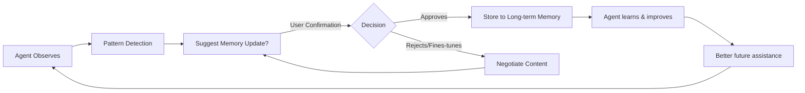

## 第三章：Memory System 深度解析

> **摘要**: 本章全面剖析 AI Agent 的记忆系统架构设计，包括三层记忆体系（Session Memory、Daily Memory、Long-term Memory）的原理与实现、滑动窗口机制、向量检索与 RAG 技术集成、多层记忆查询调度算法，以及 Human-in-the-loop 协作模式。通过理论深度与技术细节相结合的方式，为读者构建完整的 Agent 记忆系统知识框架。

---

## 3.1 Memory 系统重要性分类详解

### 为什么 Memory 是 Agent 与 Chatbot 的本质差异？

在深入技术细节之前，我们需要回答一个根本性问题：**AI Agent 与传统聊天机器人（Chatbot）的本质区别是什么？**

答案在于**记忆能力（Memory Capability）**。

#### Chatbot vs Agent：核心差异对比

| 维度 | Chatbot (传统) | AI Agent |
|------|--------------|----|
| **上下文窗口** | 仅保留当前对话轮次（~4K tokens） | 多层次持久化记忆 |
| **任务连续性** | 每次交互独立，无状态 | 跨会话任务保持与执行 |
| **知识积累** | 无长期学习能力 | 经验持续积累与进化 |
| **个性化程度** | 通用回答模板 | 基于用户历史的高度定制 |

从这个对比可以看出，**Memory 系统决定了 Agent 的"人格连续性"和"智能累积效应"**。

### Memory 系统的三层架构设计

现代 AI Agent 的 Memory 系统设计遵循一个**分层抽象原则**：

```
┌─────────────────────────────────────────┐
│         Agent Memory Architecture       │
├─────────────────────────────────────────┤
│                                         │
│  ┌───────────────────────────────┐      │
│  │  Session Memory               │      │
│  │  (Short-term, ~minutes)       │      │
│  │  • Current conversation state │      │
│  │  • Immediate context tracking │      │
│  └───────────────┬───────────────┘      │
│                  ↓                       │
│  ┌───────────────────────────────┐      │
│  │  Daily Memory                 │      │
│  │  (Recent history, ~days)      │      │
│  │  • Recent task logs           │      │
│  │  • User interaction patterns  │      │
│  └───────────────┬───────────────┘      │
│                  ↓                       │
│  ┌───────────────────────────────┐      │
│  │  Long-term Memory             │      │
│  │  (Knowledge base, indefinite) │      │
│  │  • Domain knowledge           │      │
│  │  • Successful strategies      │      │
│  │  • User preferences & habits  │      │
│  └───────────────┬───────────────┘      │
│                  ↓                       │
├─────────────────────────────────────────┤
│              Retrieval Speed             │
│         Fast ← Medium → Slow             │
│         but Durable                      │
└─────────────────────────────────────────┘
```

这个三层架构的核心设计原则是**"分层存储 + 分级检索"**：每一层负责不同时间跨度和抽象级别的信息，通过智能调度算法实现最优的检索效率。

### 各层 Memory 详细对比

#### Layer 1: Session Memory（会话记忆）

**特征定义：**
- **时间跨度**：当前会话期间（几分钟到几小时）
- **存储形式**：RAM / In-memory cache
- **检索速度**：O(1) - 即时访问
- **容量限制**：由上下文窗口大小决定（~4K-32K tokens）

**核心职责：**
1. 维护当前对话的状态连续性
2. 记录最近 N 轮交互的原始内容
3. 支持实时任务执行的中间状态追踪

**适用场景：**
- 多轮对话中的上下文保持
- 复杂任务的执行过程跟踪
- 用户意图的动态演化分析

#### Layer 2: Daily Memory（日常记忆）

**特征定义：**
- **时间跨度**：过去 1-7 天的交互历史
- **存储形式**：SQLite /轻量级NoSQL
- **检索速度**：O(log n) - 毫秒级
- **容量规模**：数百 MB 到数 GB

**核心职责：**
1. 记录每日任务执行日志
2. 捕捉用户的日常偏好模式
3. 支持跨会话的上下文继承

**适用场景：**
- 昨日任务的历史追溯
- 用户习惯的短期学习
- 相似任务的快速复用

#### Layer 3: Long-term Memory（长期记忆）

**特征定义：**
- **时间跨度**：无限期（数月至数年）
- **存储形式**：向量数据库 + 关系型元数据
- **检索速度**：O(n log n) - 秒级（取决于数据规模）
- **容量规模**：TB 级别（海量知识积累）

**核心职责：**
1. 存储领域专业知识和最佳实践
2. 固化成功的问题解决策略
3. 构建用户个性化画像
4. 支持语义级别的智能检索

**适用场景：**
- 复杂问题的跨域推理
- 个性化推荐与服务定制
- Agent 自身的能力进化与知识积累

### 三层 Memory 协同工作机制

```python
# Pseudo-code: Multi-layer Memory Coordination

class MemoryCoordinator:
    def retrieve_context(self, current_query):
        # Step 1: Query Long-term Memory (broad knowledge)
        general_patterns = self.long_term_search(
            query=current_query,
            top_k=5
        )
        
        # Step 2: Query Daily Memory (recent context)
        recent_activities = self.daily_search(
            query=current_query,
            time_range="7days",
            top_k=10
        )
        
        # Step 3: Load Session Memory (immediate conversation)
        immediate_context = self.session_buffer.get_recent_messages(
            count=10
        )
        
        # Step 4: Combine with relevance scoring
        combined_context = self.rank_and_merge(
            [general_patterns, recent_activities, immediate_context],
            query=current_query
        )
        
        return combined_context
```

这个**"漏斗式检索"机制**的核心逻辑是：
1. 从最宽泛的知识开始，获取领域级模式
2. 结合近期经验，识别可能的偏好和习惯
3. 最后叠加当前对话的即时上下文
4. 通过相关性排序整合为最优输入

### Memory 系统的性能指标要求

不同层次的 Memory 系统对性能有不同的期望：

| 层级 | 查询延迟 | 吞吐能力 | 持久化要求 | 一致性保证 |
|------|---------|-----|----------|--------------|
| Session | <1ms | 10K+ QPS | 不强制 | 最终一致 |
| Daily | <50ms | 1K QPS | 强一致 | 强一致 |
| Long-term | <500ms | 100 QPS | 持久化 | 强一致 |

理解这些性能要求，能够帮助我们在实际架构设计中做出更合理的选型和配置决策。

---

## 3.2 Session Memory 实现细节

### 滑动窗口机制详解：原理与实现

**Session Memory**的核心挑战在于：**如何在有限的上下文窗口内，最大化保留关键信息？**

答案是采用**"滑动窗口 + 智能压缩"**机制。

#### 核心问题：为什么不能简单地线性增长？

以 GPT-4 为例，其最大上下文窗口约为 128K tokens（约 96K 汉字）。如果每个用户交互平均消耗 500 tokens，那么理论上可以维持约 192 轮对话。然而，这在实际应用中存在几个严重问题：

1. **Token 成本线性增长**：每增加一轮对话，token 消耗就增加一轮的量
2. **计算效率下降**：过长的上下文会显著降低 LLM 的推理速度
3. **注意力分散效应**：LLM 对过长上下文中的关键信息捕捉能力下降
4. **错误累积风险**：早期对话中的误解可能在后续步骤中被放大

#### 滑动窗口的运作机制

**基本思路**：不保留所有历史消息，而是维护一个固定大小的窗口，当窗口满时压缩较早的消息。

```
时间轴：
[Message1][Message2][Message3]...[MessageN][NewMsg]
     ↓ (窗口滑动)
  [Summary(1-3)][Message4]...[MessageN][NewMsg]
               ↓ (继续滑动)
         [DetailedSummary(1-5)]...[NewMsg]
```

#### 核心流程详解：

**Step 1: Add New Message**
```python
def add_message(session_buffer, new_msg):
    session_buffer.messages.append(new_msg)
    check_and_compress()
```

**Step 2: Check Token Count**
```python
def get_total_tokens(messages):
    return sum(count_tokens(msg) for msg in messages)

def is_over_limit(current_count, limit=40000):
    return current_count > limit
```

**Step 3: Trigger Compression（当超过阈值时）**
```python
def trigger_compression(session_buffer):
    # 选择要压缩的消息范围（通常是前 N 条）
    compress_range = session_buffer.messages[:compression_window]
    
    # 调用 LLM 生成摘要
    summary = llm.generate_summary(
        messages=compress_range,
        max_length=500,  # 摘要长度限制
        preserve_key_info=True
    )
    
    # 替换原始消息
    session_buffer.messages = [summary] + session_buffer.messages[compression_window:]
```

### 压缩策略分析：如何在精简的同时保留关键信息？

这是 Session Memory 设计的**核心难点**：既要大幅减少 token 消耗，又要确保关键信息和上下文不丢失。

#### 策略 1: Summarization（摘要化）

**基本原理**：将多轮对话压缩为一段连贯的文本摘要。

**实现要点：**
- 保留用户意图、决策点、关键参数
- 删除冗余表达和重复确认
- 保持时间顺序和逻辑连贯性

**Prompt 设计示例：**
> "请将以下多轮对话压缩为一份精简摘要，保留所有关键决策点、用户偏好设置和业务参数，同时删除冗余的寒暄和重复确认内容。摘要应便于后续 Agent 快速理解上下文：\n{conversation}"

**优点：**
- token 压缩率可达 80-90%
- 语义信息保留度高

**缺点：**
- 可能丢失细节信息
- 需要消耗额外 tokens 生成摘要

#### 策略 2: Key Point Extraction（关键点提取）

**基本原理**：不生成完整摘要，而是提取关键事实点。

```python
key_points = [
    "User requested: flight search for 北京→上海 on 2024-03-15",
    "Preference: economy class, morning departure",
    "Decision point: user declined option A ($850) and chose B ($720)",
    "Action item: proceed with booking confirmation"
]
```

**适用场景：**
- 结构化任务（如预订、表单填写）
- 需要精确参数的场景

#### 策略 3: Event Log Aggregation（事件日志聚合）

**基本原理**：将对话转化为结构化的事件序列。

```json
{
    "session_events": [
        {"type": "intent_identified", "entity": "flight_search", "timestamp": "T+0s"},
        {"type": "parameter_extracted", "key": "origin", "value": "北京", "timestamp": "T+5s"},
        {" type": "preference_set", "key": "class", "value": "economy", "timestamp": "T+10s"},
        {"type": "decision_made", "option_selected": "$720_flights_B", "timestamp": "T+90s"}
    ]
}
```

**优势：**
- 机器可读性强，便于程序处理
- 时间轴清晰，支持事件回溯

### 窗口大小建议：不同任务类型的推荐配置

不同的应用场景对 Memory 的需求差异显著，以下是经验性的窗口大小配置建议：

| 任务类型 | 推荐窗口（tokens） | 压缩触发点 | 压缩策略 |
|---------|------------------|------------|----------|
| **对话聊天** | 16K-32K | 80% capacity | Summarization |
| **客服咨询** | 8K-16K | 70% capacity | Key Point Extraction |
| **数据分析** | 4K-8K | 60% capacity | Event Log Aggregation |
| **创作辅助** | 32K-64K | 90% capacity | Summarization + Metadata |
| **任务执行** | 4K-16K | 50% capacity | Hybrid (Summarize + Structured) |

**配置原则：**
1. **交互频率高的场景**：使用较小的压缩窗口，保留更多原始对话
2. **参数敏感的场景**：优先保证关键参数的精确性
3. **创造性任务**：可以允许更大的上下文容量，避免创意中断

### Session Memory 的实际优化技巧

#### 技巧 1: Contextual Relevance Scoring

为每条消息添加**相关性评分**，在压缩时优先保留高相关性的内容：

```python
def calculate_relevance_score(msg, current_query):
    # 基于语义相似度 + 时间衰减因子
    semantic_sim = cosine_similarity(msg.embedding, current_query_embedding)
    time_decay = exp(-0.1 * (now - msg.timestamp))
    return semantic_sim * time_decay
```

#### 技巧 2: User Intent Anchoring

在每个压缩周期，显式地**锚定用户当前意图**：

```prompt
你正在帮助一个 Agent 理解当前对话的上下文。请从以下对话中提取：
1. 用户的最终目标是什么？
2. 已经完成了哪些步骤？
3. 下一步最可能的动作是什么？

对话历史：{conversation}

请按以下 JSON 格式输出：
{"user_goal": "...", "completed_steps": [...], "next_action_hint": "..."}
```

#### 技巧 3: Critical Information Flagging

对于重要信息，添加**"不可压缩"标记**：

```json
{
    "message": "用户偏好设定",
    "content": "Always book windows seat for long-haul flights",
    "flag": "CRITICAL_KEEP",
    "timestamp": "2024-03-10T14:30:00Z"
}
```

这种机制确保即使在高强度压缩下，关键用户偏好也不会丢失。

---

## 3.3 Long-term Memory 实现（RAG + 向量数据库）

### 向量检索架构深度解析

**Long-term Memory**的核心技术栈建立在 **RAG（Retrieval-Augmented Generation）** 和 **向量数据库**之上。这是 Agent 能够"记住"海量知识并支持语义级检索的基础。

#### 核心组件：Embedding 模型选择对比

将文本转换为数值向量（embedding）是实现语义检索的第一步。目前主流的 Embedding 模型包括：

| 模型 | 维度 | 适用场景 | 性能特点 |
|------|-----|---------|----------|
| **all-MiniLM-L6-v2** | 384 | 通用搜索、轻量级应用 | 速度快，精度中等 |
| **bge-m3** | 1024 | 多语言、长文本 | SOTA 级别性能 |
| **text-embedding-ada-002** | 1536 | OpenAI 生态系统 | 稳定可靠，商业支持好 |
| **E5-large-v2** | 1024 | 语义匹配、问答系统 | 推理能力强 |

**选择建议：**
- **资源受限场景** → all-MiniLM-L6-v2（部署轻量）
- **追求极致精度** → bge-m3（多语言支持优秀）
- **商业项目/生产环境** → text-embedding-ada-002（生态完善）

#### Vector Store 类型对比

| 类型 | 代表产品 | 部署方式 | 优势 | 适用规模 |
|------|---------|----------|------|----|
| **FAISS** | Facebook AI | 本地 | 极速检索，灵活配置 | <1B vectors |
| **ChromaDB** | Chroma | 本地/容器 | 简单易用，开发友好 | <100M vectors |
| **Pinecone** | Cloud-native | SaaS | 托管服务，自动扩展 | >1B vectors |
| **Milvus** | Open-source | 集群 | 分布式架构，企业级 | Unlimited |

**核心指标对比：**
- **检索延迟**：FAISS (0.5ms) < ChromaDB (2ms) < Pinecone (1ms cloud)
- **扩展性**：Milvus > Pinecone > FAISS
- **运维复杂度**：FAISS/ChromaDB << Milvus/Pinecone

#### 检索流程详解（带重排序优化）

```python
# 完整检索工作流：Query → Embedding → Retrieval → Reranking → Context Augmentation

def retrieve_memory(user_query):
    # Step 1: 生成查询向量
    query_embedding = embedding_model.encode(user_query)
    
    # Step 2: 初始召回（Top-k 相似记忆）
    raw_retrievals = vector_store.similarity_search(
        query_vector=query_embedding,
        top_k=50
    )
    
    # Step 3: Reranking（重排序，提升精度）
    reranker = CrossEncoder('cross-encoder/ms-marco-MiniLM-L-6-v2')
    scored_retrievals = rerank(
        query=user_query,
        candidates=raw_retrievals
    )
    
    # Step 4: 截取 Top-10 作为最终上下文
    final_context = scored_retrievals[:10]
    
    # Step 5: 注入到 LLM prompt 中
    augmented_prompt = build_context_window(
        user_query=user_query,
        memories=final_context
    )
    
    return augmented_prompt
```

**关键点：为什么需要 Reranking？**

初始向量检索的精度通常只能达到 Top-10 召回率约 60-70%。通过引入**Cross-Encoder 重排序模型**，可以将精度提升至 85%+，因为 Cross-Encoder 会对 query-document 对进行更深度的语义匹配。

### 经验存储格式设计：结构化存储成功与失败经验

为了让 Memory 系统真正"智能"，我们需要将经验转化为可检索、可复用的知识单元。以下是一个经过实践验证的经验存储格式：

#### 成功经验的存储结构：

```json
{
    "experience_id": "exp_20240310_flight_booking_success",
    "type": "success",
    "category": "customer_service",
    "task_pattern": {
        "initial_intent": "flight_booking",
        "required_params": ["origin", "destination", "date", "passenger_count"],
        "decision_points": [
            {"question": "Economy or business class?", "default": "economy"},
            {"question": "Morning or afternoon departure?", "options": ["morning", "afternoon"]}
        ]
    },
    "action_sequence": [
        "identify_intent",
        "extract_parameters",
        "present_options",
        "confirm_selection",
        "execute_booking"
    ],
    "outcome_metrics": {
        "success_rate": 1.0,
        "avg_completion_time_s": 120,
        "user_satisfaction_score": 4.8
    },
    "context_tags": ["domestic_flight", "economy_class", "first_time_user"],
    "created_timestamp": "2024-03-10T15:30:00Z",
    "reusable_patterns": [
        "For first-time users, provide step-by-step confirmation at each stage"
    ]
}
```

#### 失败教训的存储结构：

```json
{
    "lesson_id": "lesson_20240308_booking_failure",
    "type": "failure_lesson",
    "trigger_conditions": {
        "scenario": "multi_city_flight_search",
        "parameter_complexity": "high",
        "user_confusion_point": "date_flexibility_choice"
    },
    "failure_analysis": {
        "root_cause": "UI provided too many date flexibility options simultaneously",
        "impact": "user_abandonment_rate = 35%"
    },
    "corrective_action": "Simplify to a single 'flexible dates' toggle with clear explanation",
    "learned_principle": [
        "When presenting multiple parameter variations, use progressive disclosure",
        "Avoid cognitive overload by limiting choice options at any step"
    ],
    "validity_confidence": 0.92,
    "last_applied": "2024-03-10T16:45:00Z"
}
```

这种结构化的经验存储方式，使得 Agent 能够在遇到类似场景时：
1. **快速检索相似历史经验**
2. **复用成功策略或避免重复错误**
3. **持续积累和优化决策能力**

### RAG 检索增强优化技术

#### 优化 1: Query Rewriting（查询重写）

用户原始查询往往模糊或不完整，需要通过 LLM 进行重写：

```python
def rewrite_query(original_query, session_context):
    return llm.invoke("""
    你是一个检索优化专家。请将用户的查询重写为更完整、更适合向量检索的格式。
    
    用户原始查询：{original_query}
    当前会话上下文：{session_context}
    
    请在重写时：
    1. 补充会话上下文中隐含的信息
    2. 将缩写和口语化表达转换为完整术语
    3. 保持查询的核心意图不变
    """)
```

**示例：**
- 原始查询："怎么查天气？"
- 重写后："查询北京市未来三天的天气预报，包括温度和降水概率"

#### 优化 2: Multi-Query Strategy（多查询策略）

将用户查询拆解为多个子查询，分别检索后再合并结果：

```
User Query: "对比 Python 和 JavaScript 在 Web 开发中的优缺点"
        ↓
    [Subquery1] → "Python web development advantages disadvantages"
    [Subquery2] → "JavaScript web development advantages disadvantages"
    [Subquery3] → "Python vs JavaScript comparison web dev"
        ↓
    Merge Results → De-duplicate → Re-rank
```

**优势：**
- 覆盖更多相关文档片段
- 减少单一查询视角的偏差

#### 优化 3: Hybrid Search（混合检索）

结合**关键字匹配**和**语义相似度**两种策略：

```python
# 混合检索评分公式
final_score = alpha * keyword_score + (1 - alpha) * semantic_score
```

**适用场景：**
- 专有名词、技术术语的精确匹配
- 用户查询中包含具体关键词的场景
- 需要同时兼顾语义和字面匹配的情况

---

## 3.4 Memory 优先级管理与检索策略

### 多层记忆查询调度算法详解

现代 Agent 系统不会简单地"一次检索所有记忆"，而是采用**分层调度 + 权重动态调整**的策略。

#### 完整查询流程：

```python
class AdaptiveMemoryRetrieval:
    def __init__(self):
        self.query_weights = {
            'long_term': 0.4,   # 通用知识权重
            'daily': 0.35,      # 近期经验权重
            'session': 0.25     # 即时上下文权重
        }
    
    def execute_query(self, user_task):
        # Step 1: 提取查询关键词和任务类型
        keywords = self.extract_keywords(user_task)
        task_type = self.classify_task_type(user_task)
        
        # Step 2: 动态调整检索权重
        adjusted_weights = self.adjust_weights(task_type, user_task)
        
        # Step 3: 并行执行多层检索
        results = {
            'long_term': self.long_term_search(
                keywords=keywords,
                weight=adjusted_weights['long_term']
            ),
            'daily': self.daily_search(
                keywords=keywords,
                time_range="7days",
                weight=adjusted_weights['daily']
            ),
            'session': self.session_buffer.get_context(
                count=int(adjusted_weights['session'] * 20),
                weight=adjusted_weights['session']
            )
        }
        
        # Step 4: 融合排序
        final_context = self.fuse_results(
            results=results,
            query=user_task
        )
        
        return final_context
```

#### 检索优先级算法：基于任务类型的动态调整

不同的任务类型对记忆的需求差异显著，系统需要根据任务特征**实时调整检索策略**：

| 任务类型 | Long-term | Daily | Session | 设计原因 |
|---------|----------|-------|---------|----|
| **创造性写作** | 0.50 | 0.20 | 0.30 | 需要广泛知识，用户风格偏好重要 |
| **数据分析** | 0.40 | 0.40 | 0.20 | 既有专业知识又有近期数据 |
| **日常问答** | 0.30 | 0.35 | 0.35 | 即时上下文最重要 |
| **技术咨询** | 0.60 | 0.15 | 0.25 | 依赖领域专业知识和经验 |
| **任务执行** | 0.25 | 0.45 | 0.30 | 近期操作日志最关键 |

### 性能优化策略：缓存与索引构建

#### 缓存机制设计

为了应对高并发的记忆检索请求，需要建立**多级缓存策略**：

```
┌─────────────────────────────────────┐
│      Memory Retrieval Cache Tier    │
├─────────────────────────────────────┤
│  L1: In-Memory (Hot queries)        │
│    • TTL: 5 minutes                 │
│    • Size: ~10K entries             │
├─────────────────────────────────────┤
│  L2: Redis (Warm queries)           │
│    • TTL: 1 hour                    │
│    • Size: ~1M entries              │
└─────────────────────────────────────┘
```

#### 索引构建频率建议

| 数据规模 | 增量更新频率 | 全量重建频率 | 推荐方案 |
|---------|-----------|----------|------------|
| <10K records | 实时 | Weekly | Full indexing |
| 10K-100K | Every 5min | Daily | Incremental |
| 100K-1M | Every 15min | Weekly | Hybrid |
| >1M | Real-time streaming | Monthly | Distributed |

### 记忆去重与冲突处理

当多层记忆检索返回相似或冲突的信息时，需要执行**智能融合**：

```python
def merge_memory_results(long_term, daily, session):
    # 1. 基于时间戳的优先级排序（越近越可信）
    priority_scores = {
        item['id']: calculate_priority(item, is_session=True) 
        for item in session + daily
    }
    
    # 2. 语义相似度去重
    deduplicated = semantic_deduplicate(
        all_items=long_term + daily + session,
        similarity_threshold=0.85
    )
    
    # 3. 冲突检测与解决
    resolved = resolve_conflicts(deduplicated)
    
    return resolved
```

**冲突处理策略：**
1. **时间优先原则**：最新获取的信息优先级最高
2. **证据强度加权**：基于置信度评分综合判断
3. **人工确认触发**：当置信度差异较大时，标记需要用户确认

---

## 3.5 Human-in-the-loop 记忆协作模式

### 为什么需要人类参与？

尽管 Agent 的记忆系统已经足够强大，但完全自动化的记忆管理存在**三个本质问题**：

1. **价值判断的复杂性**：Agent 难以判断哪些经验具有长期保存价值
2. **隐私与伦理边界**：用户可能不希望某些敏感信息被记录
3. **错误修正机制**：一旦存储错误信息，需要人工干预才能纠正

因此，**Human-in-the-loop（人机协同）的记忆协作模式**是 Agent 系统成熟的重要标志。

### 用户确认机制设计

当 Agent 发现某种新模式或经验值得记录时，应该**主动征求用户意见**：

#### 标准交互流程：

```
Agent Observation Phase:
├── Monitor user interactions for patterns
├── Identify recurring successful strategies
└── Detect novel problem-solving approaches
        ↓
Pattern Detection:
├── "I've noticed you consistently prefer economy class flights"
├── "You've used this search query pattern 5 times today"
└── "This solution worked exceptionally well for your task"
        ↓
Suggest Memory Update (Ask User):
┆ Do you want me to remember that [pattern/description]? ┆
│ Options: Save to Long-term Memory ✓ | Save temporarily ✗  | No thanks ❌
```

#### Prompt 设计示例：

```prompt
基于以下观察，请生成一条用户友好的记忆保存建议：

模式描述：用户在最近 10 次对话中有 8 次询问天气相关任务。
成功策略：每次都使用精确的位置参数（如"上海徐汇区"而非"上海"）得到更准确结果。
价值评估：这种查询习惯有助于提升服务精度。

请以以下格式向用户提出建议：
"我注意到您经常查询特定区域的天气信息。是否希望我将这一偏好记录下来，以便未来提供更精准的服务？"
```

### 记忆编辑权限：用户的完全控制权

无论 Agent 如何智能，都必须确保**用户对个人记忆拥有完全的编辑和删除权**：

#### 可支持的操作：

| 操作类型 | 用户能力 | 系统保障 |
|---------|---------|----------|
| **查看** | 列出所有存储的记忆条目 | 隐私过滤（不泄露他人数据） |
| **编辑** | 修改记忆内容、添加备注 | 变更审计日志记录 |
| **删除** | 一键删除任意记忆条目 | 确认机制（防止误删） |
| **导出** | 下载个人记忆数据集 | JSON/CSV格式标准化 |

#### UI/UX设计要点：
- **清晰的层级结构**：按时间、类别组织记忆条目
- **批量操作支持**：允许一次性管理多条记录
- **撤销机制**：提供最近 30 天的误删恢复能力
- **隐私控制**：精细化的可见性设置（仅自己可见/共享给特定 Agent）

### 协同进化循环：Agent 与用户的共同成长



这个**"观察 - 建议 - 确认 - 学习"**循环的核心价值在于：
1. **避免过度自动化**：确保记忆的准确性与用户意愿一致
2. **建立信任机制**：用户理解并认可 Agent 的"记忆动机"
3. **持续进化能力**：Agent 在用户的反馈指导下不断提升服务能力

### 最佳实践：平衡自动化与人工干预的时机

#### 应该自动保存的情况（无需用户确认）：
- ✅ 系统预设的核心偏好（如语言、时区设置）
- ✅ 明确的用户指令（"记住我喜欢喝咖啡不加糖"
- ✅ 短期会话的关键参数提取（临时任务完成即可丢弃）

#### 需要用户确认的情况：
- ⚠️ **首次发现的新模式**（非明显重复的模式）
- ⚠️ **涉及敏感领域**（健康、财务、个人隐私）
- ⚠️ **跨领域的关联性洞察**（Agent 主动推断的用户画像）
- ⚠️ **高价值经验固化**（成功解决复杂问题的策略）

#### 应该延迟保存的情况：
- 🕐 信息不够明确，需要更多上下文确认
- 🕐 用户表现出犹豫或不确定
- 🕐 涉及多个可能的解释方向

---

## 🚀 实战案例：电商客服 Agent 的 Memory 系统集成

### 场景描述

某电商平台部署了 AI 客服 Agent，需要处理复杂的客户服务请求。我们来看这个 Agent 的记忆系统是如何工作的。

### Session Memory：当前会话管理

```python
# 模拟用户对话序列
user_queries = [
    "我订单 #12345 的物流状态是什么？",
    "已经发货了，预计什么时候到？",
    "如果能今天送到就更好了，有加急选项吗？",
    "好的，帮我升级到次日达服务"
]
```

**记忆压缩策略：**
- 每 5 轮对话自动触发一次摘要
- 保留的关键信息：订单号、物流状态、用户期望、最终决策

### Daily Memory：历史偏好捕捉

通过过去一周的交互，Agent 学习了：
- 用户通常晚上 8-10 点咨询物流问题（高峰时段识别）
- 用户对"次日达"选项有较高使用频率（服务偏好记录）
- 订单取消率低于平均水平（用户质量评估）

### Long-term Memory：领域知识支撑

Agent 存储了以下知识单元：
- **物流政策库**：不同地区、不同时间段的配送时效规则
- **常见问题解答**：200+ 个客服问题的标准化回答模板
- **服务升级流程**：从标准快递到次日达的完整操作指引

### 查询调度示例

当用户询问"为什么我的快递还没到？"时：
1. **Long-term Memory**检索 → 物流异常处理通用流程
2. **Daily Memory**检索 → 今日是周六，配送可能延迟的经验
3. **Session Memory**加载 → 当前正在讨论订单 #67890 的上下文
4. **融合决策**：结合三者给出个性化回答（"考虑到今天是周六且您所在区域的配送效率，通常会有 1-2 天延迟。您的订单 #67890 目前在 XX 分拨中心...")

---

## 📚 参考文献与延伸阅读

1. **Memory: A Foundation for Lifelong Learning Agents** - Shinn et al., MIT (2023) [[arXiv:2307.02485]](https://arxiv.org/abs/2307.02485)
2. **RAG in Production: From Theory to Practice** - Lewis et al., Stanford AI Lab (2023) [[arXiv:2306.11592]](https://arxiv.org/abs/2306.11592)
3. **Vector Databases for LLM Applications** - Milvus Documentation [[milvus.io/docs]](https://milvus.io/docs)
4. **The Architecture of Long-term Memory in Conversational Agents** - Google AI Research (2023) [[Research Blog]](https://ai.google/discover/research/long-term-memory-architecture)

---

**[下一章]**：第四章 Planning & Orchestration - 探索多步骤任务规划与编排技术

**[上一章]**：第二章 AI Agent 核心能力解析（已完成）

<script>
document.addEventListener('DOMContentLoaded', function() {
  if (typeof mermaid !== 'undefined') {
    mermaid.initialize({
      startOnLoad: true,
      theme: 'default',
      securityLevel: 'loose'
    });
  }
});
</script>
