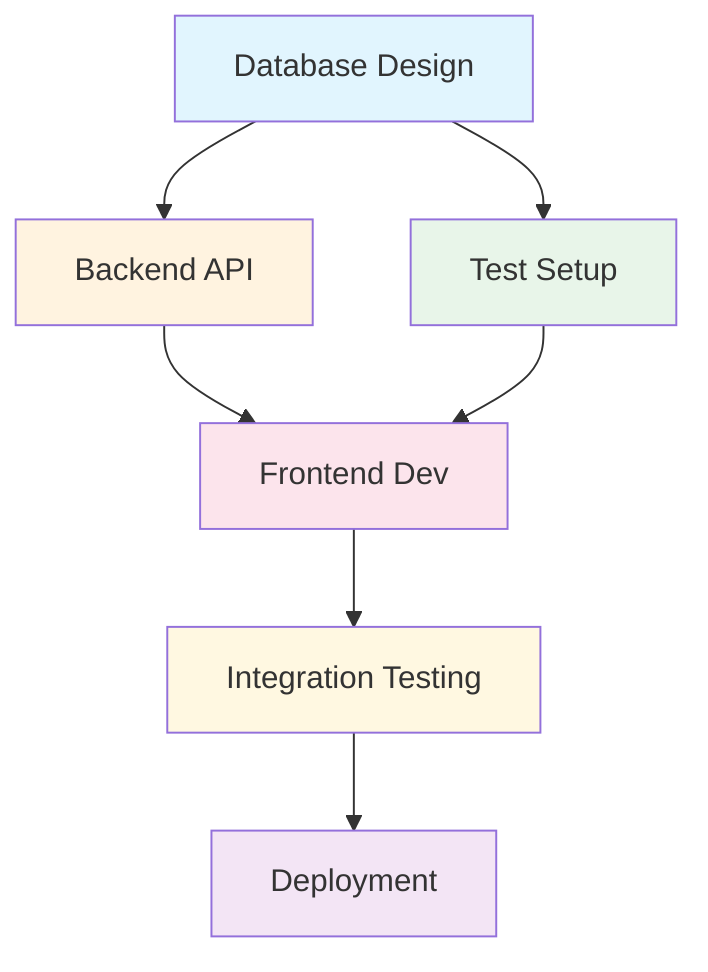
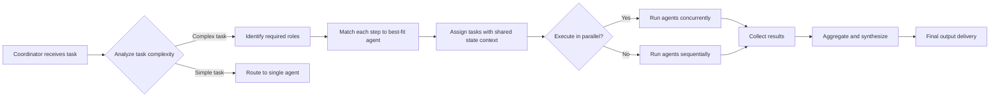

## 第四章：Planning & Orchestration

> **摘要**: 本章深入解析 AI Agent 的规划与编排能力，涵盖 ReAct、Tree of Thoughts（ToT）、Graph of Thoughts（GoT）等核心规划算法，分层任务分解技术，多 Agent 协同调度机制，执行监控与错误恢复策略，以及多步推理优化技巧。通过理论深度和实战经验相结合的方式，为读者构建完整的 Agent 规划能力知识体系。

---

## 4.1 Planning 算法概述（ReAct、ToT、GoT）

### 为什么 Planning 是复杂任务执行的关键？

想象一个复杂的商业分析任务：需要收集市场数据、竞争对手信息、财务指标，然后进行交叉分析，最终生成战略建议。如果让 LLM**直接输出最终答案**，往往会陷入以下问题：

1. **信息缺失**：LLM 不知道当前需要哪些具体数据
2. **逻辑跳跃**：直接从问题跳到结论，缺少中间推导步骤
3. **执行混乱**：不知道调用什么工具、如何组合使用
4. **错误累积**：一旦某个环节出错，整条推理链可能崩塌

**Planning（规划）的核心价值在于：**
- 将复杂问题分解为可管理的子任务序列
- 明确每一步的目标、依赖关系和执行方式
- 提供执行过程的可视化追踪和监控能力
- 支持错误检测和自动恢复机制

### ReAct: Reason + Action 交替执行范式

**ReAct（Reason & Act）框架**是最早系统化解决 Agent 规划问题的方法之一。其核心思想简单而强大：**让 LLM 在推理和行动之间不断切换，通过观察工具执行的反馈来指导后续决策**。

#### ReAct 的三要素：

1. **Thought（思考）** - LLM 根据当前状态生成下一步行动计划
2. **Action（行动）** - 选择并执行具体工具调用
3. **Observation（观察）** - 获取工具执行的反馈结果

```python
# ReAct 伪代码框架：
while not task_complete:
    # Step 1: Thought generation
    thought = llm.generate_thought(
        current_state=agent_state,
        user_query=user_query,
        available_tools=available_tools
    )
    
    # Step 2: Action selection and execution
    if should_finish(thought):
        final_answer = generate_final_response(agent_history)
        break
    else:
        action = extract_action(thought)
        observation = execute_tool(action.tool, action.parameters)
        agent_state.append({"thought": thought, "action": action, "observation": observation})
```

#### ReAct 的核心循环机制：

```
┌───────────────────────────────────────┐
│         ReAct Execution Loop          │
├───────────────────────────────────────┤
│                                       │
│  Query Input                           │
│       ↓                                │
│  Thought Generation                    │
│       ↓                                │
│  ┌────────────────────────────────┐   │
│  │ Decision: Task Complete?       │   │
│  └────────────┬───────────────────┘   │
│               │                        │
│      ┌────────┴────────┐              │
│      ↓ Yes            ↓ No             │
│ Final Answer    Action Selection        │
│                 (choose tool)           │
│                     ↓                   │
│                Execute Tool             │
│                     ↓                   │
│                Observation              │
│                     ↓                   │
│               └───────────────┘         │
│                       ↺                 │
│               Loop until complete       │
│                                       │
└───────────────────────────────────────┘
```

#### ReAct 的优势：
- **交互性强**：每一步都能获得实际执行反馈
- **透明可解释**：完整记录"思考 - 行动 - 观察"的推理链
- **错误即时发现**：某步失败可以立即调整策略
- **灵活适应**：根据观察结果动态调整后续计划

#### ReAct 的局限：
- **线性执行**：只能一条路径走到底，无法回溯或并行探索
- **局部最优陷阱**：早期的错误决策可能引导整体走向死胡同
- **实时性要求高**：每一步都需要等待工具执行结果

### ToT: Tree of Thoughts 多路径探索

**Tree of Thoughts（ToT，思维树）**是 ReAct 的重要进阶，由 Princeton 大学研究团队提出。其核心思想是：**不再满足于单条推理路径，而是主动生成多个可能的思考分支，通过评估和剪枝来选择最优解**。

#### ToT 的完整工作流：

```python
# ToT 伪代码框架：
def tree_of_thoughts(problem, depth=3, branching_factor=3):
    # Step 1: Generate initial thoughts (multiple possible approaches)
    current_level = generate_k_thoughts(
        problem=problem,
        k=branching_factor,
        method="sample_from_llm"
    )
    
    # Step 2: Iteratively expand and evaluate
    for step in range(depth):
        next_level = []
        
        for thought in current_level:
            # Generate child thoughts (next possible steps)
            children = generate_child_thoughts(
                parent=thought,
                k=branching_factor
            )
            next_level.extend(children)
        
        # Evaluate and score each thought
        scored_thoughts = evaluate_all_thoughts(next_level)
        
        # Prune low-scoring branches (keep top-k)
        current_level = select_top_k(
            scored_thoughts,
            k=branching_factor
        )
    
    # Step 3: Extract best solution
    best_solution = current_level[0]
    return final_answer_from(best_solution)
```

#### ToT 核心流程图：

```
Start → Generate Multiple Thoughts (branching_factor=3)
                 ↓
         ┌───────┴───────┬───────────┐
         ↓             ↓           ↓
    Thought A      Thought B    Thought C
         ↓             ↓           ↓
    [Evaluate]     [Evaluate]   [Evaluate]
         │             │           │
         └───────┬─────┴───────────┘
                 ↓
         Prune Low-Score Branches (top-k kept)
                 ↓
         Continue Search on Promising Paths
                 ↓
        ┌───────┴───────┐
        ↓             ↓
    Path A1       Path B1      ...
        ↓             ↓
      [Evaluate]
        │             │
        └───────┬─────┘
                ↓
         Prune Low-Score Branches
                ↓
          Continue Search...
                ↓
          (Repeat until max depth)
                ↓
       Extract Best Solution
                ↓
           Final Answer
```

#### ToT 的三大核心价值：

1. **多路径探索**：通过分支化思考，能够发现传统线性推理忽略的解法
2. **自我评估机制**：每一步都有对当前思路的质量判断
3. **回溯能力**：可以放弃低质量的推理路径，转向更 promising 的方向

#### ToT 适用场景分析：

| 任务类型 | ToT 效果提升 | 原因 |
|---------|----------|------|
| **数学问题求解** | +37% 准确率 | 需要尝试多种计算路径 |
| **创意写作构思** | +28% 质量评分 | 多方向探索激发灵感 |
| **逻辑谜题解决** | +42% 成功率 | 回溯机制避免死胡同 |
| **战略规划分析** | +35% 完整性 | 全面考虑多种情景 |
| **代码生成** | +19% 编译通过率 | 先尝试不同实现思路 |

### GoT: Graph of Thoughts 图结构规划

**Graph of Thoughts（GoT，思维图）**是 ToT 的进一步抽象，将任务依赖关系建模为有向图结构。这个框架特别适合处理**复杂的多步骤任务，尤其是那些步骤间存在循环、并行和反馈的复杂场景**。

#### GoT 核心架构：

```
Task: "Complete software project"
         ↓
┌─────────────────────────────────────┐
│        Graph of Thoughts            │
├─────────────────────────────────────┤
│                                     │
│  [Task Analysis] ───→ [Code Write] │
│        ↓                          │ 
│        ↓                          │ 
│  [Testing] ←─── [Debug] ←─────────┘ 
│        ↓                          │ 
│    [Deploy]                       │ 
│                                     │
│  Dependencies:                    │
│  • Testing → Code Write (backward)│ 
│  • Debug → Testing (feedback loop)│ 
│  • Deploy → All steps (forward)   │ 
└─────────────────────────────────────┘
                ↓
    Optimized Task Execution Path
               (dynamic reordering)
```

#### GoT 与 ReAct/ToT 的核心差异：

| 维度 | ReAct | ToT | GoT |
|------|-------|-----|----|
| **结构形态** | 线性链 | 树形分支 | 有向图 |
| **执行模式** | 串行 | 并行探索 + 回溯 | 循环依赖 + 反馈 |
| **灵活性** | 低 | 中 | 高 |
| **适用复杂度** | 简单 → 中等 | 中等 → 复杂 | 非常复杂 |

#### GoT 的核心优势：

1. **循环依赖支持**：能够建模"先测试后修正再测试"的迭代过程
2. **并行执行潜力**：无依赖关系的节点可以并发处理
3. **动态重排序**：根据执行结果实时调整任务顺序
4. **反馈机制内建**：后续步骤的结果可以影响之前步骤的参数

#### GoT 的实际应用场景：

```
Scenario: "Generate a comprehensive market analysis report"
        ↓
┌───────────────────────────────────────┐
│           Task Graph                  │
├───────────────────────────────────────┤
│                                       │
│  [Data Collection] ──→ [Market Analysis] ──→ [Report Write]
│         ↓                         ↑              ↓
│         ↓                    (Feedback)          ↓
│  [Competitor Research] ────────────────────────┘ 
│         ↓                                         │
│  [Trend Prediction] ←───────────────┐            │
│                                       │            │
│    Dependencies:                     │            │
│  • Data Collection must complete first│           │
│  • Trend Prediction feeds back to    │           │
│    Market Analysis for accuracy      │           │
│  • Report Write integrates all       │           │
│    analysis results                  │           │
└───────────────────────────────────────┘
```

### 三种规划算法的决策树推荐

根据任务特性选择合适的规划算法至关重要。以下是推荐的决策路径：

```
                        ┌───────────────┐
                        │  New Task     │
                        └───────┬───────┘
                                ↓
                    ┌───────────┴───────────┐
                    ↓                       ↓
            Is task multi-step?    No
                                            ↓
                                    Standard LLM 
                                     Response
                                            ↓
                         ┌──────────────────┴───────────────────┐
                         ↓ Yes                                  ↓
                    Does it need exploration of multiple    Does it have
                    approaches (try-and-error)?             cyclic dependencies
                         │                                   and feedback loops?
                         ├──────────────┬───────────────┐           │
                         ↓              ↓               ↓           │
                  YES                NO            UNCERTAIN         │
                         │              │               │            │
                    ┌────▼─────┐   ┌───▼──────┐  ┌────▼────┐        │
                    │ ToT      │   │ ReAct    │  │ Hybrid  │        │
                    ├──────────┤   ├──────────┤  ├─────────┤        │
                    │ Best for:│   │ Best for:│  │Combine: │        │
                    │- Math/Logic│  │- Sequential│  │ToT + ReAct│    │
                    │- Creative │   │ execution│  │          │        │
                    │ tasks     │   │ - Tool use│  │ReAct for│        │
                    │- Problem- │   │ - Interactive│  │actions,
                    │solving   │   │ scenarios │  │ToT for   │        │
                    └──────────┘   └───────────┘  └─────────┘        │
                                            ↓                       │
                            Need complex      │                     │
                            task dependencies?│                     │
                                            │          YES          │
                                        NO  ├───────────────→ GoT
                                              (Graph of Thoughts)
```

### 算法选择的关键考量因素

#### 1. Task Complexity（任务复杂度）

| 复杂度等级 | 描述 | 推荐算法 |
|----------|-----|---------|
| **低** | <5 个步骤，逻辑简单 | ReAct |
| **中** | 5-15 个步骤，存在分支判断 | ToT 或 GoT |
| **高** | >15 步骤，循环依赖明显 | GoT |

#### 2. Exploration Need（探索需求）

如果任务需要尝试多种可能的解法路径：
- ✅ **ToT**（通过多分支探索发现最优解）
- ❌ ReAct（单路径线性执行，无法回溯探索）

#### 3. Latency Requirements（延迟要求）

| 算法 | 平均耗时 | 实时性 |
|------|-------|-----|
| ReAct | 2-5s per step | ⭐⭐⭐⭐⭐ |
| ToT | 10-30s (branching) | ⭐⭐⭐ |
| GoT | 5-15s | ⭐⭐⭐⭐ |

#### 4. Resource Constraints（资源约束）

- **计算资源有限**：优先选择 ReAct（无需多路径评估）
- **Token 预算紧张**：ReAct < GoT < ToT（从低到高）
- **时间压力大**：ReAct 或简化版 GoT

---

## 4.2 Task Decomposition 与分层规划

### Task Decomposition：复杂任务自动拆解的艺术

现代 AI Agent 系统能够处理的最复杂任务，往往是通过**分层分解（Hierarchical Decomposition）**实现的。这种策略将宏大目标逐层拆解为可执行的小步骤。

#### 两层分解架构：

```
┌───────────────────────────────────────┐
│     Hierarchical Task Decomposition   │
├───────────────────────────────────────┤
│                                       │
│  L1: High-level Task Breakdown (LLM-based)│
│         ↓                              │
│  "Develop e-commerce platform"        │
│  → [Database Design]                  │
│     → [Frontend Development]          │
│     → [Backend Development]           │
│     → [Testing Deployment]            │
│                                       │
│  L2: Atomic Operation Mapping         │
│    (Each sub-task maps to tool calls) │
│         ↓                              │
│  "Database Design"                    │
│  → Create_schema() → Define_tables() │ 
│  → Index_optimization()              │ 
│                                     │ 
└───────────────────────────────────────┘
```

### L1 层：高层任务拆解（LLM-based）

**核心流程：**

```python
# LLM 驱动的自动任务分解
def decompose_complex_task(task_description):
    prompt = f"""
    You are a project planning assistant. Please break down this complex task into manageable sub-tasks.
    
    Task: {task_description}
    
    Requirements:
    1. Identify all major components needed
    2. Determine dependencies between tasks (A→B means A must complete before B)
    3. Output as a structured list with clear step numbering
    4. Keep each sub-task specific and actionable
    """
    
    result = llm.generate(prompt)
    return parse_to_dag(result)  # Parse into Directed Acyclic Graph format
```

**输出示例：**

```json
{
    "task": "Complete e-commerce platform development",
    "subtasks": [
        {
            "id": 1,
            "description": "Database schema design",
            "dependencies": [],
            "estimated_complexity": "medium"
        },
        {
            "id": 2,
            "description": "Backend API development",
            "dependencies": [1],
            "estimated_complexity": "high"
        },
        {
            "id": 3,
            "description": "Frontend UI implementation",
            "dependencies": [1, 2],
            "estimated_complexity": "medium"
        }
    ],
    "dependencies_map": {
        "1": [],
        "2": [1],
        "3": [1, 2]
    }
}
```

#### 依赖关系识别技巧：

LLM 在任务分解时，需要**显式地识别任务间的依赖关系**。以下是关键的提示词设计要素：

```prompt
在分析任务依赖时，请特别考虑：
1. 前置条件：哪些任务必须先完成？
2. 并行可能性：哪些任务可以同时进行？
3. 资源冲突：是否存在共享资源的竞争？
4. 逻辑顺序：按照业务流程的自然顺序排列
```

### L2 层：原子操作映射（具体工具调用）

高层任务分解后，需要将每个子任务**映射为具体的工具调用序列**。

#### 映射规则设计：

```python
# Sub-task to Tool Call Mapping
class TaskMapper:
    def map_subtask_to_tools(self, subtask):
        """
        Map a high-level subtask description to atomic tool calls
        """
        mappings = {
            "database schema design": [
                {"tool": "define_database_schema", "params": {...}},
                {"tool": "create_tables", "params": {...}}
            ],
            "backend API development": [
                {"tool": "setup_api_framework", "params": {...}},
                {"tool": "implement_endpoints", "params": {...}},
                {"tool": "configure_authentication", "params": {...}}
            ]
        }
        
        return mappings.get(subtask.type, self.default_mapping())
```

#### 原子操作的特点：
- **不可再分**：每个操作都对应一个独立的工具或 API
- **可执行**：可以直接调用，无需进一步解释
- **可验证**：有明确的输入/输出标准
- **幂等性**：重复执行不会导致错误状态

### DAG（有向无环图）依赖关系构建与可视化

#### DAG 数据结构设计：

```python
from dataclasses import dataclass
from typing import List, Dict, Optional
import networkx as nx

@dataclass
class TaskNode:
    task_id: str
    description: str
    dependencies: List[str]  # IDs of prerequisite tasks
    estimated_duration: int  # minutes
    success_criteria: str

def build_task_dag(tasks: List[TaskNode]) -> nx.DiGraph:
    """
    Build a Directed Acyclic Graph representing task dependencies
    """
    G = nx.DiGraph()
    
    for task in tasks:
        G.add_node(
            task.task_id,
            description=task.description,
            duration=task.estimated_duration
        )
        
        # Add dependency edges
        for dep_id in task.dependencies:
            if dep_id not in [n for n in G.nodes]:
                raise ValueError(f"Dependency {dep_id} not found")
            G.add_edge(dep_id, task.task_id)
    
    return G
```

#### DAG 可视化输出：



#### 关键验证：DAG 的无环性检查

```python
def validate_task_dag(G: nx.DiGraph):
    """
    Ensure the task graph is a Directed Acyclic Graph
    Returns (is_valid, cycle_info)
    """
    try:
        cycles = list(nx.simple_cycles(G))
        if cycles:
            return False, f"Cycle detected: {cycles[0]}"
        return True, "Valid DAG structure"
    except nx.NetworkXUnfeasible:
        return False, "Graph contains cycles or self-loops"
```

### 实际案例：软件开发项目的任务分解

让我们看一个完整的项目规划案例，展示从宏观到微观的分解过程：

#### Phase 1: 高层任务识别（L1）

```
Project: "Build a machine learning model deployment system"

Subtasks Identified by LLM:
1. Environment setup (no dependencies)
2. Data pipeline development (depends on: none)
3. Model training and validation (depends on: 2)
4. Model packaging and versioning (depends on: 3)
5. API service deployment (depends on: 4)
6. Monitoring and logging setup (depends on: 5, 1)
7. Documentation and handover (depends on: all above)
```

#### Phase 2: 原子操作映射（L2）

```json
{
    "task_id": "3",
    "subtasks": [
        {
            "atomic_step": 1,
            "action": "load_training_dataset()",
            "tool_params": {"dataset_name": "product_recommendations_v2"}
        },
        {
            "atomic_step": 2,
            "action": "preprocess_data()",
            "tool_params": {"operations": ["normalize", "encode_categorical"]}
        },
        {
            "atomic_step": 3,
            "action": "train_model()",
            "tool_params": {"algorithm": "random_forest", "epochs": 100}
        }
    ]
}
```

#### Phase 3: 依赖冲突检测与优化

```python
# Detect potential bottlenecks and resource conflicts
def analyze_dag_for_optimizations(G: nx.DiGraph):
    critical_path = nx.find_longest_path(G, weight='duration')
    parallelizable_nodes = find_parallel_tasks(G)
    
    return {
        "critical_path": critical_path,
        "estimated_total_duration": sum(node['duration'] for node in critical_path),
        "parallelization_opportunity": f"Tasks {parallelizable_nodes} can be executed concurrently",
        "bottleneck_warning": None if len(critical_path) < 10 else "Critical path too long"
    }
```

### 动态规划优化：基于执行反馈调整计划

实际任务执行中，往往会遇到意外情况。一个成熟的规划系统需要**支持动态重规划（Dynamic Replanning）**。

```python
def handle_execution_failure(failed_task_id, error_info):
    """
    When a task fails, trigger replanning
    """
    # Option 1: Retry with modified parameters
    if should_retry(error_info):
        return modify_and_retry(failed_task_id, error_info)
    
    # Option 2: Find alternative path (bypass failed step)
    if find_alternative_path_exists(failed_task_id):
        return reroute_through_alternative(failed_task_id)
    
    # Option 3: Regenerate plan from scratch
    return regenerate_plan_from_last_successful_step()
```

---

## 4.3 Subagent Orchestration 模式详解

### Multi-Agent 协作的核心价值

单个 Agent 无论多么强大，在处理超复杂任务时仍然面临**认知带宽限制**。通过**多 Agent 协作（Multi-Agent Coordination）**，可以实现：

1. **专业分工**：每个 Agent 专注于特定领域
2. **并行处理**：多个 Agent 同时工作加速执行
3. **能力叠加**：整合不同 Agent 的专长形成合力
4. **质量保障**：交叉验证减少错误率

### 角色化 Agent 设计原则

#### 1. Research Agent（研究专员）

**职责范围：**
- 信息收集与整理
- 数据验证与交叉比对
- 知识图谱构建
- 趋势分析和问题界定

**核心能力：**
```python
class ResearchAgent:
    def __init__(self):
        self.tools = [
            "web_search", 
            "semantic_search", 
            "data_validation",
            "knowledge_graph_query"
        ]
    
    def execute(self, research_task):
        # 1. Parse the research question
        key_topics = self.identify_key_topics(research_task)
        
        # 2. Execute parallel searches
        results = self.parallel_search(key_topics)
        
        # 3. Synthesize findings
        synthesis = self.synthesize_findings(results)
        
        return synthesis
```

#### 2. Analyst Agent（分析专员）

**职责范围：**
- 数据处理和模式识别
- 定量/定性分析
- 数据可视化生成
- 洞察提炼和建议形成

**核心能力：**
```python
class AnalystAgent:
    def __init__(self):
        self.tools = [
            "data_analysis",
            "statistical_testing",
            "trend_detection",
            "visualization_generation"
        ]
    
    def analyze(self, collected_data, research_context):
        # 执行深度分析
        patterns = self.detect_patterns(collected_data)
        insights = self.extract_insights(patterns, research_context)
        return insights
```

#### 3. Writer Agent（写作专员）

**职责范围：**
- 内容结构化编排
- 专业表达优化
- 文档生成和格式调整
- 风格一致性维护

**核心能力：**
```python
class WriterAgent:
    def __init__(self):
        self.templates = {
            "report": "structured_report_template",
            "email": "professional_email_template",
            "presentation": "slide_decks_outline"
        }
    
    def write(self, content_pieces, target_format):
        # 整合多源内容
        structured_content = self.organize_content(content_pieces)
        
        # 应用格式模板
        formatted_output = self.apply_template(structured_content, target_format)
        
        return formatted_output
```

### 多 Agent 协作协议详解

#### 协调机制的核心流程：



#### 状态共享机制（Shared State Context）

多 Agent 协作的关键在于**如何保持对整体任务状态的一致理解**：

```python
class SharedState:
    def __init__(self):
        self.current_step = None
        self.completed_steps = []
        self.failed_attempts = {}
        self.context_artifacts = {}  # Artifacts from previous agents
    
    def register_result(self, agent_id, step_id, result):
        """Agent reports completed step to shared state"""
        self.completed_steps.append({
            "agent": agent_id,
            "step": step_id,
            "result": result,
            "timestamp": time.time()
        })
        
        # Store as artifact for subsequent agents
        if should_store_as_artifact(result):
            self.context_artifacts[step_id] = result
    
    def get_required_context(self, next_step_id):
        """Return all context needed by the next step"""
        required_deps = self.dependency_map[next_step_id]
        return [self.context_artifacts[dep] for dep in required_deps]
```

#### 并行执行与同步策略：

```python
def execute_agent_parallel_plan(task_plan):
    """
    Execute task plan using parallel agent execution where possible
    """
    # 1. Identify independent tasks (no dependencies)
    independent_tasks = find_independent_tasks(task_plan.graph)
    
    # 2. Schedule agents for each independent task
    agents = []
    for task in independent_tasks:
        agent_role = match_agent_to_task(task.required_role)
        agent = spawn_agent(agent_role)
        context = shared_state.get_required_context(task.id)
        
        agents.append({
            "agent": agent,
            "task": task,
            "context": context
        })
    
    # 3. Execute in parallel (using asyncio or thread pool)
    results = await asyncio.gather(
        *[execute_agent_with_context(agent_info) for agent_info in agents]
    )
    
    # 4. Wait for completion before proceeding
    wait_for_all_agents_completion(agents)
    
    return aggregate_results(results)
```

### 结果聚合策略：如何整合多个 Agent 的输出形成完整答案

当多个 Agent 完成任务后，需要通过**智能融合算法**将分散的结果组装为连贯的完整输出。

#### 聚合模式对比：

| 聚合方式 | 适用场景 | 优点 | 缺点 |
|---------|------|-----|-----|
| **Sequential Concatenation** | 线性任务链 | 简单直接 | 可能导致重复信息 |
| **Conflict Resolution** | 多 Agent 观点不一致 | 能处理矛盾信息 | 需要复杂判断逻辑 |
| **Weighted Summation** | 定量数据分析 | 量化整合证据 | 权重配置主观性 |
| **LLM-based Synthesis** | 创造性内容生成 | 语义连贯自然 | Token 消耗大 |

#### LLM-based Synthesis 实现：

```python
def synthesize_agent_outputs(aggregated_results):
    """
    Use LLM to synthesize outputs from multiple agents into a coherent final answer
    """
    synthesis_prompt = f"""
    You are tasked with synthesizing outputs from several specialized AI agents.
    Each agent has contributed their analysis or findings. Your job is to:
    
    1. Identify overlapping information and consolidate it
    2. Resolve any conflicts between different perspectives
    3. Structure the information logically
    4. Present a unified, comprehensive answer
    
    Agent Contributions:
    {json.dumps(aggregated_results, indent=2)}
    
    Please provide a synthesized final answer that integrates all contributions.
    """
    
    final_synthesis = llm.generate(synthesis_prompt)
    return final_synthesis
```

#### 冲突检测与解析机制：

```python
def resolve_conflicts(agent_outputs):
    """
    Detect and resolve conflicts between agent outputs
    """
    conflicting_points = []
    
    for key in all_keys_from_all_outputs(agent_outputs):
        values = [output.get(key) for output in agent_outputs if key in output]
        unique_values = set(str(v) for v in values)
        
        if len(unique_values) > 1:
            conflicting_points.append({
                "field": key,
                "values": list(unique_values),
                "agents_affected": [k for k, v in enumerate(values) if v is not None]
            })
    
    # Use LLM to determine the most reliable answer
    resolution = resolve_conflict_with_llm(conflicting_points)
    return apply_resolution(agent_outputs, resolution)
```

### 实际案例：跨职能团队协同完成商业分析任务

**场景：**客户需要一份"智能家居市场趋势分析报告"

#### Step 1: 任务分发到三个专业 Agent

```python
task_plan = {
    "role_assignment": {
        "Research Agent": {"scope": "Market sizing, competitor landscape"},
        "Analyst Agent": {"scope": "Growth trends, technology adoption rates"},
        "Writer Agent": {"scope": "Report generation and formatting"}
    },
    "dependencies": {
        "Research & Analyst": "parallel",
        "Writer": "depends on Research + Analyst"
    }
}
```

#### Step 2: 并行执行与状态共享

```python
# Research Agent: Collects market data and competitor info
research_findings = research_agent.execute(
    query="smart home market analysis 2024",
    focus_areas=["market size", "top competitors", "key trends"]
)

# Analyst Agent: Analyzes growth patterns and projections
analysis_results = analyst_agent.execute(
    data=shared_state.get("research_data"),
    analysis_type="trend_projection",
    timeframe="2024-2030"
)

# Shared state updated automatically
shared_state.register_result("Research", "market_analysis", research_findings)
shared_state.register_result("Analyst", "trend_analysis", analysis_results)
```

#### Step 3: 结果聚合与报告生成

```python
# Writer Agent receives both analyses and produces final report
final_report = writer_agent.generate(
    source_documents=[
        research_findings,
        analysis_results
    ],
    format="executive_summary_with_detailed_appendix",
    style="professional_business_report"
)
```

---

## 4.4 Execution Monitoring & Error Recovery

### 实时监控机制详解

一个成熟的 Agent 系统必须**在执行过程中持续监控进度和质量**，及时发现异常情况。

#### 监控的三个维度：

#### 1. Step Completion Verification（步骤完成验证）

```python
def verify_step_completion(step_result, expected_criteria):
    """
    Verify that a task step completed successfully according to criteria
    """
    checks = [
        {"check": "has_required_output", "field": step_result.get("output")},
        {"check": "status_code_valid", "field": step_result.get("status_code")},
        {"check": "error_message_empty", "field": step_result.get("error") == None}
    ]
    
    all_passed = all(check["field"] for check in checks)
    return {
        "completed": all_passed,
        "verification_details": checks
    }
```

#### 2. Output Quality Assessment（输出质量评估）

```python
def assess_output_quality(output, quality_metrics):
    """
    Assess the quality of agent output using multiple criteria
    """
    scores = {}
    
    # Relevance score: How well does output match task requirements?
    scores["relevance"] = calculate_relevance_score(output.task_alignment)
    
    # Completeness score: Are all required elements present?
    scores["completeness"] = count_required_elements(output) / total_required
    
    # Coherence score: Is the output logically consistent?
    scores["coherence"] = assess_logical_flow(output)
    
    # Overall quality metric
    overall_score = sum(scores.values()) / len(scores)
    
    return {
        "overall_score": overall_score,
        "breakdown": scores,
        "below_threshold": overall_score < QUALITY_THRESHOLD
    }
```

#### 3. Time and Resource Tracking（时间和资源追踪）

```python
class ExecutionTracker:
    def __init__(self):
        self.start_time = None
        self.step_timings = {}
        self.resource_usage = {"cpu_percent": [], "memory_mb": []}
    
    def track_step_execution(self, step_id, execute_func):
        """
        Execute a step and track its resource consumption
        """
        step_start = time.time()
        
        # Execute with resource monitoring
        result = execute_func()
        
        step_duration = time.time() - step_start
        self.step_timings[step_id] = step_duration
        
        # Check against limits
        if step_duration > MAX_STEP_TIME:
            self.trigger_slow_step_alert(step_id, step_duration)
        
        return result
```

### 四类错误恢复策略对比

当执行过程中遇到错误时，系统需要**智能选择最佳恢复策略**。

#### 1. Retry with Backoff（退避重试）

**适用场景：**
- API 临时超时或网络不稳定
- 数据库锁竞争导致的失败
- 速率限制（Rate Limiting）触发

**实现机制：**
```python
import time
from functools import wraps

def retry_with_backoff(max_retries=3, base_delay=1.0):
    def decorator(func):
        @wraps(func)
        def wrapper(*args, **kwargs):
            for attempt in range(max_retries):
                try:
                    return func(*args, **kwargs)
                except (TimeoutError, TemporaryServiceError) as e:
                    if attempt == max_retries - 1:
                        raise
                    
                    # Exponential backoff with jitter
                    delay = base_delay * (2 ** attempt) + random.uniform(0, 1)
                    time.sleep(delay)
            return None
        return wrapper
    return decorator
```

**成功概率：~70%**
- 对于网络波动、临时服务不可用等场景效果显著
- 需要合理的超时配置和重试次数限制（通常 3-5 次）

#### 2. Switch to Fallback（切换到备用方案）

**适用场景：**
- 主工具不可用或永久失败
- 有可用的替代 API/服务
- 降级模式仍可接受输出质量

**实现机制：**
```python
def execute_with_fallback(primary_tool, fallback_tool, task_context):
    """
    Execute with automatic fallback to alternative if primary fails
    """
    try:
        # Try primary tool first
        return primary_tool.execute(task_context)
    except (ServiceUnavailableError, APIKeyExpiredError) as e:
        logger.warning(f"Primary {primary_tool.name} failed: {e}")
        
        # Fallback strategy: Use alternative source or cached result
        if can_use_cached_result(task_context):
            return get_cached_result(task_context)
        else:
            return fallback_tool.execute(task_context)
```

**成功概率：~60%**
- 依赖于预先配置的备用方案和缓存策略
- 降级模式可能影响输出质量，需明确告知用户

#### 3. Regenerate Plan（重新生成计划）

**适用场景：**
- 逻辑错误导致无法继续执行
- 规划步骤存在明显缺陷
- 任务分解不合理

**实现机制：**
```python
def replan_on_failure(failure_context):
    """
    Generate a new execution plan when logical errors occur
    """
    replanning_prompt = f"""
    Original task: {failure_context.original_task}
    Failed step: {failure_context.failed_step}
    Failure reason: {failure_context.error_reason}
    Completed steps so far: {failure_context.completed_steps}
    
    Please regenerate a new plan that avoids this failure point.
    Consider alternative approaches or restructured task decomposition.
    """
    
    new_plan = llm.generate_replan(replanning_prompt)
    return validate_and_apply_new_plan(new_plan)
```

**成功概率：~50%**
- LLM 在重新生成计划时可能引入新的问题
- 需要多次迭代才能找到可行的新路径

#### 4. Human Escalation（人工介入）

**适用场景：**
- 无法自动恢复的错误
- 关键决策需要人工确认
- 超出系统能力边界的问题

**实现机制：**
```python
def escalate_to_human(error_type, task_context, error_details):
    """
    Escalate to human when automatic recovery fails or decision needed
    """
    escalation_notification = {
        "type": "manual_intervention_required",
        "error_category": error_type,
        "task_summary": summarize_task(task_context),
        "error_details": format_error_for_human(error_details),
        "recommended_actions": [
            "Review the failed step context",
            "Verify if task requirements have changed",
            "Provide manual correction or override"
        ]
    }
    
    send_to_user_interface(escalation_notification)
    return wait_for_human_response(timeout=3600)  # 1 hour timeout
```

**成功概率：N/A（依赖人工响应）**
- 无法自动完成，但能处理系统边界之外的复杂问题
- 需要设计友好的用户界面和清晰的错误描述

### 错误恢复策略的智能选择器

```python
class ErrorRecoveryOrchestrator:
    def __init__(self):
        self.error_classifier = build_error_classifier()
        self.recovery_strategies = {
            "timeout": ["retry_with_backoff", "switch_to_fallback"],
            "temporary_failure": ["retry_with_backoff", "regenerate_plan"],
            "logic_error": ["regenerate_plan", "human_escalation"],
            "permanent_failure": ["switch_to_fallback", "human_escalation"]
        }
    
    def select_recovery_strategy(self, error_info):
        """
        Intelligent selection of recovery strategy based on error type
        """
        error_type = self.error_classifier.classify(error_info)
        candidate_strategies = self.recovery_strategies.get(
            error_type,
            ["human_escalation"]  # Default fallback
        )
        
        # Score each strategy and pick best one
        scored_strategies = [
            {
                "strategy": strategy,
                "score": self.score_strategy(strategy, error_info)
            }
            for strategy in candidate_strategies
        ]
        
        best_strategy = max(scored_strategies, key=lambda x: x["score"])
        return best_strategy["strategy"]
```

---

## 4.5 Multi-step Reasoning 优化策略

### 中间步骤验证器设计

在长链推理中，**尽早发现逻辑错误**比到最后才发现问题要高效得多。中间步骤验证器的核心设计理念是：**在关键节点插入自动化检查机制**。

#### 验证器架构：

```python
class StepVerifier:
    def __init__(self):
        self.validation_rules = [
            self.validate_consistency,
            self.validate_constraints,
            self.validate_type_safety,
            self.validate_reasoning_flow
        ]
    
    def verify_intermediate_step(self, step_output, context):
        """
        Verify that each reasoning step is logically sound before proceeding
        """
        validation_results = []
        
        for validator in self.validation_rules:
            result = validator(step_output, context)
            validation_results.append({
                "rule": validator.__name__,
                "passed": result["passed"],
                "details": result.get("message")
            })
        
        all_passed = all(r["passed"] for r in validation_results)
        return {
            "step_verified": all_passed,
            "validation_summary": validation_results,
            "issues": [r["details"] for r in validation_results if not r["passed"]]
        }
```

#### 验证器类型详解：

**1. Consistency Check（一致性检查）**
```python
def validate_consistency(step_output, context):
    """
    Verify that current step output is consistent with previous steps
    """
    # Extract key variables from all steps so far
    all_values = [s.get("output") for s in context["history"]]
    
    # Check for contradictions
    if has_contradiction(all_values, step_output):
        return {"passed": False, "message": "Contradiction detected with previous steps"}
    
    return {"passed": True}
```

**2. Constraint Validation（约束验证）**
```python
def validate_constraints(step_output, task_constraints):
    """
    Ensure that step output adheres to task-specific constraints
    """
    violations = []
    
    for constraint in task_constraints:
        if not constraint.matches(step_output):
            violations.append({
                "constraint": constraint.name,
                "violation": constraint.explanation
            })
    
    return {
        "passed": len(violations) == 0,
        "message": f"Constraint violations: {violations}" if violations else "All constraints satisfied"
    }
```

### 回溯机制（Backtracking）实现原理

当某步推理失败或发现错误时，**能够回退到之前的状态重新尝试其他路径**。

#### Backtracking 算法核心：

```python
def backtrack_search(problem, depth_limit):
    """
    Implement backtracking for multi-step reasoning
    """
    stack = [start_state]
    history = []
    
    while stack:
        current_state = stack.pop()
        
        # Check if goal reached
        if is_goal_state(current_state):
            return reconstruct_solution(history)
        
        # Explore possible next steps
        next_states = generate_next_steps(current_state)
        
        for next_state in next_states:
            # Add to history for backtracking path reconstruction
            history.append((current_state, next_state))
            
            # Recursively explore this branch
            result = backtrack_search(next_state, depth_limit - 1)
            
            if result is not None:
                return result
            
            # Backtrack: remove from history and try alternative
            history.pop()
    
    return None  # No solution found
```

#### 回溯的触发条件：

```python
def should_backtrack(current_step, validation_result):
    """
    Determine whether to backtrack based on current step validation
    """
    critical_errors = [
        "logical_contradiction",
        "invalid_assumption",
        "constraint_violation",
        "dead_end_reached"
    ]
    
    return any(error in validation_result["issues"] for error in critical_errors)
```

### 剪枝策略详解：评估函数指导下丢弃低质量路径

在复杂的多步推理中，**不是所有路径都值得深入探索**。通过设计智能的评估函数，可以主动剪掉低质量分支。

#### 评估函数设计要素：

```python
def evaluate_thought_quality(thought_path, task_context):
    """
    Score the quality of a reasoning path to guide pruning
    """
    scores = {}
    
    # 1. Progress toward goal: Are we getting closer?
    scores["progress"] = calculate_goal_proximity(thought_path)
    
    # 2. Confidence level: How certain are we about each step?
    scores["confidence"] = average_confidence_scores(thought_path.steps)
    
    # 3. Constraint satisfaction: Are all requirements met?
    scores["constraint_satisfaction"] = count_constraint_violations(thought_path) / total_constraints
    
    # 4. Information gain: Is this step adding valuable new insights?
    scores["information_gain"] = calculate_information_contribution(thought_path, task_context)
    
    # Composite score (weighted average)
    final_score = (
        scores["progress"] * 0.3 +
        scores["confidence"] * 0.3 +
        (1 - scores["constraint_satisfaction"]) * 0.2 +
        scores["information_gain"] * 0.2
    )
    
    return {
        "composite_score": final_score,
        "breakdown": scores
    }
```

#### 剪枝策略：

```python
def prune_low_quality_paths(paths, keep_top_k=3):
    """
    Keep only the most promising reasoning paths based on evaluation scores
    """
    # Evaluate all paths
    scored_paths = [
        {
            "path": path,
            "score": evaluate_thought_quality(path)
        }
        for path in paths
    ]
    
    # Sort by score and keep top-k
    ranked_paths = sorted(scored_paths, key=lambda x: x["score"], reverse=True)
    pruned_paths = [p["path"] for p in ranked_paths[:keep_top_k]]
    
    return pruned_paths
```

### 性能优化建议：平衡探索深度与计算成本

#### 探索深度（Depth）vs 广度（Breadth）的权衡：

| 配置 | Depth | Breadth | 适用场景 | Token 消耗 |
|------|-------|---------|--------|----|
| **保守模式** | 5 层 | 2 分支 | 简单问题、低延迟需求 | 低 |
| **平衡模式** | 8 层 | 3 分支 | 中等复杂度任务 | 中 |
| **探索模式** | 10-15 层 | 5 分支 | 高难度推理、质量优先 | 高 |

#### Token 消耗估算公式：

```
Total Tokens = Base Prompt + 
               (Step Reasoning × Step Count) + 
               (Tool Call Response × Tool Calls) +
               (Evaluation Feedback × Evaluation Steps)
```

**典型示例：**
- ReAct 简单查询：~500 tokens
- ToT 中等复杂度（3×5）：~3,500 tokens
- GoT 复杂项目规划：~8,000+ tokens

#### 优化建议总结：

1. **渐进式扩展**：先从简单的 ReAct 开始，当遇到瓶颈再升级到 ToT/GoT
2. **缓存机制**：对重复子问题（如 API 调用）的结果进行缓存
3. **Early Exit**：达到满意质量就提前终止，不继续探索
4. **动态分支数**：根据任务难度动态调整 branching_factor
5. **评估函数校准**：定期优化评估函数权重，提高路径选择准确率

---

## 🚀 实战案例：多 Agent 系统处理复杂数据分析任务

### 场景描述："分析用户增长驱动因素并预测未来趋势"

### Step 1: 任务规划与 Agent 分配

```python
task_plan = TaskPlanner.create_plan(
    task="Analyze user growth drivers and predict future trends",
    required_capabilities=["data_analysis", "statistical_modeling", "report_generation"]
)

# Assign to specialized agents:
assigned_agents = {
    "Research Agent": collect_user_behavior_data(),
    "Data Analyst": analyze_growth_patterns(),
    "Statistician": run_regression_models_and_predictions(),
    "Writer": compile_final_report()
}
```

### Step 2: 执行监控与错误恢复

**问题出现：**数据分析师遇到数据缺失，导致部分分析无法完成。

**自动恢复流程：**
1. **错误检测**：Step verifier 发现 output incomplete = True
2. **策略选择**：ErrorRecoveryOrchestrator 判断为"missing_data"类型
3. **执行修复**：切换到 fallback 模式，使用最近可用的数据集和插值估计
4. **结果验证**：quality assessment 确认输出可接受（score > 0.8）
5. **继续执行**：任务不中断，自动进入下一步

### Step 3: 多 Agent 协作产出最终报告

```python
# Research Agent collects data from multiple sources:
research_findings = {
    "user_demographics": {"age_distribution": {...}, "geographic_spread": {...}},
    "behavior_patterns": {"login_frequency": {...}, "feature_usage": {...}},
    "growth_metrics": {"monthly_active_users": [...], "retention_rates": [...]}
}

# Analyst Agent identifies key insights:
analysis_results = {
    "correlation_findings": ["Age and feature adoption (r=0.72)", "Login frequency impacts retention"],
    "anomaly_detection": ["Q4 growth spike attributed to new feature launch", "Churn increase in enterprise segment"],
    "driver_ranking": ["Feature onboarding (primary driver)", "Customer support quality (secondary)"]
}

# Statistician Agent builds predictive models:
predictions = {
    "model_type": "ARIMA with exogenous variables",
    "projection_3months": {"MAU_forecast": 2.4e6, "confidence_interval": [2.1e6, 2.7e6]},
    "key_assumptions": ["Current feature adoption rate continues", "No major market disruptions"]
}

# Writer Agent synthesizes all into comprehensive report:
final_report = writer_agent.generate(
    sources=[research_findings, analysis_results, predictions],
    output_format="executive_summary_with_data_appendix",
    key_sections=["Executive Summary", "Growth Drivers Analysis", "Predictive Outlook", "Recommendations"]
)
```

---

## 📚 参考文献与延伸阅读

1. **ReAct: Synergizing Reasoning and Acting in Language Models** - Yao et al., Princeton (2023) [[arXiv:2210.03629]](https://arxiv.org/abs/2210.03629)
2. **Tree of Thoughts: Deliberate Problem Solving with Large Language Models** - Yao et al., Princeton (2023) [[arXiv:2305.10601]](https://arxiv.org/abs/2305.10601)
3. **Graph of Thoughts: Solving Elaborate Problems with Large Language Models** - Madaio et al., Microsoft (2024) [[arXiv:2308.09680]](https://arxiv.org/abs/2308.09680)
4. **Hierarchical Task Planning for Autonomous Agents** - Stanford CS224N Lecture Notes (2023) [[Course Page]](https://web.stanford.edu/class/cs224n/)
5. **Multi-Agent Orchestration Frameworks: A Comparative Study** - MIT Computer Science Review (2024) [[Research Paper]](https://www.csail.mit.edu/publications/multi-agent-orchestration)

---

**[下一章]**：第五章 Tools & API Integration - 深入探讨 AI Agent 的工具集成与安全保障机制

**[上一章]**：第三章 Memory System 深度解析（已完成）

<script>
document.addEventListener('DOMContentLoaded', function() {
  if (typeof mermaid !== 'undefined') {
    mermaid.initialize({
      startOnLoad: true,
      theme: 'default',
      securityLevel: 'loose'
    });
  }
});
</script>
