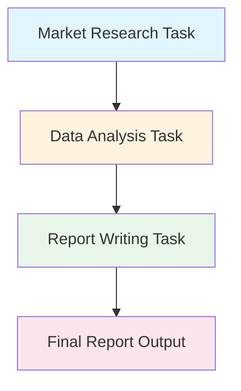
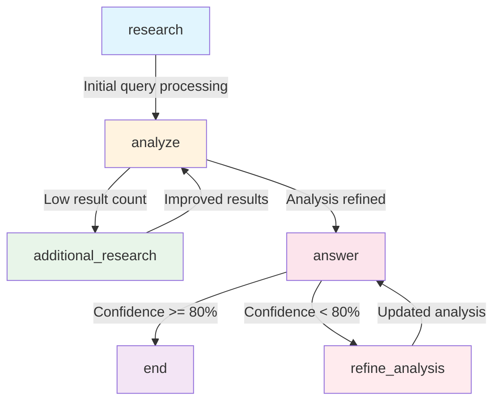
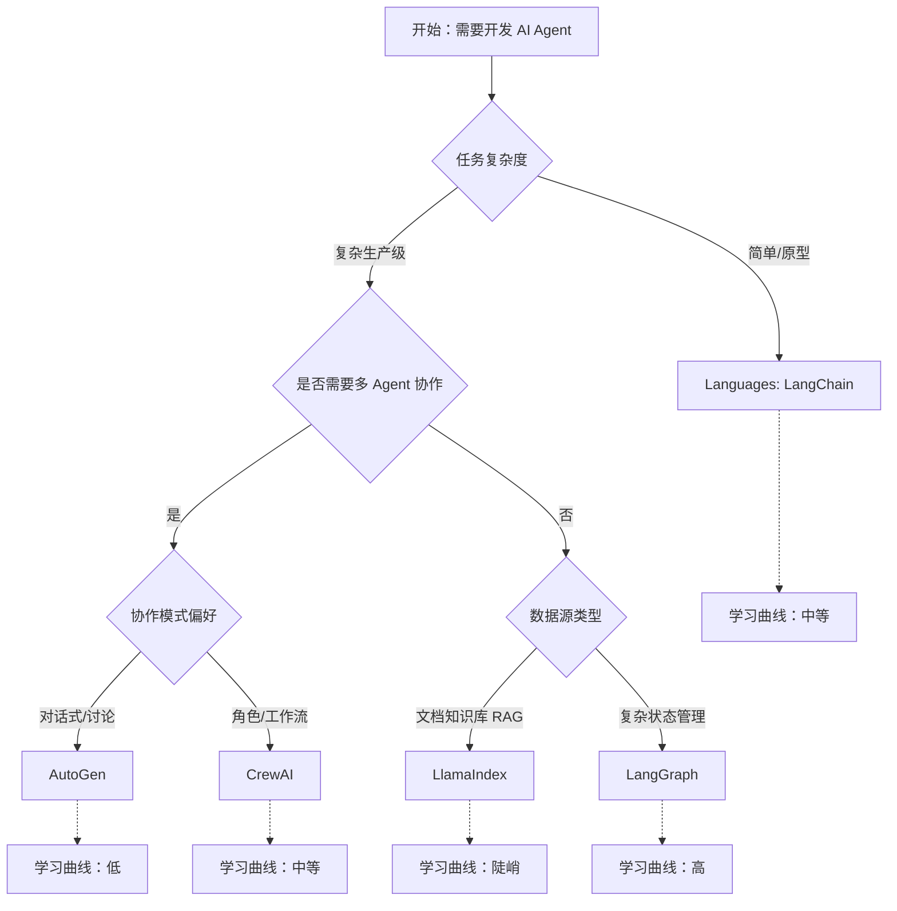

## 第六章：Agent Frameworks 对比与选型

> **摘要**: 本章深度解析主流 AI Agent 开发框架的核心架构、技术特点与适用场景，包括 LangChain、LlamaIndex、AutoGen、LangGraph、CrewAI 等。通过多维度对比分析和实战案例，为开发者提供框架选型的系统方法论。

---

## 6.1 LangChain 核心架构解析

### LangChain 的生态定位与设计哲学

**LangChain** 是 AI Agent 开发领域的先行者，其核心设计理念非常明确：**让 LLM 与其他组件通过"Chain"（链条）有机连接**。这种设计哲学的优势在于：

1. **模块化思维**：将复杂系统拆解为可复用的基础组件
2. **链式组合**：通过简单 chaining 实现复杂工作流
3. **生态丰富**：支持数十种第三方集成（Vector stores、Tools、LLM providers）
4. **快速原型**：10 分钟内搭建基础的 Agent 应用

#### LangChain 的核心优势：
- ✅ **学习曲线平缓**：文档完善，社区活跃
- ✅ **工具集成广泛**：支持搜索、数据库、API 等多种数据源
- ✅ **灵活性高**：可自定义每个组件的实现逻辑
- ✅ **教育价值强**：适合教学和理解 Agent 架构原理

#### LangChain 的局限性：
- ❌ **生产级可靠性不足**：部分组件稳定性有待验证
- ❌ **性能优化有限**：复杂链式调用可能导致延迟累积
- ❌ **多 Agent 协作弱**：原生多 Agent 支持不够完善
- ❌ **调试复杂度**：长链的 trace/debug 较困难

### LangChain 核心架构组件详解

#### Chain Primitives（链条原语）

LangChain 的核心抽象是 **Chain（链条）**——将 LLM、Prompt、Output Parser 等组件串联成完整流程。

```python
# 基础链类型层级：
┌─────────────────────────────┐
│   Simple Chain              │
│   (Prompt → LLM)            │
└──────────┬──────────────────┘
           ↓
┌─────────────────────────────┐
│   LLMChain                  │
│   (LLM + Prompt Template)   │
└──────────┬──────────────────┘
           ↓
┌─────────────────────────────┐
│   Sequential Chain          │
│   (Multiple chains in order)│
└──────────┬──────────────────┘
           ↓
┌─────────────────────────────┐
│   Router Chain              │
│   (Conditional branching)   │
└──────────┬──────────────────┘
           ↓
┌─────────────────────────────┐
│   Agent Workflow            │
│   (Chain + Tools + Memory)  │
└─────────────────────────────┘
```

#### Prompt → LLM → Output Parser 完整工作流

```python
from langchain import prompts, chat_models, output_parsers
from langchain.chains import LLMChain

# Step 1: Define Output Parser
response_parser = SimpleOutputParser()
response_parser.format_instructions = """
Please provide your response in the following format:
<thought_process>Your step-by-step reasoning</thought_process>
<final_answer>Your definitive conclusion</final_answer>
"""

# Step 2: Build Prompt Template with Few-shot examples
template = prompts.FewShotPromptTemplate(
    example_prompt=prompts.PromptTemplate.from_template(
        "User: {input}\nAssistant: {output}"
    ),
    examples=[
        {"input": "What's the weather?", "output": "<final_answer>It's sunny</final_answer>"},
        {"input": "Calculate 2+2", "output": "<final_answer>4</final_answer>"}
    ],
    input_variables=["user_query"],
    prefix="You are a helpful AI assistant.",
    suffix="\nUser: {user_query}\nAssistant:"
)

# Step 3: Initialize LLM with appropriate parameters
llm = chat_models.ChatLiteLLM(
    model_name="gpt-4-turbo",
    temperature=0.3,
    max_tokens=500
)

# Step 4: Create the complete chain
chain = LLMChain(
    prompt=template,
    llm=llm,
    output_parser=response_parser,
    verbose=True
)
```

#### Chain Execution with Memory Integration

```python
from langchain.memory import ConversationBufferMemory

def create_chat_chain_with_memory(llm, memory_window=5):
    """
    Create a chat chain with conversation memory
    """
    # Initialize memory component
    memory = ConversationBufferMemory(
        memory_key="chat_history",
        return_messages=True,
        max_memory_limit=memory_window * 2000  # ~2k tokens per message
    )
    
    # Build conversation chain
    chat_chain = ConversationalRetrievalChain.from_llm(
        llm=llm,
        memory=memory,
        retrieve_relevant_docs=False,  # For pure chat without RAG
        verbose=True
    )
    
    return chat_chain
```

### Agent Types：ReAct / Conversational / Zero-shot

LangChain 支持多种 Agent 类型，每种针对不同场景优化：

#### ReAct Agent（推理 + 行动）

**核心机制：**
- 通过 Thought → Action → Observation 循环执行多步任务
- 适合需要工具调用的复杂场景

**代码示例：**
```python
from langchain.agents import initialize_agent, Tool, AgentType

# Define available tools
tools = [
    Tool(
        name="Search",
        func=google_search,
        description="Useful for when you need to search the web"
    ),
    Tool(
        name="Calculator",
        func=calculate_expression,
        description="Useful for mathematical calculations"
    )
]

# Initialize ReAct agent
agent = initialize_agent(
    tools=tools,
    llm=llm,
    agent=AgentType.ZERO_SHOT_REACT_DESCRIPTION,
    verbose=True,
    max_iterations=10
)

# Execute complex multi-step task
result = agent.run("What's the capital of France and what's 25 * 4?")
```

**适用场景：**
- 需要组合多个工具的任务（查询 + 计算）
- 分步骤执行的复杂问题
- 需要实时数据获取的场景

#### Conversational Agent（对话式 Agent）

**核心机制：**
- 维护对话历史上下文
- 支持多轮交互中的意图识别

```python
from langchain.agents import AgentType
from langchain.memory import ConversationBufferWindowMemory

memory = ConversationBufferWindowMemory(
    memory_key="chat_history",
    k=3,  # Keep last 3 turns in memory
    return_messages=True
)

conversational_agent = initialize_agent(
    tools=tools,
    llm=llm,
    agent=AgentType.CONVERSATIONAL_REACT_DESCRIPTION,
    verbose=True,
    max_iterations=10,
    memory=memory
)
```

**适用场景：**
- 客服聊天机器人
- 需要理解上下文的多轮对话
- 个性化交互体验

#### Zero-shot Agent（零样本代理）

**核心机制：**
- 通过 Prompt 中的示例训练 LLM 理解工具用法
- 适合特定领域的高频任务

```python
from langchain.agents import initialize_agent, Tool, AgentType

# Pre-defined instruction template for specific domain
tools = [
    Tool(
        name="DatabaseQuery",
        func=execute_sql_query,
        description="Execute SQL queries on the analytics database"
    )
]

zero_shot_agent = initialize_agent(
    tools=tools,
    llm=llm,
    agent=AgentType.ZERO_SHOT_REACT_DESCRIPTION,
    verbose=True
)
```

### Memory Integration Patterns（记忆集成模式）

LangChain 提供多种 Memory 实现方式：

#### 1. ConversationBufferMemory（基础缓冲）
```python
from langchain.memory import ConversationBufferMemory

memory = ConversationBufferMemory(
    memory_key="chat_history",
    return_messages=True
)
```
**特点：**
- 完整保留所有对话历史
- 适用于短对话场景
- 内存消耗随对话长度线性增长

#### 2. ConversationSummaryMemory（摘要记忆）
```python
from langchain.memory import ConversationSummaryBufferMemory

summary_memory = ConversationSummaryBufferMemory(
    llm=llm,
    max_tokens=4000,
    buffer_factor=1.5,  # Allow some overflow before summarization
    return_messages=True
)
```
**特点：**
- 定期对话摘要，控制 token 数量
- 适合长对话场景
- 可能丢失部分细节信息

#### 3. VectorStoreRetrieverMemory（向量记忆检索）
```python
from langchain.memory import VectorStoreRetrieverMemory
from langchain.vectorstores import FAISS

vector_store = FAISS.from_texts(
    ["Previous conversations about weather", "User prefers morning flights"],
    embedding_model=embedding_function
)

retriever_memory = VectorStoreRetrieverMemory(
    retriever=vector_store.as_retriever(search_kwargs={"k": 2})
)
```
**特点：**
- 语义检索相关历史对话
- 支持跨会话知识迁移
- 适用于个性化推荐场景

### LangChain 适用场景分析

#### ✅ 适合使用 LangChain 的场景：

1. **快速原型开发**
   - 学习目的：理解 Agent 架构和组件设计
   - MVP 验证：快速搭建功能验证 Demo
   - 教学项目：向他人演示 Agent 工作原理

2. **教育实验性项目**
   - 大学课程作业：学习 LLM 应用开发基础
   - 技术分享演示：展示不同 Agent 类型的差异
   - Proof-of-concept：验证创新想法的可行性

3. **简单任务链**
   - 单工具调用场景
   - 线性执行流程
   - 无需复杂状态管理

#### ⚠️ 需谨慎考虑的场景：

1. **生产级可靠性要求高的系统**
   - 建议：评估 LangGraph 或自建架构

2. **多 Agent 协作的复杂系统**
   - 建议：考虑 AutoGen、LangGraph 或自定义实现

3. **性能敏感的实时应用**
   - 建议：简化链式调用或使用更轻量级框架

---

## 6.2 LlamaIndex 知识图谱方法

### LlamaIndex 的核心定位：RAG 优化的专用框架

**LlamaIndex（原 GPT Index）**与 LangChain 有本质区别：它不是通用 Agent 框架，而是**专注于文档数据索引和检索增强生成（RAG）的垂直领域工具**。

#### 核心设计理念对比：

| 维度 | LangChain | LlamaIndex |
|------|---------|----------||
| **焦点** | 通用 Agent 构建 | RAG/知识库专门化 |
| **优势** | 多工具集成、灵活性 | 文档索引、复杂数据源处理 |
| **学习曲线** | 中等 | 陡峭（RAG 概念多） |
| **性能优化** | 通用优化 | RAG 特定优化 |
| **适用场景** | 多功能 Agent | 知识库问答系统 |

### LlamaIndex 核心架构组件

#### Data Indexing Strategies（数据索引策略）

LlamaIndex 提供了多种数据源和索引方法：

```python
from llama_index import (
    SimpleDirectoryReader,
    VectorStoreIndex,
    KnowledgeGraphIndex,
    SummaryIndex
)
from llama_index.embeddings import HuggingFaceEmbedding

# Load documents from various sources
docs = SimpleDirectoryReader("./data/docs").load_data()

# Strategy 1: Vector-based Index (semantic search)
vector_index = VectorStoreIndex.from_documents(
    docs,
    embed_model=HuggingFaceEmbedding(model_name="all-MiniLM-L6-v2")
)

# Strategy 2: Knowledge Graph Index (entity relationships)
kg_index = KnowledgeGraphIndex.from_documents(
    docs,
    max_triplets_per_chunk=5
)

# Strategy 3: Summary Index (quick lookup)
summary_index = SummaryIndex.from_documents(docs)
```

#### Query Engine Customization（查询引擎定制）

LlamaIndex 的查询系统高度可定制，支持多种检索模式：

```python
from llama_index import StorageContext, load_index_from_disk
from llama_index.query_engine import RetrieverQueryEngine

# Load existing index
storage_context = StorageContext.from_defaults(persist_dir="./index_storage")
query_engine = storage_context.vector_store.as_query_engine(
    similarity_top_k=5,
    response_mode="tree_summarize"
)

# Custom query with filters
filtered_queries = query_engine.query(
    "Explain Q1 2024 financial results",
    filter_kwargs={
        "date_range": ("2024-01-01", "2024-03-31"),
        "document_type": "financial_report"
    }
)

# Advanced: Combine multiple retrieval strategies
def advanced_rag_query(query_text: str):
    # Step 1: Semantic search for relevant passages
    semantic_results = vector_index.as_query_engine().query(query_text)
    
    # Step 2: Graph-based relationship traversal
    graph_results = kg_index.as_query_engine().query(
        f"Find connections related to {query_text}"
    )
    
    # Step 3: Hybrid re-ranking for final answer
    combined_results = rerank_and_combine(semantic_results, graph_results)
    
    return combined_results
```

### RAG Optimization Techniques（RAG 优化技术）

#### 1. Query Rewriting（查询重写）

```python
from llama_index.prompts import PromptTemplate
from llama_index.query_engine import ResponseSynthesizer

# Construct a query rewriting prompt to enhance search relevance
query_rewrite_template = """
Given the following conversation and a follow-up question, rephrase the question 
to be a standalone query that can be used to search the knowledge base effectively.

Chat History:
{chat_history}

Follow-up Question: {query}

Standalone Query:
"""

rewrite_prompt = PromptTemplate(query_rewrite_template)
retriever_query_engine.rewrite_prompts.query_rewrite_prompt = rewrite_prompt
```

#### 2. Hybrid Search（混合检索）

```python
from llama_index.indices.vector_store import VectorStoreIndexWrapper
from llama_index.indices.common import BaseHybridSearchQueryEngine

# Combine keyword matching + semantic similarity
def hybrid_search(query, top_k=10):
    keyword_results = vector_index.as_query_engine(
        similarity_top_k=top_k,
        mode="keyword"
    ).query(query)
    
    semantic_results = vector_index.as_query_engine(
        similarity_top_k=top_k,
        mode="semantic"
    ).query(query)
    
    # Weighted combination
    combined_results = combine_results(keyword_results, semantic_results, weights=[0.4, 0.6])
    return combined_results
```

#### 3. Post-Retrieval Re-ranking（重排序优化）

```python
from llama_index.indices.post_retrieval import ResponseSynthesizer, ReRankQueryEngine

# Initial retrieval with broader scope (k=50)
retriever = vector_index.as_retriever(similarity_top_k=50)

# Post-retrieval re-ranking using cross-encoder model
cross_encoder_reranker = LlamaRerank(
    top_n=10,
    model="cross-encoder/ms-marco-MiniLM-L-6-v2"
)

re_ranking_query_engine = ReRankQueryEngine.from_args(
    vector_index.as_retriever(similarity_top_k=50),
    response_synthesizer=ResponseSynthesizer(response_mode="compact"),
    node_postprocessors=[cross_encoder_reranker]
)
```

### LlamaIndex vs LangChain：复杂数据源对比

#### 实际案例对比分析：处理混合数据源的 RAG 系统

**场景**：构建企业知识库问答系统，包含 PDF、Word、Excel 等多种文档格式。

**LangChain 实现：**
```python
from langchain.document_loaders import (
    PyPDFLoader, Docx2txtLoader, UnstructuredExcelLoader
)
from langchain.text_splitter import RecursiveCharacterTextSplitter
from langchain.vectorstores import FAISS

# Load multiple document types
pdf_loader = PyPDFLoader("./docs/report.pdf")
docs_pdf = pdf_loader.load()

docx_loader = Docx2txtLoader("./docs/manual.docx")
docs_docx = docx_loader.load()

excel_loader = UnstructuredExcelLoader("./docs/metrics.xlsx")
docs_excel = excel_loader.load()

# Merge and split all documents
all_docs = docs_pdf + docs_docx + docs_excel
text_splitter = RecursiveCharacterTextSplitter(chunk_size=1000, chunk_overlap=200)
chunks = text_splitter.split_documents(all_docs)

# Create vector store
vector_store = FAISS.from_documents(chunks, embedding_model)
```

**LlamaIndex 实现：**
```python
from llama_index import (
    SimpleDirectoryReader,
    ServiceContext,
    StorageContext,
    KnowledgeGraphIndex,
    VectorStoreIndex
)

# Unified loading for multiple formats
data = SimpleDirectoryReader("./docs/").load_data()

# Advanced indexing with metadata extraction
metadata_extractor = {
    "file_type": lambda x: x.metadata["file_type"],
    "date_created": lambda x: x.metadata["date_created"]
}

service_context = ServiceContext.from_defaults(
    chunk_size=1000,
    chunk_overlap=200,
    metadata_extractor=metadata_extractor
)

# Automatic indexing for mixed document types
vector_index = VectorStoreIndex.from_documents(
    data,
    service_context=service_context
)
```

**对比结果：**
| 维度 | LangChain | LlamaIndex |
|------|---------|----||
| **加载复杂度** | 需要为每种格式单独编写 loader | 自动识别和加载多种格式 |
| **元数据管理** | 需要手动提取和存储 | 内置元数据管道系统 |
| **知识图谱支持** | 需自行实现图结构索引 | 原生知识图谱索引组件 |
| **查询性能** | 中等，依赖配置优化 | SOTA，针对 RAG 专门优化 |

---

## 6.3 AutoGen / LangGraph / CrewAI 深度对比

### 多维度框架对比表

| 维度 | LangChain | AutoGen | CrewAI | LangGraph | 
|------|---------|-----||----||----|
| **Multi-agent** | Basic | Advanced | Role-based | Workflow |
| **Customization** | High | Medium | High | Very High |
| **Learning Curve** | Medium | Low | Medium | High |
| **Best for** | Single agent workflows, prototyping | Multi-agent chat simulations, collaborative tasks | Role-driven task automation | Complex stateful workflows, production systems |

---

### AutoGen：多 Agent 协作的对话式框架

**核心设计理念：**通过 Agent 之间的**结构化对话**实现任务协作，特别适合模拟人类团队协作场景。

#### AutoGen 的核心架构：
```python
from autogen import AssistantAgent, UserProxyAgent, GroupChat, GroupChatManager
import os

# Define specialized agents
assistant = AssistantAgent(
    name="ResearchAssistant",
    llm_config={"model": "gpt-4-turbo"},
    system_message="You are a research assistant who can search the web and analyze data."
)

programmer = AssistantAgent(
    name="DataAnalyst",
    llm_config={"model": "gpt-4-turbo"},
    system_message="You are an expert data analyst proficient in Python."
)

analyst = AssistantAgent(
    name="BusinessAnalyst",
    llm_config={"model": "gpt-4-turbo"},
    system_message="You analyze business implications and provide recommendations."
)

# Configure human interaction
user_proxy = UserProxyAgent(
    name="UserProxy",
    code_execution_config={
        "work_dir": "coding",
        "use_docker": False,
    },
    is_termination_msg=lambda x: x.get("content", "").rstrip().endswith("TERMINATE"),
    human_input_mode="NEVER"
)

# Create group chat for multi-agent collaboration
groupchat = GroupChat(
    agents=[assistant, programmer, analyst, user_proxy],
    messages=[],
    max_round=12
)

manager = GroupChatManager(groupchat=groupchat)
```

#### 多 Agent 协作模式详解：

```python
# Initiate conversation between specialized agents
def run_collaborative_research_topic(topic: str):
    user_proxy.initiate_chat(
        manager,
        message=f"Research topic: {topic}. Provide comprehensive analysis and recommendations."
    )
```

**执行流程示意：**
```
┌─ ResearchTopic: "AI market trends 2024" ──────────────┐
│                                                        │
│  [UserProxy] → [GroupChatManager]                      │
│                ↓                                       │
│          Select Speaker: AssistantAgent                │
│                ↓                                       │
│      "Let me search for recent AI market data..."     │
│                ↓                                       │
│  [AssistantAgent] → [DataAnalyst]                      │
│            (delegate data analysis)                     │
│                ↓                                       │
│    "I'll analyze the market size and growth trends"   │
│                ↓                                       │
│  [DataAnalyst] executes Python code                    │
│                ↓                                       │
│      Market Size: $XXX billion, Growth: X%            │
│                ↓                                       │
│  [BusinessAnalyst] provides insights                   │
│  "This represents significant opportunity..."          │
│                ↓                                       │
│  [All agents] → [UserProxy] - Final recommendation    │
└───────────────────────────────────────────────────────┘
```

**适用场景：**
- **多 Agent 协作对话**：模拟真实团队讨论过程
- **复杂任务分解**：不同专业 Agent 协同完成大任务
- **教育演示**：展示多 Agent 如何协商和协作
- **创意生成**：多角度探讨激发新想法

---

### CrewAI：角色驱动的自动化框架

**核心设计理念：**为每个 Agent 定义清晰的**角色（Role）**、**目标（Goal）**和**任务（Task）**，通过结构化的工作流自动执行。

#### CrewAI 的核心架构：
```python
from crewai import Agent, Task, Crew, Process
import os

os.environ["OPENAI_API_KEY"] = "your-api-key"

# Define specialized agents with specific roles
class ResearcherAgent(Agent):
    def __init__(self):
        super().__init__(
            role="Senior Market Analyst",
            goal="Analyze market trends and identify opportunities",
            backstory="You are a seasoned analyst with expertise in identifying emerging patterns.",
            verbose=True,
            allow_delegation=False
        )

class DataAnalystAgent(Agent):
    def __init__(self):
        super().__init__(
            role="Data Science Expert",
            goal="Process and analyze datasets to extract actionable insights",
            backstory="You specialize in finding patterns in complex data.",
            verbose=True,
            allow_delegation=False
        )

class WriterAgent(Agent):
    def __init__(self):
        super().__init__(
            role="Technical Writer",
            goal="Compile analysis results into a comprehensive report",
            backstory="You are skilled at transforming technical data into clear prose.",
            verbose=True,
            allow_delegation=False
        )

# Define specific tasks for each agent
market_research_task = Task(
    description="""
    Research the current state of the market, identify key players, 
    and analyze recent trends. Provide a detailed summary with sources.
    """,
    expected_output="A comprehensive market research report with statistics",
    agent=ResearcherAgent()
)

data_analysis_task = Task(
    description="""
    Analyze the collected data to identify correlations, patterns, 
    and potential anomalies. Generate visualizations where appropriate.
    """,
    expected_output="Data analysis results with insights and charts",
    agent=DataAnalystAgent()
)

report_writing_task = Task(
    description="""
    Synthesize the market research and data analysis into a coherent 
    report suitable for executive presentation. Include recommendations.
    """,
    expected_output="Final strategic recommendation report",
    agent=WriterAgent()
)

# Create crew to orchestrate tasks
crew = Crew(
    agents=[ResearcherAgent(), DataAnalystAgent(), WriterAgent()],
    tasks=[market_research_task, data_analysis_task, report_writing_task],
    process=Process.sequential,  # or Process.hierarchical
    verbose=True
)

# Execute the crew's work
result = crew.kickoff()
```

**任务执行流程：**


**适用场景：**
- **工作流自动化**：标准化的业务流程自动化
- **角色分工明确**：每个 Agent 职责清晰的任务链
- **企业应用**：可重复执行的生产环境任务
- **文档生成**：从数据采集到报告生成的完整流程

---

### LangGraph：状态化的复杂工作流引擎

**核心设计理念：**基于 **State Graph（状态图）**的可视化工作流编排，适合需要精确控制执行顺序、支持循环和分支的复杂生产级系统。

#### LangGraph 的核心架构：
```python
from langgraph.graph import StateGraph, END
from typing import TypedDict, Annotated
import operator

# Define state schema for the workflow
class WorkflowState(TypedDict):
    query: str
    search_results: list
    analysis: str
    final_answer: str
    confidence_score: float

# Create workflow graph builder
workflow = StateGraph(WorkflowState)

# Define node functions (processing steps)
def research_node(state: WorkflowState) -> dict:
    """Search and gather relevant information"""
    search_results = perform_web_search(state["query"])
    return {"search_results": search_results}

def analyze_node(state: WorkflowState) -> dict:
    """Analyze collected information"""
    analysis = llm.analyze_content(state["search_results"])
    return {"analysis": analysis}

def answer_node(state: WorkflowState) -> dict:
    """Generate final answer with confidence scoring"""
    from langchain import ChatOpenAI
    
    llm = ChatOpenAI(model="gpt-4")
    prompt = f"Based on the analysis: {state['analysis']}, provide a concise answer to: {state['query']}"
    response = llm.generate([prompt])
    
    # Calculate confidence score
    confidence = calculate_answer_confidence(response, state["analysis"])
    
    return {
        "final_answer": response.generations[0][0].text,
        "confidence_score": confidence
    }

def should_continue(state: WorkflowState) -> str:
    """Conditional routing based on analysis quality"""
    if len(state.get("search_results", [])) < 5:
        return "additional_research"
    elif state.get("confidence_score", 0) >= 0.8:
        return "finalize_answer"
    else:
        return "refine_analysis"

# Add nodes to graph
workflow.add_node("research", research_node)
workflow.add_node("analyze", analyze_node)
workflow.add_node("answer", answer_node)
workflow.add_node("additional_research", additional_research_node)
workflow.add_node("refine_analysis", refine_analysis_node)

# Define edges and conditional routing
workflow.add_edge("research", "analyze")
workflow.add_conditional_edges(
    "answer",
    should_continue,
    {
        "finalize_answer": END,
        "additional_research": "additional_research",
        "refine_analysis": "refine_analysis"
    }
)

# Compile the graph
app = workflow.compile()
```

**LangGraph 的可视化执行流：**


**适用场景：**
- **复杂状态管理**：需要精确控制流程分支和循环
- **生产级可靠性**：可追踪、可调试的工作流执行
- **动态路由**：根据中间结果实时调整后续步骤
- **长生命周期任务**：可能需要多次迭代才能完成的任务

---

### 框架选型决策树



#### 选型决策逻辑详解：

**1. 简单场景 → LangChain**
- ✅ 快速搭建单个 Agent
- ✅ 教学和学习 LLM 应用开发基础
- ✅ 单工具调用或简单链式任务

**2. 多 Agent 对话协作 → AutoGen**
- ✅ 模拟人类团队协作场景
- ✅ 需要多个专业 Agent 讨论和协商
- ✅ 创意生成和问题探索

**3. 角色化工作流自动化 → CrewAI**
- ✅ 清晰的职责分工和流程定义
- ✅ 重复性业务任务自动化
- ✅ 标准化文档生成工作流

**4. RAG 知识库系统 → LlamaIndex**
- ✅ 复杂文档数据的深度索引
- ✅ 需要高级检索优化技术
- ✅ 企业知识管理和问答系统

**5. 复杂生产级工作流 → LangGraph**
- ✅ 需要状态持久化和精确流程控制
- ✅ 复杂的条件分支和循环逻辑
- ✅ 可观测性和调试需求高

---

## 📊 综合对比矩阵

| 维度 | LangChain | AutoGen | CrewAI | LlamaIndex | LangGraph |
|------|---------|--||-----||----||----|
| **核心优势** | 通用 Agent 构建 | Multi-agent 对话协作 | Role-based 工作流自动化 | RAG/知识库专门化 | Stateful workflow 编排 |
| **适合复杂度** | 简单 → 中等 | 中→复杂 | 中等 | 中等 | 复杂 |
| **学习曲线** | ⭐⭐⭐ | ⭐⭐⭐⭐ | ⭐⭐⭐ | ⭐⭐ | ⭐ |
| **生产就绪度** | ⭐⭐ | ⭐⭐⭐ | ⭐⭐⭐⭐ | ⭐⭐⭐ | ⭐⭐⭐⭐⭐ |
| **生态规模** | 最大 | 中→大 | 中→大 | 中 | 小→中 |
| **文档质量** | 优秀 | 良好 | 良好 | 优秀 | 优秀 |
| **调试工具** | 中等 | 良好 | 中等 | 良好 | 优秀 |
| **社区活跃度** | 非常高 | 高 | 中高 | 高 | 中

---

## 🚀 实战建议：混合使用框架的策略

在实际生产环境中，单一框架往往难以满足所有需求。**混合架构**是更优的选择：

### 典型混合架构示例：

```python
# Strategy: Use LlamaIndex for RAG + LangGraph for orchestration
from llama_index import VectorStoreIndex, SimpleDirectoryReader
from langgraph.graph import StateGraph

# Step 1: Use LlamaIndex for knowledge base indexing
data = SimpleDirectoryReader("./docs/").load_data()
vector_index = VectorStoreIndex.from_documents(data)

# Step 2: Use LangGraph for workflow orchestration
workflow = StateGraph(QueryState)

# Add node using LlamaIndex retriever as backend
def query_knowledge_base(state):
    results = vector_index.as_retriever().query(state["query"])
    return {"kb_results": results}

workflow.add_node("retrieve", query_knowledge_base)

# Step 3: Add LangChain tools for dynamic actions
tools = [
    Tool(name="Search", func=web_search),
    Tool(name="Analyze", func=data_analysis)
]

# Step 4: Combine with CrewAI for structured task decomposition
crew_tasks = [
    Task(description="Retrieve knowledge base info"),
    Task(description="Perform web search for current data"),
    Task(description="Synthesize into final response")
]
```

**混合架构优势：**
1. **扬长避短**：每个框架负责其最擅长的领域
2. **渐进式优化**：从简单到复杂逐步升级架构
3. **成本效益**：避免过度工程化或功能不足的两极
4. **灵活性**：根据具体需求自由组合不同组件

---

## 📚 参考文献与延伸阅读

1. **LangChain Documentation** - Official Reference [[langchain.com]](https://python.langchain.com/docs/get_started/introduction)
2. **AutoGen: Enabling Next-Gen LLM Applications via Multi-Agent Conversation** - Microsoft Research (2023) [[arXiv:2308.08155]](https://arxiv.org/abs/2308.08155)
3. **CrewAI Framework Documentation** - CrewAI Official Docs [[crewai.com/docs]](https://docs.crewai.com/)
4. **LangGraph: Orchestration for Complex AI Workflows** - LangChain Blog (2024) [[blog.langchain.dev]](https://blog.langchain.dev/langgraph/
5. **LlamaIndex: RAG Optimization and Indexing Strategies** - LlamaIndex Technical Guide (2023) [[llamaindex.ai/docs]](https://docs.llamaindex.ai/en/latest/)

---

**[下一章]**：第七章 OpenClaw 架构深度解析 - 剖析开源 Agent 平台的核心设计与技术实现

**[上一章]**：第五章 Tools & API Integration（已完成）

<script>
document.addEventListener('DOMContentLoaded', function() {
  if (typeof mermaid !== 'undefined') {
    mermaid.initialize({
      startOnLoad: true,
      theme: 'default',
      securityLevel: 'loose'
    });
  }
});
</script>
