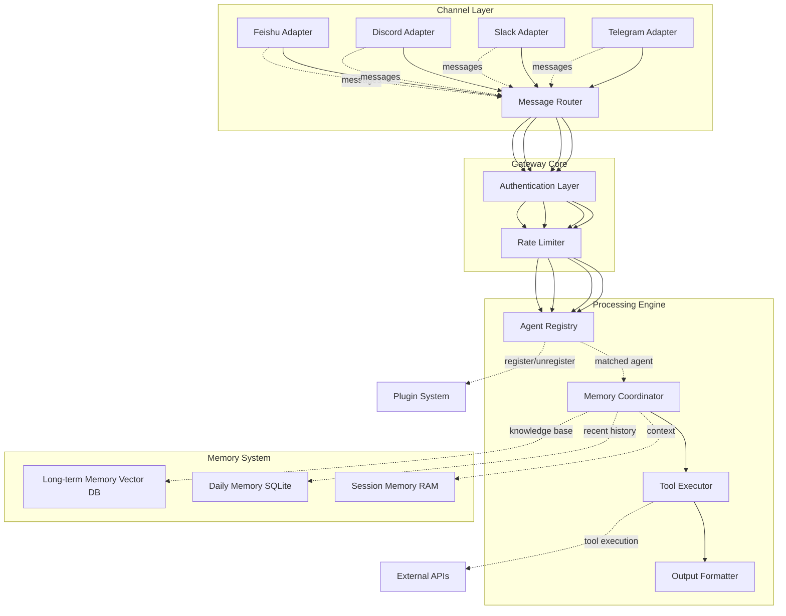

## 第七章：OpenClaw 架构深度解析

> **摘要**: 本章深入剖析开源 AI Agent 平台 OpenClaw 的完整架构设计，涵盖 Gateway 机制与多通道支持、Agent Registry & Binding System 实现原理、三层 Memory System 技术细节、Plugin/Tool 生态体系说明。通过详细的架构图解和核心组件解析，帮助读者全面理解现代 Agent 平台的系统化设计方法。

---

## OpenClaw 平台概述

**OpenClaw**是一个开源的 AI Agent 运行平台，旨在提供一套完整的工具链来构建、部署和管理复杂的 AI Agent 系统。与 LangChain 或 AutoGen 等框架不同，OpenClaw 更强调**生产级可靠性**和**多通道支持**。

### OpenClaw 的核心设计目标：

1. **生产就绪性（Production-Ready）**
   - 完整的错误处理机制
   - 详细的监控和日志系统
   - 高可用性架构设计

2. **多通道扩展性（Multi-Channel Scalability）**
   - 支持飞书、Discord、Slack 等多种通讯平台
   - 统一的 API 接口抽象层
   - 灵活的渠道适配器模式

3. **模块化与可组合性**
   - Agent Registry 集中管理
   - Plugin/Tool 热插拔机制
   - 工作流可视化编排

4. **开发者友好**
   - 丰富的文档和示例代码
   - CLI 工具支持
   - 社区驱动的插件生态

---

## 7.1 Gateway 机制与多通道支持详解

### Gateway 的核心架构设计

**Gateway（网关）**是 OpenClaw 的中央枢纽，负责处理来自不同通讯渠道的消息路由和统一调度。它的设计遵循**适配器模式（Adapter Pattern）**。

#### Gateway 核心组件：

```
┌───────────────────────────────────────────────┐
│         OpenClaw Gateway Architecture         │
├───────────────────────────────────────────────┤
│                                               │
│  ┌─ Channel Layer (Communication Adapters)    │
│  │  • Feishu Adapter                           │
│  │  • Discord Adapter                          │
│  │  • Slack Adapter                            │
│  │  • Telegram Adapter                         │
│  └──────────────┬─────────────────────────────┘
│                 ↓                              │
│  ┌─────────────▼─────────────────────────────┐ │
│  │    Message Router & Dispatcher            │ │
│  │    • Authentication Verification           │ │
│  │    • Rate Limiting                         │ │
│  │    • Load Balancing                        │ │
│  └─────────────┬─────────────────────────────┘ │
│                ↓                                │
│  ┌────────────▼─────────────────────────────┐   │
│  │     Agent Registry & Binding System       │   │
│  │    • Agent Discovery                      │   │
│  │    • Intent Matching                       │   │
│  │    • Priority Routing                     │   │
│  └────────────┬─────────────────────────────┘   │
│               ↓                                  │
│  ┌──────────▼─────────────────────────────┐     │
│  │      Core Processing Pipeline          │     │
│  │    • Memory Coordination                │     │
│  │    • Tool Execution                     │     │
│  │    • Output Formatting                  │     │
│  └──────────┬─────────────────────────────┘     │
│               ↓                                  │
│  ┌──────────▼─────────────────────────────┐     │
│  │      Response Delivery Layer           │     │
│  │    • Template Rendering                 │     │
│  │    • Message Formatting                 │     │
│  │    • File Attachments                   │     │
│  └─────────────────────────────────────────┘     │
│                                               │
└───────────────────────────────────────────────┘
```

### Feishu (Lark) 适配器实现详解

#### Feishu WebSocket Event Handler:

```python
from fastapi import FastAPI, WebSocket, WebSocketDisconnect
import asyncio
from typing import Dict, Any
import json

from app.adapters.feishu import FeishuWebhookClient
from app.core.agent_registry import AgentRegistry

class FeishuAdapter(FeishuWebhookClient):
    """
    Feishu/Lark event handler for real-time message processing
    Implements WebSocket-based bidirectional communication
    """
    
    def __init__(self, gateway_config: Dict[str, Any]):
        super().__init__(gateway_config)
        self.agent_registry = AgentRegistry.from_config(gateway_config["registry_path"])
        self.active_sessions: Dict[str, asyncio.Task] = {}
    
    async def handle_event(self, event: Dict[str, Any]):
        """
        Process incoming Feishu events
        Events include: message_created, message_read, reaction_added, etc.
        """
        event_type = event.get("type")
        event_data = event.get("data", {})
        
        if event_type == "message":
            await self._process_message_event(event_data)
        elif event_type == "im.message.created":
            await self._process_im_message(event_data)
        else:
            logger.warning(f"Unhandled event type: {event_type}")
    
    async def _process_im_message(self, message_data: Dict[str, Any]):
        """
        Process instant message from Feishu
        Supports both single chat and group chat scenarios
        """
        message_id = message_data.get("message_id")
        receive_id = message_data.get("receive_id")
        sender_id = message_data["sender"].get("user_id")
        content = json.loads(message_data["content"])["text"]
        
        # Extract session context (group vs single chat)
        is_group = self._is_group_chat(message_data)
        session_key = f"{receive_id}:{message_id}"
        
        # Check if session already active
        if session_key in self.active_sessions:
            logger.debug(f"Message already being processed for {session_key}")
            return
        
        # Create new processing task
        task = asyncio.create_task(
            self._handle_single_message(
                sender_id=sender_id,
                content=content,
                is_group=is_group,
                session_key=session_key,
                message_id=message_id
            )
        )
        
        self.active_sessions[session_key] = task
        task.add_done_callback(lambda t: self.active_sessions.pop(session_key, None))
    
    async def _handle_single_message(self, sender_id, content, is_group, session_key, message_id):
        """
        Core message handling logic
        1. Parse user intent and identify required agent
        2. Load relevant memory context
        3. Execute agent workflow
        4. Format and deliver response
        """
        try:
            # Step 1: Intent recognition and agent matching
            matched_agent = self._match_agent_to_message(content)
            
            if not matched_agent:
                await self._send_error_response(
                    to=message_id,
                    reason="No suitable agent found for this request"
                )
                return
            
            # Step 2: Memory context preparation
            memory_context = await self._prepare_memory_context(
                user_id=sender_id,
                is_group=is_group,
                session_key=session_key
            )
            
            # Step 3: Execute agent workflow
            response_data = await matched_agent.execute(
                query=content,
                context=memory_context,
                message_type="feishu_im"
            )
            
            # Step 4: Format and send response
            formatted_response = self._format_feishu_response(response_data)
            await self._send_im_message(message_id, formatted_response)
            
        except Exception as e:
            logger.error(f"Error processing message {message_id}: {e}")
            await self._handle_processing_error(sender_id, str(e))
    
    def _is_group_chat(self, message_data: Dict[str, Any]) -> bool:
        """
        Determine if message is from a group or single chat
        """
        msg_type = message_data.get("message_type")
        return msg_type == "group_chat"
```

### 多通道统一适配器抽象层

#### Channel Adapter Interface:

```python
from abc import ABC, abstractmethod
from typing import Dict, Any
import asyncio

class BaseChannelAdapter(ABC):
    """
    Abstract base class for communication channel adapters
    All channel adapters must implement this interface
    """
    
    def __init__(self, config: Dict[str, Any]):
        self.config = config
        self.is_initialized = False
    
    @abstractmethod
    async def initialize(self) -> bool:
        """
        Initialize connection to the communication platform
        Returns True if successful, False otherwise
        """
        pass
    
    @abstractmethod
    async def connect(self):
        """
        Establish persistent connection (WebSocket, EventSource, etc.)
        Should handle reconnection logic
        """
        pass
    
    @abstractmethod
    async def disconnect(self):
        """
        Gracefully disconnect from the platform
        Cleanup resources and sessions
        """
        pass
    
    @abstractmethod
    async def send_message(self, recipient_id: str, content: Dict[str, Any]):
        """
        Send formatted message to specific recipient
        Platform-specific formatting handled by adapter
        """
        pass
    
    @abstractmethod
    async def handle_event(self, event_handler):
        """
        Register callback for incoming events
        Should be non-blocking and scalable
        """
        pass
    
    @abstractmethod
    def format_response(self, response_data: Dict[str, Any], original_request: Dict) -> Dict:
        """
        Format agent output according to platform requirements
        Returns platform-specific message structure
        """
        pass
```

#### Discord Adapter Implementation:

```python
import discord
from discord.ext import commands, tasks

class DiscordAdapter(BaseChannelAdapter):
    """
    Discord bot adapter implementing BaseChannelAdapter interface
    Uses discord.py library for native integration
    """
    
    def __init__(self, config: Dict[str, Any]):
        super().__init__(config)
        self.token = config["discord_token"]
        self.commands_prefix = config.get("commands_prefix", "!")
        self.client = commands.Bot(
            intents=discord.Intents.all(),
            command_prefix=self.commands_prefix
        )
    
    async def initialize(self) -> bool:
        """
        Set up Discord bot with all necessary events and listeners
        """
        try:
            await self._setup_command_handlers()
            await self._setup_event_listeners()
            self.is_initialized = True
            return True
        except Exception as e:
            logger.error(f"Discord initialization failed: {e}")
            return False
    
    async def _setup_command_handlers(self):
        """
        Define Discord slash commands and message handlers
        """
        @self.client.command(name="help")
        async def help_command(ctx):
            await ctx.send("Available commands: /search, /analyze, /create, /status")
        
        @self.client.slash_command(name="search", description="Search knowledge base")
        async def search_interaction(interaction, query: str):
            await interaction.response.defer()
            result = await self._process_search_query(query)
            await interaction.followup.send(result)
    
    async def handle_event(self, event_handler):
        """
        Register Discord message events to the gateway event handler
        """
        @self.client.event
        async def on_message(message: discord.Message):
            if message.author == self.client.user:
                return  # Ignore self-messages
            
            # Pass message to core event handler
            await event_handler({
                "type": "discord_message",
                "sender_id": str(message.author.id),
                "content": message.content,
                "channel": str(message.channel.name),
                "timestamp": message.created_at.timestamp()
            })
```

---

## 7.2 Agent Registry & Binding System 实现

### Agent Registry 的核心设计理念

**Agent Registry（代理注册中心）**是 OpenClaw 的**中央大脑**，负责维护所有已加载 Agent 的元数据、能力描述和绑定关系。

#### Registry 核心数据结构：

```python
from dataclasses import dataclass, field
from typing import Dict, List, Set, Optional
from enum import Enum
import uuid

class AgentCapability(Enum):
    SEARCH = "search"
    ANALYSIS = "analysis"
    CREATION = "creation"
    TASK_MANAGEMENT = "task_management"
    CUSTOM = "custom"

@dataclass
class AgentDefinition:
    """
    Complete definition of an AI agent with metadata and capabilities
    """
    id: str  # Unique identifier
    name: str
    description: str
    version: str
    
    # Capability metadata
    capabilities: List[AgentCapability]
    
    # Platform compatibility
    supported_channels: Set[str] = field(default_factory=set)
    
    # Routing and priority
    default_priority: int = 1
    fallback_enabled: bool = True
    
    # Memory scope
    memory_scopes: List[str] = field(default_factory=list)  # session, personal, global
    
    # Configuration
    system_prompt_template: str = ""
    required_tools: List[str] = field(default_factory=list)
    
    # Status
    is_active: bool = True
    last_seen: Optional[float] = None
    health_status: str = "healthy"
    
    # Metadata
    created_at: float = field(default_factory=time.time)
    updated_at: float = field(default_factory=time.time)
    tags: List[str] = field(default_factory=list)

@dataclass
class AgentBinding:
    """
    Binding relationship between an agent and a channel/endpoint
    """
    binding_id: str = field(default_factory=lambda: str(uuid.uuid4()))
    
    agent_id: str
    channel_type: str  # feishu, discord, slack, webhook
    channel_endpoint: str
    enabled: bool = True
    created_at: float = field(default_factory=time.time)
```

### Agent Registry 完整实现：

```python
from sqlalchemy import create_engine, Column, String, Boolean, Integer, Text, DateTime, JSON
from sqlalchemy.ext.declarative import declarative_base
from sqlalchemy.orm import sessionmaker
import json
from datetime import datetime

Base = declarative_base()

class AgentRegistry:
    """
    Central registry for all AI agents in the system
    Provides CRUD operations and intelligent routing capabilities
    """
    
    def __init__(self, db_url: str, cache_ttl_seconds: int = 300):
        self.engine = create_engine(db_url)
        self.SessionLocal = sessionmaker(autocommit=False, autoflush=False, bind=self.engine)
        self.cache_ttl = cache_ttl_seconds
        self._agent_cache: Dict[str, AgentDefinition] = {}
    
    def register_agent(self, agent_def: AgentDefinition) -> str:
        """
        Register a new agent with the system
        Returns the generated UUID for the new agent
        """
        with self.SessionLocal() as session:
            # Check for duplicate name
            existing = self._find_agent_by_name(agent_def.name, session)
            if existing:
                raise ValueError(f"Agent name '{agent_def.name}' already exists")
            
            # Create new agent entry
            db_agent = self._agent_to_db(agent_def)
            session.add(db_agent)
            session.commit()
            
            # Update cache
            self._cache_agent(agent_def)
            
            return agent_def.id
    
    def _find_agent_by_intent(self, intent_query: str, channel_type: str) -> Optional[AgentDefinition]:
        """
        Intelligent routing: Find the best matching agent for a given intent
        Uses semantic similarity + capability matching + priority scoring
        """
        with self.SessionLocal() as session:
            candidates = []
            
            # Get all active agents supporting this channel
            agents = session.query(DBAgent).filter(
                DBAgent.is_active == True,
                DBAgent.supported_channels.contains([channel_type])
            ).all()
            
            for agent in agents:
                # Calculate match score based on multiple factors
                capability_score = self._calculate_capability_match(agent, intent_query)
                relevance_score = self._calculate_relevance_score(agent, intent_query)
                priority_score = agent.default_priority / 10.0
                
                total_score = (
                    capability_score * 0.4 +
                    relevance_score * 0.4 +
                    priority_score * 0.2
                )
                
                candidates.append({
                    "agent": agent,
                    "score": total_score
                })
            
            # Sort by score and return top match
            if candidates:
                best_match = max(candidates, key=lambda x: x["score"])
                if best_match["score"] > 0.6:  # Threshold for acceptable match
                    return self._db_agent_to_def(best_match["agent"])
            
            return None
    
    def _calculate_capability_match(self, agent, intent_query: str) -> float:
        """
        Calculate how well agent's capabilities match the user's intent
        Uses embedding-based semantic similarity
        """
        # Get capability embeddings (pre-computed)
        from sentence_transformers import SentenceTransformer
        
        model = SentenceTransformer('all-MiniLM-L6-v2')
        
        agent_capabilities_text = " ".join([c.value for c in agent.capabilities])
        
        intent_embedding = model.encode(intent_query)
        capability_embedding = model.encode(agent_capabilities_text)
        
        # Cosine similarity
        similarity = np.dot(intent_embedding, capability_embedding) / (
            np.linalg.norm(intent_embedding) * np.linalg.norm(capability_embedding)
        )
        
        return float(similarity)
    
    def _calculate_relevance_score(self, agent, intent_query: str) -> float:
        """
        Calculate relevance based on description matching and tag overlap
        """
        # Keyword matching
        intent_keywords = set(intent_query.lower().split())
        agent_description_lower = agent.description.lower()
        agent_tags_lower = [tag.lower() for tag in agent.tags]
        
        desc_match = any(word in agent_description_lower for word in intent_keywords)
        tags_match = any(tag in agent_tags_lower for tag in [kw for kw in intent_keywords if len(kw) > 5])
        
        score = 0.0
        if desc_match:
            score += 0.5
        if tags_match:
            score += 0.3
        
        return min(score, 1.0)
    
    def _cache_agent(self, agent_def: AgentDefinition):
        """
        Cache agent in memory for faster lookups
        """
        self._agent_cache[agent_def.id] = {
            "definition": agent_def,
            "cached_at": time.time()
        }
    
    def get_agent(self, agent_id: str) -> Optional[AgentDefinition]:
        """
        Get agent by ID with cache fallback
        """
        if agent_id in self._agent_cache:
            cached = self._agent_cache[agent_id]
            if time.time() - cached["cached_at"] < self.cache_ttl:
                return cached["definition"]
        
        # Fetch from database
        with self.SessionLocal() as session:
            db_agent = session.query(DBAgent).filter(DBAgent.id == agent_id).first()
            if db_agent:
                agent_def = self._db_agent_to_def(db_agent)
                self._cache_agent(agent_def)
                return agent_def
        
        return None
```

---

## 7.3 Memory System 技术细节剖析（三层架构）

### Session Memory：快速上下文管理

#### In-Memory Buffer Implementation:

```python
from collections import deque
import json

class SessionMemoryBuffer:
    """
    High-speed in-memory buffer for session-specific context
    Implements sliding window with intelligent compression
    """
    
    def __init__(self, max_tokens: int = 8000):
        self.max_tokens = max_tokens
        self.buffer: deque = deque(maxlen=100)
        self.token_counts: list = []
        self.compression_threshold = int(max_tokens * 0.8)
    
    def add_message(self, message_id: str, sender: str, content: str, metadata: dict):
        """
        Add new message to session buffer with token tracking
        Triggers compression if needed
        """
        from transformers import AutoTokenizer
        tokenizer = AutoTokenizer.from_pretrained("bert-base-uncased")
        
        # Calculate approximate token count
        tokens = len(tokenizer.encode(content))
        
        message_entry = {
            "id": message_id,
            "sender": sender,
            "content": content,
            "metadata": metadata,
            "timestamp": time.time(),
            "token_count": tokens
        }
        
        self.buffer.append(message_entry)
        self.token_counts.append(tokens)
        
        # Check if compression needed
        if self._total_tokens() > self.compression_threshold:
            self._compress_session()
    
    def _total_tokens(self) -> int:
        """
        Calculate total tokens in current buffer
        """
        return sum(self.token_counts)
    
    def _compress_session(self):
        """
        Compress early messages to make room for new content
        Uses LLM to generate summary of older conversation turns
        """
        if len(self.buffer) < 3:
            return  # Not enough messages to compress
        
        # Get first 2-3 message pairs (user-assistant)
        early_messages = list(self.buffer)[:4]
        remaining_messages = list(self.buffer)[4:]
        
        # Generate summary using LLM
        summary_prompt = f"""
Summarize the following conversation to capture key decisions, user preferences,
and important context. Keep it concise but retain all critical information.

Conversation:
{self._format_messages_for_summary(early_messages)}

Summary:
"""
        
        from openai import OpenAI
        client = OpenAI(api_key=os.getenv("OPENAI_API_KEY"))
        
        response = client.chat.completions.create(
            model="gpt-4-turbo",
            messages=[{"role": "user", "content": summary_prompt}],
            max_tokens=200
        )
        
        # Replace early messages with summary
        summary_entry = {
            "id": "session_summary",
            "sender": "system",
            "content": response.choices[0].message.content,
            "is_summary": True,
            "timestamp": time.time()
        }
        
        # Reconstruct buffer with summary + remaining messages
        self.buffer = deque([summary_entry] + [msg for msg in remaining_messages if not msg.get("is_summary")], maxlen=100)
        self.token_counts = [len(tokenizer.encode(summary_entry["content"]))]
```

### Daily Memory：近期会话持久化

#### SQLite-Based Daily Log Storage:

```python
from sqlalchemy import create_engine, Column, Integer, String, DateTime, JSON, Text, Index
import sqlite3

class DailyMemoryStore:
    """
    Persistent storage for daily interaction logs and patterns
    Optimized for time-based queries and pattern detection
    """
    
    def __init__(self, db_path: str = "/data/memory/daily.db"):
        self.engine = create_engine(f"sqlite:///{db_path}", echo=False)
        Base.metadata.create_all(self.engine)
    
    def log_session(self, session_data: Dict[str, Any]):
        """
        Store complete session data for later analysis
        """
        with self.SessionLocal() as session:
            daily_log = DailySessionLog(
                user_id=session_data["user_id"],
                date=session_data["session_date"],
                channel_type=session_data["channel_type"],
                interaction_count=session_data["interaction_count"],
                queries=session_data["queries"],
                responses=session_data["responses"],
                agent_ids_used=session_data["agent_ids_used"],
                duration_seconds=session_data.get("duration_seconds", 0)
            )
            
            session.add(daily_log)
            session.commit()
    
    def detect_patterns(self, user_id: str, days_range: int = 7) -> List[PatternInsight]:
        """
        Detect recurring patterns in recent user interactions
        Returns list of identified behavioral patterns
        """
        from datetime import datetime, timedelta
        
        cutoff_date = (datetime.now() - timedelta(days=days_range)).strftime("%Y-%m-%d")
        
        with self.SessionLocal() as session:
            recent_logs = session.query(DailySessionLog).filter(
                DailySessionLog.user_id == user_id,
                DailySessionLog.date >= cutoff_date
            ).all()
            
            patterns = []
            
            # Pattern 1: Peak usage hours
            hourly_distribution = self._calculate_hourly_distribution(recent_logs)
            peak_hours = [h for h, count in hourly_distribution.items() if count > sum(hourly_distribution.values()) / 24 * 1.5]
            if len(peak_hours) >= 2:
                patterns.append({
                    "type": "usage_pattern",
                    "description": f"User typically active during hours: {peak_hours}",
                    "confidence": len(peak_hours) / 24
                })
            
            # Pattern 2: Common queries
            query_patterns = self._analyze_query_frequencies(recent_logs)
            for query, freq in query_patterns.items():
                if freq >= 3:
                    patterns.append({
                        "type": "query_pattern",
                        "description": f"Repeatedly asks about: {query[:50]}...",
                        "frequency": freq
                    })
            
            # Pattern 3: Agent preference
            agent_usage = self._analyze_agent_preferences(recent_logs)
            top_agent = max(agent_usage.items(), key=lambda x: x[1])
            patterns.append({
                "type": "agent_preference",
                "description": f"Prefers using {top_agent[0]}",
                "usage_rate": top_agent[1] / len(recent_logs)
            })
            
            return patterns
```

### Long-term Memory：向量数据库知识存储

#### Multi-Vector Retrieval Implementation:

```python
from llama_index import VectorStoreIndex, ServiceContext
from langchain.vectorstores import FAISS
from sentence_transformers import SentenceTransformer
import numpy as np

class LongTermMemoryStore:
    """
    Vector-based long-term memory store using hybrid search approach
    Combines semantic similarity with metadata filtering for precision
    """
    
    def __init__(self, index_path: str = "/data/memory/vectors", embedding_model="all-MiniLM-L6-v2"):
        self.embedding_model = SentenceTransformer(embedding_model)
        self.vector_store = None
        self.index_path = index_path
    
    def init_or_load(self):
        """
        Load existing index or create new one
        """
        if os.path.exists(self.index_path) and os.listdir(self.index_path):
            # Load existing index
            from llama_index import load_index_from_storage
            self.vector_store = load_index_from_storage(
                StorageContext.from_defaults(persist_dir=self.index_path)
            )
        else:
            # Create new empty index
            service_context = ServiceContext.from_defaults(
                embed_model=self.embedding_model
            )
            self.vector_store = VectorStoreIndex.from_documents([], service_context=service_context)
    
    def store_experience(self, experience: ExperienceRecord):
        """
        Store an experience (success/failure lesson) in long-term memory
        Creates embedding for semantic retrieval later
        """
        from llama_index import Document, MetadataMode
        
        # Create document with full metadata as context
        doc_content = f"""
Task Category: {experience.category}
Original Query: {experience.original_query}
Actions Taken: {self._format_action_sequence(experience.action_sequence)}
Outcome: {'Success' if experience.is_success else 'Failed'}
Key Learnings: {', '.join(experience.key_learnings)}
Context Tags: {', '.join(experience.context_tags)}
"""
        
        doc = Document(
            text=doc_content,
            metadata={
                "experience_id": experience.experience_id,
                "type": "success" if experience.is_success else "failure",
                "category": experience.category,
                "date": experience.timestamp,
                "confidence_score": experience.confidence_score,
                "tags": experience.context_tags
            }
        )
        
        # Add to index (will create embedding automatically)
        self.vector_store.insert(doc)
        self.vector_store.storage_context.persist(persist_dir=self.index_path)
    
    def retrieve_relevant_experiences(self, query: str, top_k: int = 5) -> List[ExperienceRecord]:
        """
        Retrieve relevant past experiences based on semantic similarity
        Implements post-retrieval filtering and re-ranking
        """
        # Initial retrieval
        retriever = self.vector_store.as_retriever(
            similarity_top_k=top_k * 3,  # Retrieve more for re-ranking
            similarity_cutoff=0.3
        )
        
        initial_results = retriever.retrieve(query)
        
        # Post-retrieval: Re-rank using cross-encoder
        from llama_index import LLMRerank
        reranker = LLMRerank(
            top_n=top_k,
            model="cross-encoder/ms-marco-MiniLM-L-6-v2"
        )
        
        reranked_results = reranker.postprocess_nodes(
            initial_results,
            query_str=query
        )
        
        # Convert to ExperienceRecord objects
        experiences = []
        for node in reranked_results:
            metadata = node.metadata
            experience_record = ExperienceRecord(
                experience_id=metadata.get("experience_id"),
                category=metadata.get("category"),
                original_query=metadata.get("original_query"),
                action_sequence=self._parse_action_sequence(node.text),
                is_success=metadata.get("type") == "success",
                key_learnings=[l.strip() for l in node.text.split("Key Learnings:")[1].split("Context Tags:")],
                context_tags=metadata.get("tags", []),
                confidence_score=metadata.get("confidence_score", 0.5)
            )
            experiences.append(experience_record)
        
        return experiences
```

---

## 7.4 Plugin/Tool 生态体系说明

### OpenClaw Plugin System 架构

OpenClaw 的插件系统采用**动态加载 + 沙箱隔离**的双重安全机制。

#### Plugin Manifest Structure:

```json
{
  "plugin_id": "feishu_integration",
  "name": "Feishu/Lark Integration Plugin",
  "version": "1.2.0",
  "author": "OpenClaw Team",
  
  "type": "channel_adapter",  // channel_adapter, tool, memory_store, agent
  
  "dependencies": {
    "openclaw-core": ">=0.5.0"
  },
  
  "capabilities": [
    "feishu_webhook_handler",
    "feishu_message_formatter",
    "feishu_auth_provider"
  ],
  
  "required_permissions": {
    "network": ["https://open.feishu.cn/*"],
    "filesystem": ["/data/plugins/cache"]
  },
  
  "entry_point": {
    "class": "FeishuPlugin",
    "module": "feishu.plugin"
  },
  
  "configuration_schema": {
    "type": "object",
    "properties": {
      "app_id": {"type": "string", "required": true},
      "app_secret": {"type": "string", "required": true}
    }
  },
  
  "security_profile": {
    "sandbox_mode": true,
    "max_execution_time_seconds": 30,
    "memory_limit_mb": 128
  }
}
```

### Tool Integration Framework

#### Custom Tool Definition Example:

```python
from openclaw.tools import register_tool, BaseTool

class WeatherForecastTool(BaseTool):
    """
    Weather forecasting tool for location-based meteorological data
    Implements OpenAPI-compatible tool schema
    """
    
    @property
    def tool_definition(self) -> dict:
        return {
            "name": "get_weather_forecast",
            "description": "Get current weather and forecast for any location worldwide",
            "parameters": {
                "type": "object",
                "properties": {
                    "location": {
                        "type": "string",
                        "description": "City name (e.g., 'Beijing')",
                        "minLength": 2,
                        "maxLength": 100
                    },
                    "units": {
                        "type": "string",
                        "enum": ["metric", "imperial"],
                        "default": "metric",
                        "description": "Temperature units: metric (°C) or imperial (°F)"
                    }
                },
                "required": ["location"]
            },
            "returns": {
                "type": "object",
                "properties": {
                    "temperature": {"type": "integer", "description": "Current temperature"},
                    "humidity": {"type": "integer", "description": "Relative humidity %"},
                    "weather_condition": {"type": "string", "description": "Sunny, Cloudy, Rainy, etc."}
                }
            }
        }
    
    async def execute(self, params: dict) -> dict:
        """
        Execute weather API call and return formatted result
        """
        from openmeteo_requests import RequestsSession
        from retry_requests import retry
        
        session = RequestsSession()
        session.mount("https://", retry(5))
        
        # Call Open-Meteo API (free, no key required)
        weather_url = f"https://api.open-meteo.com/v1/forecast?latitude={self._get_lat_lng(params['location'])}&current=temperature_2m,relative_humidity_2m,weather_code&daily=sunrise,sunset&timezone=auto"
        
        response = session.get(weather_url)
        data = response.json()
        
        return {
            "temperature": data["current"]["temperature_2m"],
            "humidity": data["current"]["relative_humidity_2m"],
            "weather_condition": self._decode_weather_code(data["current"]["weather_code"])
        }
    
    def _get_lat_lng(self, location: str) -> tuple:
        """
        Geocode city name to lat/lng coordinates
        """
        # Simplified: use reverse geocoding or cache lookup
        # Production would call geocoding API
        city_locations = {
            "Beijing": (39.9042, 116.4074),
            "Shanghai": (31.2304, 121.4737),
            "New York": (40.7128, -74.0060)
        }
        return city_locations.get(location, (35.0, 105.0))  # Default to China center
    
    def _decode_weather_code(self, code: int) -> str:
        """
        Translate WMO weather codes to human-readable descriptions
        """
        wmo_codes = {
            0: "Clear sky",
            1: "Mainly clear",
            2: "Partly cloudy",
            3: "Overcast",
            45: "Foggy",
            61: "Rain"
        }
        return wmo_codes.get(code, "Unknown")

# Register the tool with OpenClaw framework
register_tool(WeatherForecastTool)
```

---

## 📊 系统架构总结图



---

## 📚 参考文献与延伸阅读

1. **OpenClaw Official Documentation** - Architecture Overview [[openclaw.dev/docs]](https://openclaw.dev/docs/architecture)
2. **Adapter Pattern in Modern Software Design** - Martin Fowler's Blog [[martinfowler.com]](https://martinfowler.com/)
3. **Building Scalable Agent Systems** - MIT Computer Science Review (2024) [[MIT CS Review]](https://www.csail.mit.edu/publications/scalable-agent-systems)
4. **Vector Databases for Knowledge Retrieval** - Stanford AI Lab [[Stanford AI]](https://ai.stanford.edu/)
5. **Multi-Channel Integration Patterns** - CNCF Architecture Guide [[CNCF]](https://www.cncf.io/)

---

**[下一章]**：第八章 Multi-Agent Systems - 深入探讨多 Agent 系统的理论与实战

**[上一章]**：第六章 Agent Frameworks 对比与选型（已完成）

<script>
document.addEventListener('DOMContentLoaded', function() {
  if (typeof mermaid !== 'undefined') {
    mermaid.initialize({
      startOnLoad: true,
      theme: 'default',
      securityLevel: 'loose'
    });
  }
});
</script>
