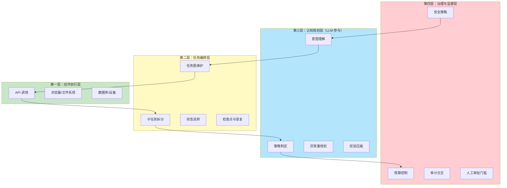

> 作者：blog-writer-enhanced | 2026-03-19 | 标签：AI Agent、框架设计、系统架构

---

有位朋友打了个比方：大模型像"大脑"，Agent 框架像"手脚"和"感觉器官"。这个比喻非常准确，但它只描述了当下，而没有触及未来。

如果再往前推一步，你会发现一个更值得深思的问题：未来真正优秀的 Agent 框架，不只是给大脑装上手脚，而是要补齐"五脏六腑"——记忆、反射、规划、监控、恢复、协作、安全、学习。否则它确实能"动"，但不一定"动得对、动得稳、动得久"。

换句话说，**未来最好的 Agent 框架，本质上不是"工具调用层"，而是"可验证、可恢复、可协作的智能操作系统"**。

这个判断不是学术上的空想，而是从大量真实失败案例中提炼出来的。

## 失败的根源：分不清是模型问题，还是框架问题

在讨论 Agent 框架之前，有必要先把问题的根源拆开。很多今天看起来像"Agent 不行"的问题，其实并不都来自模型本身。

大模型的问题，核心在于它仍然不是稳定的"可执行理性体"。它会幻觉，会在长链条任务中漂移，会把"看起来合理"误当成"事实正确"，会在多步操作里丢上下文，也不真正拥有持续世界模型。它能给出非常强的局部决策，但不保证全局最优，也不保证在十几步、几十步操作后仍然忠于目标。说得直白一点：模型擅长"聪明一下"，却不天然擅长"长期负责"。

框架问题则更工程化，也更常被低估。很多 Agent 框架今天仍停留在"ReAct + 工具列表 + 循环调用"这个层次：想一步，调一个工具，再想一步，再调一个工具。这个结构能跑 Demo，但一旦任务变复杂，就会暴露出一系列缺陷：状态管理混乱、上下文膨胀、错误传播不可控、工具接口不统一、计划与执行耦合过深、缺少中间验证、失败恢复能力弱、无法并行、无法审计、也无法稳定地人机协作。

所以，未来最好的 Agent 框架，不能只是"让模型更会调工具"，而是要把"不可靠的大脑"放进"可靠的系统"里，用系统性设计去约束和增强智能。这个逻辑决定了后面所有原则的走向。

## 第一原则：让模型负责决策，不让模型独自负责真相

这是最根本的一条，也是最容易被人忽视的一条。

模型适合做的事情是：理解意图、提出假设、生成候选计划、处理模糊性、在不完备信息下做启发式判断。模型不适合单独做的事情是：充当唯一事实源、唯一状态源、唯一流程控制器。

这个区分听起来简单，但它会深刻改变整个系统的设计思路。未来优秀框架一定会把"思考"和"事实"分层。模型提出"接下来应该做什么"，但世界状态要由外部系统记录；工具返回结果必须结构化；关键结论必须可验证；执行过程必须留痕；重要动作前必须过策略检查。

也就是说，模型是"认知核心"，但不是"唯一真理引擎"。

这会带来一个明显变化：未来框架不会再把上下文全部塞进 Prompt 里，而会把大量关键信息外置成显式状态，包括任务状态、工具输出、环境变化、用户约束、历史决策依据、错误记录、权限边界等。模型随时可以读取这些状态，但不能随意篡改它们。这种设计哲学有一个很朴素的名称：让正确的组件做正确的事。

## 第二原则：从"对话循环"升级为"状态机 + 工作流 + 反思回路"

今天很多 Agent 框架本质上还是聊天驱动的循环体，循环结构是"用户说一句 → 模型想一下 → 调工具 → 再想一下"。这个结构有一个隐含假设：一切信息都是通过对话传递的，一切行为都是通过聊天触发的。这个假设在 Demo 场景里是成立的，但在真实生产环境中几乎立刻崩溃。

未来最好的框架，应该更像一个分层控制系统，而不是一个更聪明的聊天机器人。

最底层是动作执行层，负责调用 API、浏览器、数据库、文件系统、设备等。这里强调的是确定性、幂等性、重试、超时、回滚、权限控制，和大模型基本无关。

中间层是任务编排层，它不直接"聊天"，而是维护任务图、依赖关系、子任务拆分、状态流转、异常分支、检查点和恢复点。这一层更像工作流引擎，而不是聊天机器人，它的核心职责是把复杂的长期任务拆解成可管理的阶段。

更上层是认知规划层，才由大模型参与：判断意图、制定策略、发现异常、重规划、压缩经验、在人类反馈下修正目标。这一层是大模型真正擅长的地方，因为它需要处理模糊性和判断力。

再往上一层是治理与监督层，包括安全策略、预算控制、审计日志、质量评估、人工确认门槛、合规限制等。这一层决定了整个系统的行为边界。

这样一来，Agent 不再是"一个会说话的循环"，而是"一个由 LLM 驱动的分层系统"。这个架构形态不是理论推导，而是从大量生产级 Agent 落地案例中总结出来的共同模式。

下面这张图展示了四层控制架构与模型参与的分工关系。

## 第三原则：规划必须存在，但不能迷信"大一统长期规划"

很多人做 Agent 时，喜欢让模型先输出一个完美大计划，然后按计划执行。这个思路在教学场景里是合理的，但在现实里往往脆弱。因为真实环境是动态的，工具可能失败，网页结构会变化，用户中途会改目标，外部数据会更新，一次性长规划很容易在第三步就过时。

所以，未来最好的框架应该采用"分层规划 + 滚动重规划"。

也就是说，先有一个较粗的全局目标图，明确阶段目标、成功标准、约束条件和风险点；然后在每个阶段前再做局部细化；执行中持续根据反馈重估。既不完全无计划地乱试，也不迷信一开始就算出所有路径。

这种结构很像人做事：先定大方向，再边走边修，不断校准。没有经验丰富的人会提前写好一份几十步的详细行动计划然后一丝不苟执行，因为环境在变、信息在来、能力边界在暴露。真正强的 Agent 框架也应该支持这种弹性。

一个成熟的框架应该同时支持三种规划粒度：短期动作规划，决定下一步具体做什么；中期任务规划，决定当前阶段如何完成；长期策略规划，决定总体资源如何分配、当前任务是否值得继续、何时应该求助人类。这三种规划在不同时间尺度上运行，相互协调但互不干扰。

## 第四原则：记忆不是"聊天记录变长"，而是可管理的多层记忆系统

记忆是今天很多 Agent 框架最容易被误解的部分。很多系统把"把历史对话塞回去"当作记忆，这只是上下文堆积，不是真正的记忆。上下文越长，并不代表系统越有记忆力，反而可能让模型更容易迷失在噪音里。

未来最好的 Agent 框架，记忆至少应分成四层。

第一层是工作记忆，也就是当前任务的现场状态。包括当前目标、最近几步动作、关键中间结果、当前打开的资源、待决策问题。这部分需要高频读写，但生命周期很短，任务结束即清理。

第二层是情景记忆，记录某次任务是如何完成的，中途遇到了哪些问题，最后通过什么方法解决。它像一个案例库，当类似任务再次出现时，系统可以参考这个案例来判断什么策略可能有效。

第三层是语义记忆，存放稳定知识、工具说明、领域规则、用户长期偏好、组织规范等。这类内容更新较慢，但跨任务复用的价值很高，因为它代表的是系统积累下来的通用知识，而不是某次特定任务的上下文。

第四层是程序性记忆，也就是"技能"。当 Agent 多次完成一类任务后，不只是记住结果，而是沉淀出可复用的操作模板、策略、工作流甚至可执行的技能模块。这个层次对应的是"学会做某类事"，而不只是"知道某件事"。

未来最好的框架不会只做信息检索，而会做"记忆治理"。包括写入策略、遗忘机制、冲突消解、可信度标注、时间衰减、来源追踪等维度。因为记忆如果没有治理，很快会从"增强智能"变成"污染智能"，系统会积累大量过时、矛盾、冗余的信息，反而降低决策质量。

## 第五原则：工具不是"函数列表"，而是带语义契约的能力网络

今天很多框架把工具抽象成一个个 function call：名字、参数、描述。这个抽象对于简单场景是够用的，但它太薄了，无法支撑复杂任务的规划和调度。

未来最好的 Agent 框架里，工具不该只是"能调用"，而应该带有完整的能力元数据。一个工具应该明确说明它能做什么、不能做什么、输入输出的数据结构是什么、前置条件是什么、有哪些副作用、成本和速度如何、可靠性评级是多少、失败类型有哪些、是否可以回滚、是否需要人工确认、适合在什么场景下使用。这些元数据组合在一起，就构成了一个工具的"语义契约"。

有了这些信息，Agent 选择工具时就不只是看名字像不像，而是在一个能力图谱里做推理和选择。例如，一个任务需要"获取当天股票收盘价"，系统应该能够判断应该用财经 API 工具而不是搜索引擎，因为前者的精度和可靠性更高。

更进一步，框架应当支持工具组合学习。每一次成功执行，不只完成任务本身，还应帮助系统理解哪些工具搭配效果最好、某类任务的最优调用链是什么、什么条件下该切换到备用工具。这个学习过程是框架自发进行的，不需要人工干预。

当工具从"函数列表"升级为"能力网络"，Agent 就从"调用工具"进化成了"管理能力"。这个区别听起来是工程层面的，但它直接影响系统在复杂任务上的成功率。

## 第六原则：必须原生支持不确定性、错误恢复与自我校验

现实系统不是考试题，没有标准输入，也没有完美执行环境。今天的大模型研究社区花了大量精力在提升模型的"正确性"，但对于真正要进入生产环境的 Agent 系统来说，更重要的问题是：系统出了错怎么办？

最好的 Agent 框架，不是那个从不出错的框架，而是那个"出了错也不会失控"的框架。

因此，未来框架必须把错误恢复设计成一等公民，而不是后期补丁。这意味着它要具备检查点机制，在每个关键阶段保存系统状态，以便失败后恢复到最近的正确状态而不是从头开始。它要支持动作级重试和策略级重试，区分"同一步骤再试一次"和"换一种方法来解决"。它要支持局部回滚，避免整个任务因一个无关紧要的步骤失败而重头来过。

它还要能识别异常模式。重复尝试无效路径、工具连续返回空结果、页面结构与预期不符、多个来源的数据彼此矛盾——这些不是偶然，而是系统出问题的信号。框架应该能感知到这些信号，并采取相应行动，而不是继续按原计划执行。

更关键的是，在必要时主动降低自主性并请求人类介入。这个能力说起来容易，做起来却要求框架对自身的不确定性有清醒的量化认知。很多系统之所以在关键时刻没有及时请人帮忙，是因为它根本不知道自己"不知道"。

自我校验也必须成为框架的核心能力。模型说"我已经完成了"不能算完成，框架必须定义完成标准，并通过外部验证来确认这些标准是否真的满足。发邮件任务要检查邮件是否真的进入了发件箱而不是草稿箱；数据汇总任务要检查字段完整性和数值一致性；网页操作任务要检查页面状态是否真正发生了预期变化。未来优秀 Agent 的标志之一，就是"验证先于自信"。

## 第七原则：人类不应只在两端下命令，而应在过程中可插拔地介入

许多 Agent 系统今天把人类放在两端：开始时给需求，结束时看结果，中间完全自主运行。这个设计对于低风险的娱乐聊天是 OK 的，但对于高价值生产任务来说极其危险。

未来最好的框架，应当把人类视为动态协作节点，而不只是命令的发起者和结果的接收者。人可以在关键决策点审批，在歧义节点澄清，在风险节点接管，在失败节点纠偏，在学习节点给反馈。这个过程不需要改变框架的核心逻辑，只需要框架在设计时内建这些"人工介入点"。

更重要的是，框架要知道"什么时候该问人"。这不是简单地"遇到不会的就问"，而是基于风险、代价、不确定性和可逆性来做决策。例如，删除数据、对外发布内容、转账、签署合同、变更权限，这些操作都应该有高门槛的人工确认流程。相反，低风险的信息整理、候选方案生成、文案草稿撰写，可以保持高自主性，由系统独立完成。

这会形成一种更现实的人机关系：不是"全自动替代人"，而是"高带宽协作"。在这个模式里，人和 Agent 各自做自己擅长的事，系统负责协调和调度，而不是让任何一方承担全部责任。

## 第八原则：多 Agent 不是越多越强，必须有明确分工与仲裁机制

现在很多人对多 Agent 很兴奋，觉得一个 Agent 不够聪明就上五个、十个。这种思路在没有组织结构的情况下，往往只是把混乱并行化了。

未来最好的 Agent 框架确实会支持多 Agent，但一定不是"人人都能想、人人都能做、人人都能改计划"的混乱状态。那样的成本极高，而且容易相互污染。一个真正有效的多 Agent 系统，需要在框架层面解决三个问题。

首先是角色化设计。每个 Agent 应该有明确的职责边界：规划 Agent 负责制定策略，执行 Agent 负责完成任务，验证 Agent 负责检查结果质量，安全审查 Agent 负责识别风险，领域知识支持 Agent 负责提供专业判断。它们之间通过结构化协议通信，而不是相互丢自然语言长文。用自然语言通信看起来灵活，但在规模化后会变成维护噩梦。

其次是仲裁机制。当多个 Agent 给出了相互冲突的建议时，由谁来裁决？是基于规则的优先级，还是投票机制，还是由一个专门的 judge 模型做最终判断？这些都必须在框架层明确定义，而不是让各个 Agent 自己商量着来。

第三是通信协议。多 Agent 之间的信息交换必须有格式规范，不能是随意的自然语言对话。每个 Agent 的输出应该是结构化的、可解析的，包含它做了什么决策、依据是什么、置信度多高。这些信息是上层仲裁机制的输入。

所以，多 Agent 的核心不是"多"，而是"组织"。一个组织良好的三 Agent 系统，远比一个混乱的十 Agent 系统更有价值。

## 第九原则：必须默认支持多模态与真实世界接口

Agent 不会永远只处理文本。未来它会同时理解屏幕图像、语音指令、视频流、传感器数据、设备状态，甚至机械执行器的反馈。

好的框架必须原生支持多模态状态融合，而不是把图像 OCR 成文字再硬塞进 Prompt 里。框架应该知道哪些信息来自视觉通道，哪些来自语音通道，哪些来自结构化传感器，并且理解这些不同来源信息的时效性、可信度和潜在冲突。

当 Agent 真的要接触物理世界时，安全边界的重要性就陡然上升了。数字世界里一个错误可能只是点错了页面，物理世界里可能意味着撞坏设备、误触发机械臂、浪费原材料，甚至造成安全事故。所以未来的物理 Agent 框架，一定会更像机器人控制系统：分层架构、冗余设计、实时监测、强约束条件、紧急停止机制。这些都是传统软件 Agent 框架从未面对过的挑战。

## 第十原则：可观测性必须足够强，Agent 不能是黑箱戏法

企业真正不敢在生产环境中大规模部署 Agent，原因不只是它会犯错，而是犯错时不知道它为什么错、错在哪一层、还有没有办法修复。

所以，未来最好的 Agent 框架必须把可观测性做成核心功能。框架应该记录 Agent 在每一步看到了什么、依据什么做出决策、调用了哪些工具、每个步骤耗时多少、花了多少 token、失败发生在哪一层、为什么重试、为什么改变了计划、为什么请求人工接管。这些信息加在一起，构成了一条完整的执行轨迹。

这里有一个关键细节：可观测性不是要求模型把"内心独白"全部展示出来，而是要求框架生成结构化、可解析的执行日志。真正重要的不是冗长的思维流水账，而是可审计、可诊断、可复现的结构化信息。

这也意味着，未来 Agent 框架会越来越像 DevOps 系统：tracing 追踪每一步操作，metrics 量化每个指标，logs 记录完整事件流，replay 支持历史回放，sandbox 隔离危险操作，A/B 测试验证策略改进。这套工程实践在传统软件里已经非常成熟，迁移到 Agent 系统里不是创新，而是补课。

## 第十一原则：成本、延迟、质量必须统一调度，而不是一味追求"最聪明模型"

未来最好的 Agent 框架，不会默认所有步骤都调用最强最贵的模型。因为很多步骤根本不需要那么强的模型。例如简单分类、字段抽取、格式转换、状态判断，这些任务用轻量模型或确定性规则就能完美完成，而且速度快、成本低、出错率可预测。把这些步骤交给最强模型不仅浪费，而且因为模型的不确定性，反而可能引入更多错误。

高阶规划、歧义消解、复杂推理这些真正需要模型智慧的地方，才应该动用最强模型。这个思路叫"认知资源调度"，它和云计算里的资源编排逻辑如出一辙：把昂贵的计算资源用在真正关键的地方，让整体效益最大化。

一个成熟的框架应该能根据任务难度、预算限制、实时性要求和风险等级动态分配模型与工具组合。甚至同一个任务内部，不同步骤可以由不同能力的模型接力完成。前一步的输出是后一步的输入，整个链条的"智能密度"是按需分配的。

最终目标不是"每一步都最聪明"，而是"系统整体效果最优"。这个目标听起来是常识，但在实际系统设计时，往往会因为"用最强模型"的诱惑而被遗忘。

## 第十二原则：框架要有自我进化能力，但学习必须受控

如果 Agent 每次完成任务后什么也没学到，它就永远停留在"重复劳动"的状态。但反过来，如果它不加区分地把每次经验都写进记忆和策略里，系统会越来越混乱，最终无法维护。

未来最好的框架必须支持受控学习。这意味着它能从成功和失败中抽取经验，但这些经验在写入之前要经过筛选、验证、抽象和版本管理。

举一个具体的例子。一次网页自动化操作成功后，系统不能简单记住"先点左上角蓝色按钮"，而应该抽象为"优先寻找语义上表示提交、确认、继续的主按钮；若页面布局发生变化导致找不到，则退回到基于文本精确匹配的备选策略"。只有这种抽象层面的经验，才有跨任务迁移的价值。原子的操作细节记住没有意义，因为网页结构稍微变化就会让这条经验变成误导。

更进一步，框架应该明确区分短期适配和长期进化。短期适配是为当前任务动态调整参数和策略，影响范围局限在当前任务会话内。长期进化则是更新技能库、工具路由规则、提示词模板和评估标准，这些变化会影响未来所有任务的行为模式。这两个层次的学习机制完全不同，混在一起就会导致系统行为不可预测。

## 未来最佳 Agent 框架的六层架构

综合以上十二条原则，未来最佳 Agent 框架不会是一个单一循环，而会是一个六层系统。

第一层是接口层，负责接收用户目标、环境输入、多模态信号和外部事件。第二层是状态层，维护任务状态、世界状态、资源状态、权限状态和完整历史轨迹，这一层是系统的"外部工作记忆"，模型可以读取但不能随意修改。第三层是认知层，由大模型完成意图理解、规划、重规划、冲突消解和策略选择。第四层是技能与工具层，封装工具、工作流、脚本、API、浏览器、数据库和设备能力，并附带清晰的语义契约。第五层是执行与恢复层，负责调度、并行执行、事务管理、重试机制、检查点保存与回滚、超时控制和异常处理。第六层是治理层，负责安全策略、审计日志、质量评估、成本控制、人工审批门槛和合规限制。

这个六层架构的关键词不是"更像人"，而是"更像一个可靠的工程系统"。系统的每一个设计决策，都在为这个目标服务。

## 终局不是"完全自主"，而是"可控自主"

这是我认为最重要、也最容易被误解的一个判断。

很多人直觉上觉得，Agent 的终局是完全自治：你说一句，它自己全做完，不需要人介入。这个愿景听起来很美好，但在现实中，越接近高价值任务、越接近真实世界，"完全自主"就越不是最优目标。

真正重要的能力是：它该自主的时候足够自主，该停下来的时候停，该问人的时候问，该解释的时候能解释清楚，该交还控制权的时候能交还。一个在任何情况下都坚持自主决策的系统，在关键时刻可能就是最危险的系统。

因此，最好的 Agent 框架不是"放飞大模型"，而是"把自主性做成可调参数"。用户、企业和开发者可以根据具体场景，自主设定自主等级、人工审批门槛、风险容忍度和预算边界。同一个框架，在一个场景下可以是高度自主的，在另一个场景下可以是高度受控的，这才是真正灵活的系统。

## 最后

未来 Agent 框架的竞争，不会只是谁的 Prompt 更花哨、谁的 Tool Calling 更顺、谁的多 Agent 演示更热闹。真正拉开差距的，是谁先把这件事从"会演示的智能体"做成"能长期稳定工作的智能基础设施"。

这件事没有捷径。它需要工程上的扎实、系统设计上的严谨、和对复杂性的深刻敬畏。

未来最好的 Agent 框架，应该具备这些特征：它以模型为认知核心，但不迷信模型；它以工具调用为基础，但不止于工具调用；它把记忆、规划、执行、验证、恢复、协作、安全、学习统一进一个闭环；它允许智能不完美，但要求系统可靠；它追求的不是"像人一样能想"，而是"像工程系统一样可信"。

如果压缩成一句话，我的答案是：

**未来最好的 Agent 框架，等于 LLM 驱动的、状态显式化的、可验证执行的、可恢复协作的智能操作系统。**

这可能不是最浪漫的定义，但我觉得这是最可能真正落地、并改变世界的定义。

---

*本文由 blog-writer-enhanced 基于网络调研与深度分析生成 | 2026-03-19*
