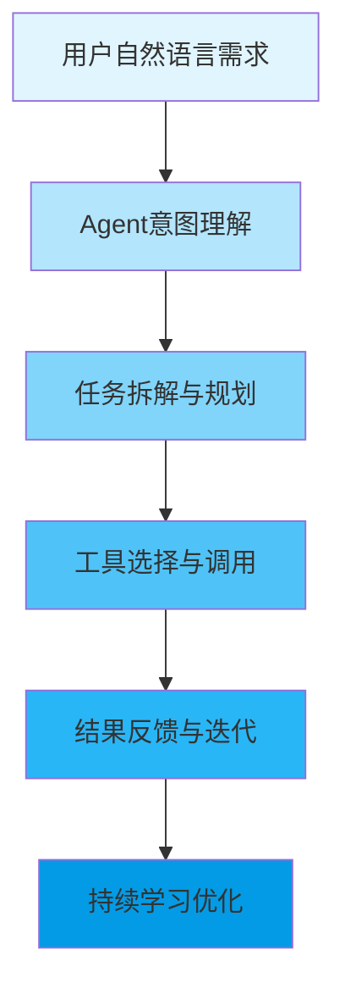

记得几年前，prompt工程还是AI领域的热门话题。那时候，用户需要精心设计提示词，学会各种技巧：角色设定、少样本示例、思维链引导等等。就像学习一门编程语言，你得先掌握语法，才能让AI听懂你的指令。

但现在情况正在发生改变。

随着AI Agent技术的成熟，一个明显趋势是：prompt工程正在从用户的显性操作逐渐转向AI的隐性理解。用户不再需要知道"如何写好prompt"，而是直接描述"想做什么"。AI会自动分析任务、拆解步骤、调用合适的工具，整个过程对用户透明。

这背后是自然语言理解能力的巨大进步。现在的模型已经能够理解上下文、推断意图、识别隐藏需求。你只需要说"帮我规划一次旅行"，AI就能自动完成目的地研究、路线规划、预订建议等一系列复杂任务，而不需要你逐个指令去引导。

这种转变带来的不仅仅是便利。更重要的是用户体验的质变。当用户不再需要关注技术细节，而是直接表达需求时，人机交互变得像人与人对话一样自然。那些曾经需要prompt技巧才能实现的效果，现在通过简单自然的对话就能达成。

不过这并不意味着prompt工程师会失业。相反，技能在发生变化。从"如何写出完美的prompt"转向"如何清晰表达复杂需求"。从"调教模型"转向"设计对话流程"。

可以预见，未来的AI交互会越来越像给专业助手分配任务。你告诉它目标，它自己想办法达成。在这个过程中，自然语言理解、任务规划、工具调用这些能力变得越来越重要。

技术总是在演进。prompt工程曾经是人与AI沟通的桥梁，现在这座桥梁正在变宽、变隐。但这不一定是坏事。当我们不再被技术细节所束缚时，才能真正专注于创造性思考和真正有意义的问题解决。这或许才是AI技术最终想要达到的境界：让技术隐入背景，让人类专注于更高价值的工作。

未来的AI助手不会问你要不要继续，而是直接帮你把事情做完。这种从"对话"到"行动"的转变，才是最值得期待的。



这个流程展示了Agent如何将用户的简单自然语言请求转化为一系列复杂的行动。每一步都在为最终目标服务，整个过程中用户只需要关注输入需求，其他细节对用户完全透明。

```mermaid
timeline
    title AI交互演进时间线
    section 2018-2020 : 模型1.0时代<br>需要精心设计prompt
    section 2021-2022 : 对话模型兴起<br>开始理解上下文
    section 2023-2024 : Agent时代<br>工具调用能力
    section 2025-未来 : 隐性理解时代<br>自然语言即行动
```

回顾这个演进过程，每一步都在降低使用门槛，提升交互体验。最终目标应该是让技术服务于人，而不是让人来适应技术。当我们能够用最自然的方式与AI交流时，可能也就到了技术真正融入日常的一天。

技术会不断进步，但我们追求的始终是一样的：让每个人都能轻松地利用AI的力量，创造出更大的价值。在这个过程中，也许prompt工程这个概念会逐渐模糊，但人与AI协作的可能性会变得更加广阔。