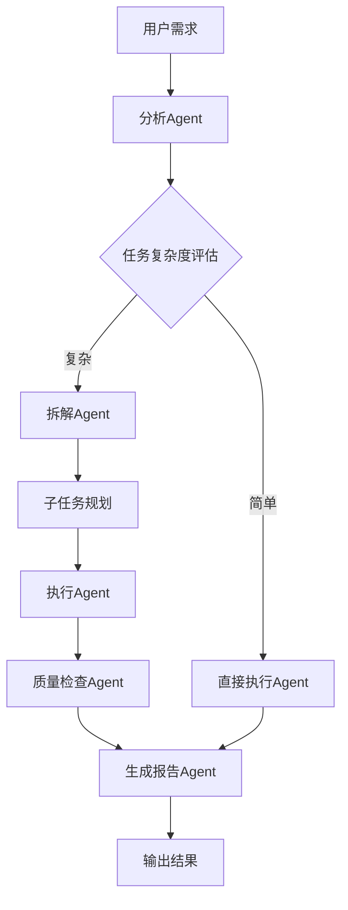

在阅读了那篇关于Agent和LLM的讨论后，有几个观点让我印象深刻，我想把这些思考整理成一篇博客文章。这不是一篇技术教程，而是关于AI时代如何更聪明地使用这些工具的一些观察和思考。

先说个判断：Agent体系会成为你个人定制的操作系统，也是你最独特的技能组合。为什么这么说？因为现在的LLM虽然强大，但每次使用都需要重新描述上下文、重新设定目标。而Agent的不同之处在于，它能记住你的偏好、学习你的工作模式、在你需要的时候主动提供帮助。一旦你的Agent体系建立起来，它就像是你大脑的延伸，一个能24小时在线的数字助手。

另一个判断：LLM和Agent会像气缸和发动机的关系。这个比喻很有意思，气缸负责产生动力，但发动机的真正价值在于如何把这些动力合理分配到不同的任务上。作为工程师，我们的角色就是为LLM和Agent配上合适的动力管线，让它们在不同的场景下都能发挥最大效能。至于LLM是否能通向AGI或ASI，这另说，但有一点可以确定：它们已经足够强大，可以显著提升我们的生产力。

基于这个判断，可以推演出一些有趣的结论。首先，工程师仍然会存在，但工作内容会发生重大转变。以前我们要花大量时间手搓组件、搭建系统，现在我们更像是管线和流程的设计者。我们不需要每个技术细节都精通，但需要理解整个系统的运作方式，知道如何把不同的工具组合起来解决实际问题。这个转变意味着我们需要更多元化的技能，但同时也解放了我们的创造力。

第二个推论：工程师的Agent体系应该能辅助甚至主导工作流的设计。这不是说工程师要完全依赖Agent，而是说我们应该学会用Agent来构建自己的工作流。一个成熟的工程师Agent体系，应该像一个工业母机，能够生产各种类型的工作流或者特化型号的Agent。当你需要处理文档时，有一个Agent专门负责文档整理；当你需要处理代码时，有一个Agent专门负责代码审查和重构。

第三个推论是基于前两个的：Agent体系需要包括哪些要素？首先当然是LLM，它是所有能力的核心。其次是工程师方法论的浓缩，这是Agent能理解你思维方式的关键。然后是适合的skill和工具，比如各种CLI工具和自动化脚本。最后需要一个轻量灵活的工作流编排和执行框架，这样才能让这些组件有机地组合起来。

说到工作流编排，我觉得这个概念很重要。以前我们写代码时习惯性地把事情拆分成一个个函数或模块，现在我们写Agent工作流时也应该这样思考。每个Agent都是一个功能单元，工作流就是连接这些单元的管道。比如处理一个复杂任务时，可以先让一个Agent做初步分析，然后把结果传给另一个Agent做深度分析，最后再让一个Agent整合结果并生成报告。

这个过程的可视化可以用一个流程图来表示：

这种设计思路的好处是清晰、可维护、可扩展。每个Agent都有明确的职责，整个流程一目了然。当你需要修改某个环节时，只需要调整对应的Agent，不会影响其他部分。

说到LLM的使用，我注意到一个常见误区：把所有任务都扔给LLM处理。实际上，LLM最擅长的还是那些模糊、泛化、需要理解上下文的任务，而不是那些需要精确计算或快速执行的任务。比如解释一个概念、分析一个复杂问题、生成一份草稿，这些是LLM的强项。而那些需要大量数据处理、系统调用、文件操作的任务，交给专门的工具会更合适。

Agent的价值在于能把LLM的能力和专用工具的能力结合起来。它知道什么时候该调用LLM，什么时候该调用哪个工具，怎么把两者的结果整合起来。这就好比一个项目经理，既懂业务又懂技术，能协调各种资源完成任务。

我想强调的是，Agent体系不是一蹴而就的，它需要持续的迭代和优化。一开始你可能只有一个简单的Agent，能帮你搜索资料、整理笔记。用了一段时间后，你可能会发现有些任务经常重复，那就创建一个专门的Agent来处理。再后来，你会发现自己形成了一套工作模式，把这些模式固化成Agent工作流。

这个过程中的关键在于不断反思和总结。每次完成任务后，问问自己：哪些步骤可以自动化？哪些Agent的设置不够合理？工作流中有没有冗余或瓶颈？这些反思的成果会反过来优化你的Agent体系，形成一个正向循环。

最后，我想说的是，AI不是要取代我们，而是要增强我们。一个好的Agent体系不是让你失去思考能力，而是给你一个强大的思考伙伴。它能处理繁琐的工作，让你有更多时间专注于真正重要的事情。它能帮你发现盲点，提供不同视角。它能陪你学习和成长，就像一个永远在线的导师。

所以，不要把Agent当成黑盒，而要理解它、信任它，并与它协作。当你和你的Agent体系配合默契时，你会发现自己的生产力有了质的飞跃。这就是AI时代工程师的正确打开方式：让Agent构建工作流，让LLM处理工作流中的模糊和泛化任务，而你，则专注于那些需要创造力、判断力和人性智慧的部分。