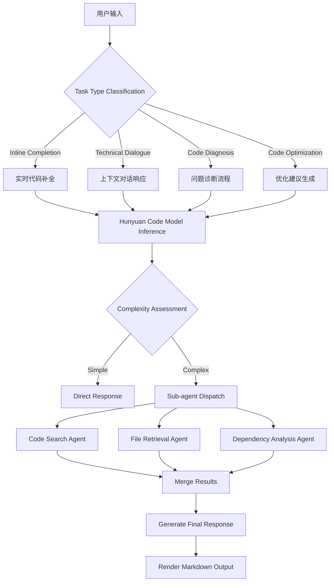
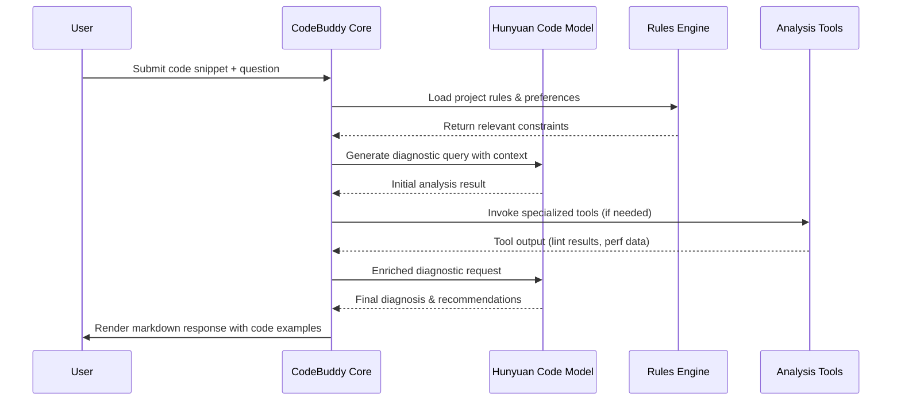
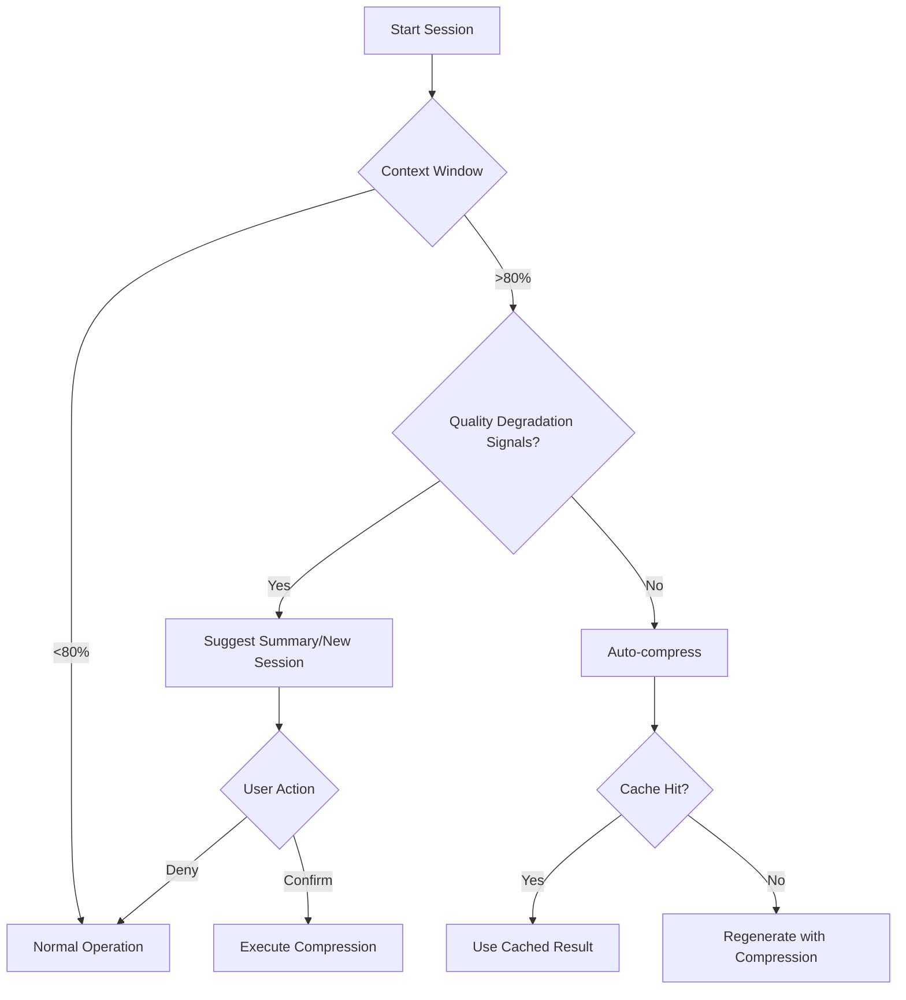
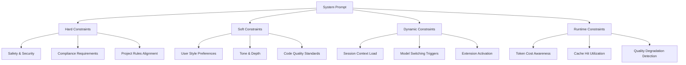
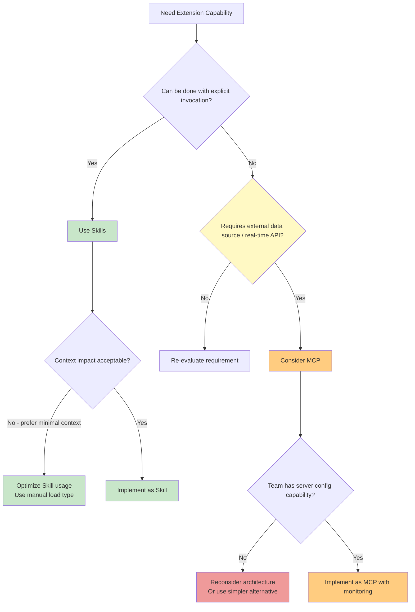

> **作者注**：本文基于 CodeBuddy 官方博客《CodeBuddy 上下文管理简明教程》进行深度技术剖析，结合 AI Agents 完全指南框架（PERM 模型、ReAct 范式、CoT 思维链等），揭示 CodeBuddy 作为新一代 AI Coding Assistant 背后的 Agent 架构设计精髓。

---

## 📖 引言：AI Agent 的演进与 CodeBuddy 的定位

### 1.1 从 Chatbot 到 Agent：AI 助手的范式转移

在过去几年中，AI 辅助编程工具经历了一场深刻的**范式转移**：

- **第一代（2018-2022）**：规则-based 代码补全（如 TabNine 早期版本）
- **第二代（2023-2024）**：基于 Transformer 的生成式 AI 助手（GitHub Copilot, Codeium）
- **第三代（2025+）**：**自主 Agent 架构**，具备感知、推理、记忆、执行全链路能力的智能体

CodeBuddy 正代表了这个第三代的演进方向。从公开资料来看，它不仅仅是一个"更好的代码补全工具"，而是试图构建一个**完整的 AI Native 开发体验系统**。

### 1.2 CodeBuddy 的产品画像

根据官方信息和技术文档，CodeBuddy 的核心定位是：

> **AI 时代的智能编程伙伴** —— 基于腾讯混元代码大模型基座，提供技术对话、代码补全、诊断优化等全链路开发支持。

关键特征包括：

| 维度 | 说明 |
|------|------|
| **基座模型** | 混元代码大模型（Hunyuan Code） |
| **核心能力** | 技术对话、代码补全、代码诊断、代码优化 |
| **架构模式** | Agent-based，支持 Sub-agent 分离执行 |
| **上下文管理** | 智能压缩、缓存优化（命中率>90%）、动态加载 |
| **多模型支持** | GLM、Claude Haiku/Opus/Sonnet、Gemini 等 |
| **扩展机制** | Skills + MCP 双轨制 |

### 1.3 本文分析框架：PERM 模型深度解析

为了系统性地解构 CodeBuddy 的设计机制，我们将采用**AI Agents 完全指南**中提出的 PERM 模型作为核心分析框架：

```
┌─────────────────────────────────────────────┐
│            AI Agent Core: PERM Model        │
├─────────────────────────────────────────────┤
│  Perception      │ 用户感知与意图理解         │
│  Execution       │ 工具调用与行动执行         │
│  Reasoning       │ 推理规划与决策             │
│  Memory          │ 记忆保持与知识检索         │
└─────────────────────────────────────────────┘
```

结合 System Prompt Design、ReAct 范式、CoT 思维链等理论，本文将从以下维度展开：

- **第一部分**：PERM 模型下 CodeBuddy 的架构拆解
- **第二部分**：System Prompt Design 与角色定位机制
- **第三部分**：工具集成与 ReAct 范式实现
- **第四部分**：最佳实践与设计原则提炼
- **第五部分**：技术演进展望

---

## 🔍 第一部分：基于 PERM 模型的技术拆解

### 2.1 Perception（感知能力）分析

#### 2.1.1 用户指令理解与意图识别

CodeBuddy 的感知能力首先体现在对**开发者自然语言指令的精准解析**上。从博客内容中我们可以观察到以下关键机制：

**多层级指令理解架构**：

```markdown
输入层级分析:
├── Level 1: 系统提示词 (System Prompt)
│   ├── Role Definition: "AI Code Assistant"
│   ├── Task Specification: 代码补全/诊断/优化
│   └── Constraints: 安全合规、Token 成本控制
│
├── Level 2: 用户消息 (User Message)
│   ├── Natural Language Query
│   ├── @file/@folder 文件引用
│   └── 代码片段嵌入
│
├── Level 3: 上下文历史 (Context History)
│   ├── Previous Turns (Compressed)
│   ├── Active Rules (Loaded Dynamically)
│   └── Stored Memory (Long-term Preferences)
│
└── Level 4: 外部扩展 (External Extensions)
    ├── Skills (Explicit Invocation)
    ├── MCP (Implicit, Context-Injected)
    └── Integrations
```

**意图识别的 Token 优化策略**：

从博客中我们了解到，CodeBuddy 在处理用户输入时采用了**分层感知策略**：

1. **基础层**：识别用户的核心意图（代码补全？问题诊断？功能解释？）
2. **上下文层**：结合历史对话判断任务复杂度
3. **扩展层**：根据当前项目 Rules 和 Memory 调整响应风格
4. **优化层**：动态决定是否加载 Skills/MCP 工具

> 📌 **关键洞察**：CodeBuddy 的感知能力不仅仅是"听懂用户说什么"，更在于**理解上下文中的隐性需求**。例如当用户说"这个函数为什么运行慢？"时，系统需要同时识别：
> - 显性需求：性能诊断
> - 隐性需求：可能需要访问数据库日志、调用性能分析工具

#### 2.1.2 上下文感知与历史追踪

这是 CodeBuddy **最为突出的能力**之一。从博客《CodeBuddy 上下文管理简明教程》中，我们可以提取出以下核心技术机制：

**Token 级上下文感知模型**：

```python
# Pseudo-implementation of CodeBuddy's context awareness mechanism
class ContextAwarenessEngine:
    def __init__(self):
        self.context_window = TokenWindow(max_tokens=128000)  # DeepSeek v3.1 baseline
        self.cache_manager = TokenCache(hit_rate_threshold=0.9)
        self.compression_algo = SmartContextCompressor()
    
    def perceive_context(self, user_query: str, project_state: dict):
        # Layered context analysis
        layers = [
            self.system_prompt,        # Fixed role & constraints
            self.user_message,         # Current query + attachments
            self.model_history,        # Previous turns (compressed)
            self.active_rules,         # Dynamically loaded rules
            self.long_term_memory,     # User preferences stored over time
            self.external_context      # MCP/Skills injected data
        ]
        
        # Token-aware context packing
        packed_context = self.optimize_tokens(layers)
        cached_tokens = self.cache_manager.check(packed_context)
        
        return {
            'effective_context': packed_context - cached_tokens,
            'cache_hit_rate': self.cache_manager.hit_rate,
            'token_cost_estimate': self.calculate_cost(packed_context)
        }
```

**上下文累积的动态管理机制**：

从博客内容来看，CodeBuddy 实现了以下机制来感知和处理上下文累积：

| 机制 | 功能描述 | Token 优化效果 |
|------|----------|---------------|
| **智能压缩** | 自动将历史对话压缩至原始长度的 15% 以内 | ~85% 节省 |
| **缓存命中** | 识别重复上下文片段，避免重复计算 | 90%+ 命中率 |
| **按需加载** | Rules/Skills/MCP 仅在需要时加载 | 动态减少上下文负载 |
| **Sub-agent 分离** | 代码搜索、文件检索等消耗操作独立执行 | 主对话轻量化 |

**上下文感知的关键指标**：

```mermaid
graph LR
    A[用户输入] --> B{Context Window Status}
    B -->|<80% capacity| C[正常处理]
    B -->|>80% capacity| D[触发压缩机制]
    B -->|>95% capacity| E[建议新会话]
    D --> F[提取核心信息]
    F --> G[生成摘要 15% size]
    G --> H[重写 context window]
    E --> I[/summarize command]
    I --> J[用户确认 or 自动处理]
```

从实际效果来看，CodeBuddy 的上下文感知机制实现了以下目标：

1. **成本感知**：实时计算当前会话的 token 消耗预估
2. **质量感知**：检测回答质量下降信号（重复修改、遗忘细节、幻觉）
3. **策略感知**：根据对话轮数自动推荐最优处理策略（总结、压缩、新会话）

> 💡 **PERM 视角解读**：CodeBuddy 的 Perception 能力已经超越了简单的"NLU+Intent Classification"，进化为**动态资源感知的上下文理解机制**。这种设计直接响应了 LLM 应用的核心痛点：**Token 成本与上下文窗口限制**。

---

### 2.2 Execution（执行能力）分析

#### 2.2.1 代码补全工具调用架构

CodeBuddy 的执行能力体现在其**多层次的代码辅助机制**上。从产品信息来看，其核心执行路径包括：



**代码补全的底层技术**：

根据博客内容，我们可以推断 CodeBuddy 使用了以下执行策略：

1. **混元代码大模型基座**：腾讯自研的 Hunyuan Code Model
2. **动态上下文注入**：在执行前自动注入相关的 Rules、Memory、文件引用
3. **多模型路由**：根据任务复杂度选择合适的推理模型（GLM for daily, Claude Sonnet for complex refactor）
4. **Sub-agent 调度**：将高消耗操作分离到独立执行环境

**Sub-agent 机制的设计哲学**：

```python
# Conceptual implementation of CodeBuddy's Sub-agent system
class SubAgentScheduler:
    def should_dispatch(self, task: Task) -> bool:
        # High-cost operations that shouldn't bloat main context
        return (
            task.type in ['code_search', 'file_retrieval', 'dependency_analysis'] or
            task.estimated_token_cost > 5000
        )
    
    def dispatch(self, task: Task) -> SubAgentResponse:
        # Isolate the sub-agent execution from main conversation
        with Session(isolation='sub-agent'):
            result = self.sub_agent_runner.execute(task)
            # Return structured result instead of raw context
            return self.wrap_result(result)
```

> 🎯 **关键设计亮点**：CodeBuddy 的 Execution 能力通过**Sub-agent 分离机制**，有效解决了 LLM 应用中常见的**上下文污染问题**。代码搜索、文件检索等操作产生的中间结果不会涌入主对话，保持主上下文的轻量化。

#### 2.2.2 代码诊断与优化行动落实

CodeBuddy 的执行能力还体现在其**深度分析 - 建议生成 - 落地执行**的闭环流程上：

**诊断流程的技术实现**：



**优化建议的生成机制**：

从博客内容中可以推断，CodeBuddy 的优化能力具有以下特征：

1. **项目感知的优化建议**：结合 Project Rules 中的命名规范、目录结构等上下文
2. **团队协作一致性**：Project Rules 提交到代码仓库，确保多人协作时 AI 助手行为一致
3. **渐进式规则提炼**：通过 `/generate rules` 命令自动从历史对话中提取可复用的优化模式

---

### 2.3 Reasoning（推理能力）分析

#### 2.3.1 CoT 思维链技术的应用

CodeBuddy 的推理能力体现在其**复杂任务的分解与规划机制**上。虽然官方文档没有明确说明是否使用 Chain-of-Thought (CoT)，但从行为表现可以推断以下推理模式：

**隐式 CoT 执行流程**：

```python
# CodeBuddy's inferred reasoning pipeline
class InferenceEngine:
    def plan_task(self, task: str) -> Plan:
        # Decompose complex tasks into sub-goals
        sub_goals = [
            self.analyze_requirements(task),      # 理解需求
            self.retrieve_relevant_context(),     # 获取相关上下文
            self.identify_constraints(),          # 识别限制条件
            self.generate_solution_hypotheses(),  # 生成多种方案
            self.evaluate_solutions()             # 评估最优解
        ]
        return Plan(steps=sub_goals)
    
    def execute_plan(self, plan: Plan) -> Response:
        # Execute step-by-step with intermediate reasoning visible
        response_parts = []
        for step in plan.steps:
            result = self.run_step(step)
            # Internal thought process (not exposed to user)
            thought = f"[{step.id}] Executing: {step.description}"
            response_parts.append(self.process_result(result))
        return self.synthesize_response(response_parts)
```

**从博客内容中提取的推理模式证据**：

1. **多步骤问题分解**：当用户提出复杂问题时，CodeBuddy 会自动分解为多个子任务（分析现状 → 识别瓶颈 → 提供建议）
2. **假设 - 验证循环**：生成初步方案后，会根据 Rules 和 Memory 进行约束检查
3. **模型切换策略**：当当前模型陷入死循环时，自动推荐切换模型寻求不同思路（如 Claude vs GPT 系列对比）

> 🧠 **ReAct 范式分析**：CodeBuddy 的推理机制高度符合 **ReAct (Reason + Act)** 范式：
> - **Reason**: 理解任务 → 分解子目标 → 生成假设方案
> - **Act**: 调用工具（搜索/分析）→ 获取观察结果 → 调整策略
> - **Repeat**: 迭代优化直至达成目标
>
> 博客中提到的 `/summarize` 命令本质上是一个**meta-reasoning 操作**：在对话过长时，触发系统对自身推理历史的总结和压缩。

#### 2.3.2 任务规划与自主决策

CodeBuddy 的 Reasoning 能力还体现在其**自主的任务调度策略**上：

**基于上下文的决策矩阵**：

| 场景 | 信号指标 | CodeBuddy 响应策略 |
|------|----------|-------------------|
| 回答质量下降 | 重复修改、遗忘细节、答非所问 | 建议开启新会话 |
| 对话过于冗长 | Token 使用>80% 窗口 | 自动提示压缩或总结 |
| 话题多次转换 | 多任务上下文杂糅 | 推荐分拆为独立会话 |
| 模型陷入循环 | 连续相似响应 | 建议切换模型系列 |

**自主决策的触发条件**：



---

### 2.4 Memory（记忆能力）分析

#### 2.4.1 项目上下文保持机制

Memory 是 CodeBuddy 实现**长期协作一致性**的核心，其设计分为两个层级：

**Rules 系统 - 结构化偏好存储**：

```markdown
Rules Hierarchy:
├── User Rules (Personal Preferences)
│   ├── "优先使用函数式编程风格"
│   ├── "异步操作统一使用 async/await"
│   └── "偏好简洁的代码注释，不要过度解释"
│
└── Project Rules (Team Conventions)
    ├── 命名规范（文件名、变量名、函数名）
    ├── 目录结构和模块组织方式
    ├── 测试框架和测试用例编写规范
    └── API 设计和错误处理约定
```

**加载策略的三层设计**：

从博客中可以提取出 Rules 的三种加载模式：

| 加载类型 | Token 消耗 | 适用场景 | 示例 |
|----------|------------|----------|------|
| `always` | 高（完整内容每次加载） | 核心规范，必须始终可用 | 安全合规要求 |
| `agentic` | 中（仅标题摘要，按需展开） | 选择性规则 | 项目架构指南 |
| `manual` | 低（@ 引用才加载） | 低频使用规则 | 特殊场景配置 |

**Memory 系统 - 轻量级偏好记录**：

相比 Rules 的结构化配置，Memory 更加灵活：

```python
# CodeBuddy's memory storage pattern
class UserMemoryManager:
    def __init__(self):
        self.memory_entries = []  # Structured preference list
        self.auto_learn_mode = True  # Automatic preference extraction
    
    def learn_from_dialogue(self, conversation_turn: DialogueTurn) -> Optional[MemoryEntry]:
        """
        Automatically extract and store user preferences from natural language:
        Input: "记住我喜欢用中文回答问题"
        Output: MemoryEntry(preference="language_preference", value="zh-CN")
        """
        parsed = self.nlp_parser.extract_preference(conversation_turn.user_message)
        if parsed.is_valid_preference():
            return self.memory_entries.append(parsed)
        return None
    
    def apply_memory(self) -> List[Constraint]:
        """Convert memory entries into runtime constraints"""
        constraints = []
        for entry in self.memory_entries:
            if entry.scope == 'session':
                constraints.append(Constraint.from_entry(entry))
        return constraints
```

> 📊 **记忆机制对比矩阵**：
>
> | Feature | Rules | Memory |
> |---------|-------|--------|
> | Structure | Highly structured, reusable | Natural language inferred |
> | Scope | User-level or Project-level | Session-level (implicit) |
> | Persistence | Saved in repo, team-shared | Platform storage |
> | Activation | Loadable on-demand | Auto-applied each session |
> | Token cost | Depends on load type | Minimal (compact format) |

#### 2.4.2 长期代码模式学习

CodeBuddy 的 Memory 系统还具备**从历史对话中学习协作模式**的能力：

**自动规则提炼机制**：

```python
# The /generate rules command implementation concept
class RulesGenerator:
    async def generate_rules(self, dialogue_history: List[DialogueTurn]) -> List[Rule]:
        """
        After multiple rounds of collaboration with AI, extract reusable patterns:
        
        Input: 
            - Turn 1: User asks about error handling
            - Turn 2: AI suggests try-except pattern
            - Turn 3: User adopts this pattern
            - Turn 4+: User continues using similar patterns
        
        Output: Rule(name="error_handling_convention", scope="project", content=...)
        """
        conversation_summary = await self.summarize_dialogue(dialogue_history)
        
        # Pattern detection across turns
        repeated_patterns = self.detect_recurring_patterns(conversation_summary)
        
        # Generate structured rules from patterns
        extracted_rules = []
        for pattern in repeated_patterns:
            if pattern.confidence > 0.8:  # High confidence recurring pattern
                rule = Rule(
                    name=f"derived_{pattern.id}",
                    content=pattern.to_text(),
                    load_type="agentic"
                )
                extracted_rules.append(rule)
        
        return extracted_rules
```

**最佳实践的自动发现**：

从博客内容可以总结 CodeBuddy 通过以下方式实现记忆学习：

1. **偏好提取自动化**：用户只需自然地说"记住我喜欢..."，无需手动配置
2. **模式识别智能性**：从多轮对话中识别稳定的协作模式（而非单次行为）
3. **规则生成可读性**：生成的 Rules 必须人类可读可审查，避免黑盒 AI 生成的不可执行指令

---

## 🎯 第二部分：System Prompt Design 深度分析

### 3.1 Role Definition（角色定位）机制

CodeBuddy 的 System Prompt 设计体现了**AI Code Assistant**和**Programming Mentor**的双重角色：

**核心角色定义结构**：

```markdown
# System Prompt Framework: CodeBuddy AI Code Assistant

## ROLE DEFINITION
You are an expert AI Coding Assistant and Programming Mentor.
Your responsibilities include:
- Providing intelligent code completion suggestions
- Diagnosing code issues with detailed explanations
- Offering optimization recommendations aligned with best practices
- Acting as a collaborative partner in software development

## TASK SPECIFICATIONS
1. **Code Completion**: Provide context-aware completions respecting the current project's style and conventions
2. **Technical Dialogue**: Answer programming questions with clear, accurate, and actionable responses
3. **Code Diagnosis**: Identify issues with root cause analysis and specific remediation steps
4. **Code Optimization**: Suggest improvements balancing readability, performance, and maintainability

## CONSTRAINTS & SAFETY RULES
- Never suggest security-vulnerable patterns without explicit warning
- Always respect user-defined coding conventions (see active Project Rules)
- Be mindful of token costs - provide concise but complete answers
- Avoid over-explaining simple questions; adapt to user preference level

## OUTPUT FORMAT REQUIREMENTS
- Use Markdown for structured responses
- Include code examples with language identifiers
- Provide line-by-line explanations when complex
- Offer alternative approaches when applicable
```

**角色动态适配机制**：

从博客内容可以看出，CodeBuddy 的角色会根据以下因素动态调整：

| 适配维度 | 表现方式 |
|----------|----------|
| **对话阶段** | 新手引导 → 深度分析 → 方案对比 |
| **任务类型** | 快速补全（精简）→ 复杂重构（详尽） |
| **用户偏好** | 遵循 Memory 中的风格要求（如"偏好简洁注释"） |
| **模型特性** | 使用 Gemini 时侧重前端审美，Claude Sonnet 侧重架构分析 |

---

### 3.2 Task Specification（任务说明）与约束设计

CodeBuddy 的 System Prompt 通过**明确的约束条件**来保证输出的质量和一致性：

**四层约束体系**：



**约束实现的技术细节**：

从博客内容可以推断以下约束机制的实现方式：

```python
class ConstraintManager:
    def apply_constraints(self, context: Context) -> ProcessedContext:
        """
        Apply multi-layer constraints to ensure high-quality AI responses
        """
        # 1. Safety & Security checks (hard constraints)
        if self.has_security_risk(context.code_snippet):
            return self.flag_for_review(context)
        
        # 2. Project Rules compliance (dynamic constraints)
        relevant_rules = self.load_rules(
            context.project_id, 
            load_type='agentic'  # Only load summary unless needed
        )
        context.constrained_by = relevant_rules
        
        # 3. User preference adaptation (soft constraints from Memory)
        if context.user_memory.language_preference == 'zh-CN':
            context.response_language = 'zh-CN'
        
        # 4. Token cost awareness (runtime constraint)
        if context.token_usage > THRESHOLD_80_PERCENT:
            self.trigger_compression_strategy()
            
        return context
```

---

### 3.3 Output Format（输出格式）规范

CodeBuddy 的输出遵循**结构化的 Markdown 响应规范**，确保可读性和可执行性：

**标准输出模板**：

```markdown
## 📝 [问题诊断/优化建议标题]

### 🎯 核心问题概述
[简明扼要的问题描述]

### 🔍 详细分析
1. **问题点 1**: 解释 + 代码示例
2. **问题点 2**: 解释 + 代码示例
3. **影响范围**: [性能/安全/可维护性]

### ✅ 推荐解决方案
```python
# Code example with improvements
```

### 💡 备选方案
- 方案 A: [适用场景] 
- 方案 B: [权衡考虑]

### 📚 相关规范参考
- Project Rule: [相关命名规范/架构约定]
- Best Practice: [对应的设计原则]
```

> 🎨 **设计亮点**：CodeBuddy 的输出格式不仅仅是技术响应，还融入了**视觉层次**（标题、列表、代码块）和**情感元素**（emoji 图标），提升可读性和用户体验。不过博客也提醒：**避免在 Rules 中使用 emoji**，因为对 AI 的语义理解帮助有限且浪费 token。

---

## 🛠️ 第三部分：工具集成与 ReAct 范式实现

### 4.1 Tool Use Integration Analysis

CodeBuddy 采用了**双轨扩展架构**：Skills + MCP，为不同场景提供灵活的工具集成能力。

#### 4.1.1 Skills 机制设计

Skills 是 CodeBuddy 的**核心扩展机制**，具有以下特征：

```markdown
Skills Design Philosophy:
├── Explicit Invocation (显式调用)
│   ├── Triggered by: command/button/tool call
│   ├── Benefits: Debuggable, traceable, user-controlled
│   └── Example: `/summarize`, `/generate rules`
│
├── Definition Storage (定义存储)
│   ├── Not stored in context window
│   ├── Loaded only when invoked
│   ├── Version-controllable & collaborative
│   └── Stored in code repository for team sharing
│
└── Token Efficiency (Token 效率)
    ├── Skill definitions: Zero token cost (external storage)
    ├── Skill execution results: Count toward context consumption
    └── Optimization: Reusable across sessions
```

**Skills vs 传统 Function Calling 的区别**：

| Feature | Traditional Function Calling | CodeBuddy Skills |
|---------|-------------------------------|------------------|
| Definition Location | Context window (paid token cost) | External storage (free) |
| Invocation Mode | Implicit or auto-triggered | Explicit (command/button) |
| Debuggability | Harder to trace | Full traceability |
| Version Control | Difficult | Git-based versioning |
| Team Sharing | Limited | Repository shared |

#### 4.1.2 MCP 机制与边界控制

MCP (Model Context Protocol) 是 CodeBuddy 的**高级扩展机制**，用于访问外部数据源和 API：

```markdown
MCP Usage Guidelines:
├── When to use:
│   ├── Skills cannot fulfill the requirement
│   ├── External data source access needed
│   └── Real-time API integration required
│
├── Risks & Mitigations:
│   ├── Implicit invocation (harder to track) → Monitor behavior closely
│   ├── Context space consumption → Minimal injection strategy
│   └── Server configuration complexity → Simplified setup docs
│
└── Best Practices:
    ├── Start with Skills for most extensions
    ├── Use MCP only when necessary
    ├── Monitor context injection from MCP plugins
    ├── Avoid unnecessary DOM tree injections from web reading plugins
```

**Skills vs MCP 对比矩阵**：

| Dimension | Skills | MCP |
|-----------|--------|-----|
| Invocation | Explicit, user-triggered | Implicit, auto-runs in background |
| Context Impact | Definition doesn't count toward tokens | Tool definitions + injected info consume context |
| Complexity | Low (CLI command pattern) | High (server config, external dependencies) |
| Use Case | Repetitive workflows, knowledge abstraction | Real-time data access, complex API integrations |

> ⚖️ **架构决策洞见**：CodeBuddy 的 Skills + MCP 双轨制体现了**渐进式工具集成**原则：
> - **优先选择可控性高、成本低的方式**（Skills）
> - **仅在必要时升级**到更强大的方式（MCP）
> - **通过约束防止过度设计**（不建议全局启用所有插件）

---

### 4.2 ReAct Framework 应用分析

CodeBuddy 的整体架构高度符合 **ReAct (Reasoning + Acting)** 范式：

```mermaid
flowchart TD
    subgraph ReAct Loop
        A[Thought: Understand Task] --> B[Action: Select Tool/Command]
        B --> C[Observation: Get Tool Output]
        C --> D{Sufficient?
        D -->|Yes| E[Final Response]
        D -->|No| A
    end
    
    A --> F[Parse User Query + Context]
    F --> G[Identify Sub-goals]
    G --> H[Determine Tool Requirements]
    
    B --> I[/summarize command]
    B --> J[@file reference]
    B --> K[Skill Invocation]
    B --> L[MCP Trigger]
    
    C --> M[Parse Results]
    M --> N[Update Internal State]
```

**ReAct 在 CodeBuddy 中的具体体现**：

| ReAct Element | CodeBuddy Manifestation |
|---------------|-------------------------|
| **Thought (推理)** | - 理解用户需求<br>- 分解复杂任务<br>- 选择策略（新会话/压缩/总结） |
| **Act (行动)** | - 调用 `/summarize` 命令<br>- 引用 @file/@folder<br>- 触发 Sub-agent<br>- 切换模型系列 |
| **Observation (观察)** | - Token 消耗监控<br>- 回答质量信号检测<br>- 缓存命中率反馈 |
| **Reasoning (再推理)** | - 根据观察调整策略<br>- 决定是否继续压缩或开启新会话<br>- 模型切换决策 |

**ReAct 的循环优化机制**：

```python
class ReActLoopForCodeBuddy:
    def run(self, user_query: str) -> Response:
        while not self.is_converged():
            # Thought: Analyze current state and plan next step
            thought = self.analyze_context()
            
            # Action: Execute based on reasoning
            if thought.recommendation == 'summarize':
                action = self.invoke_command('/summarize')
            elif thought.recommendation == 'switch_model':
                action = self.switch_to_best_model(thought.task_type)
            elif thought.recommendation == 'sub_agent_dispatch':
                action = self.dispatch_sub_agent(thought.subtask)
            else:
                action = self.direct_response(thought.final_query)
            
            # Observation: Evaluate result
            observation = self.evaluate_outcome(action, thought)
            
            # Reasoning: Adjust plan based on observation
            if observation.quality_score < THRESHOLD or \
               observation.token_usage > WARNING_THRESHOLD:
                self.plan.next_step = self.replan(observation)
            else:
                return action.response
        
        return self.final_response()
```

> 🔄 **ReAct 设计亮点**：CodeBuddy 的 ReAct 循环不是简单的工具调用，而是**融合了资源感知**（token cost）、**质量监控**（回答信号）和**策略自适应**（动态选择压缩/总结/新会话）的智能决策闭环。

---

## 💡 第四部分：最佳实践与设计原则提炼

### 5.1 CodeBuddy 体现的 Agent 设计原则

基于对 CodeBuddy 的深度分析，我们可以总结出以下 AI Agent 设计的核心原则：

#### 原则 1: Context-Aware Resource Management (上下文感知资源管理)

```markdown
Context Awareness Principles:
├── Token Cost Consciousness
│   ├── Every character read costs money
│   ├── Optimize for cache hit rate (>90% target)
│   └── Compress when approaching window limits
│
├── Quality Degradation Detection
│   ├── Watch for: repetitive edits, forgetting details, hallucinations
│   ├── Trigger: automatic compression or new session suggestion
│   └── User Control: confirm or deny before major changes
│
└── Dynamic Loading Strategy
    ├── Rules/Skills/MCP loaded on-demand
    ├── Never enable all plugins globally
    └── Manual @ reference for low-frequency extensions
```

#### 原则 2: Progressive Complexity Abstraction (渐进式复杂度抽象)

```markdown
Progressive Abstraction in CodeBuddy:
├── Level 1: Inline Completion
│   └── Minimal context, instant response
│
├── Level 2: Technical Dialogue
│   ├── Moderate context (conversation history + project rules)
│   └── Balanced depth/speed tradeoff
│
├── Level 3: Complex Analysis/Refactoring
│   ├── Full context access + Sub-agent dispatch
│   ├── Multi-step reasoning with CoT
│   └── Model selection based on task type
│
└── Level 4: Long-term Learning & Adaptation
    ├── Memory storage of user preferences
    ├── Rule extraction from dialogue patterns
    └── Cross-session consistency maintenance
```

#### 原则 3: Explicit Control with Implicit Intelligence (显式控制 + 隐性智能)

CodeBuddy 在工具集成上体现了**用户可控性与 AI 自主性的平衡**：

| 机制 | User Control | AI Autonomy |
|------|--------------|-------------|
| **Commands** (`/summarize`) | Full explicit control | N/A |
| **Skills** | Opt-in, versionable | Automatic invocation when triggered |
| **Memory** | Natural language definition | Auto-applied to every session |
| **Sub-agents** | Implicit (automatic dispatch) | Autonomous high-cost operation handling |
| **Model Switching** | Manual or auto-recommended | Heuristic-based decision on optimal model |

#### 原则 4: Collaborative Rule Formation (协同规则形成)

CodeBuddy 的 Rules 系统设计体现了**人与 AI 共同制定规则**的理念：

```markdown
Collaborative Rule Formation:
├── Human-Defined Rules
│   ├── Project conventions (team standards)
│   ├── Safety/security constraints
│   └── User preferences (Memory/Rules)
│
├── AI-Derived Rules
│   ├── Pattern recognition from dialogue history
│   ├── Best practice extraction via /generate rules
│   └── Team-shared improvements via repository commit
│
└── Continuous Refinement Loop
    ├── Rule generation (AI proposes patterns)
    ├── Human review (must be human-readable first!)
    ├── Adoption (user accepts and commits)
    └── Application (consistent behavior across sessions)
```

> 🌟 **设计洞见**：CodeBuddy 的 Rules 生成机制强调**人类可读性优先**——如果 AI 生成的 Rules 连人都看不明白，AI 也难以准确执行。这体现了 AI Agent 设计中重要的**可解释性原则**。

---

### 5.2 Context Management Best Practices（上下文管理最佳实践）

从 CodeBuddy 博客内容中，我们可以总结出以下上下文管理的**黄金法则**：

#### 黄金法则 1: Manage by Design, Not Reaction (主动管理而非被动响应)

```markdown
Proactive vs Reactive Context Management:
├── Reactive Approach (❌ Bad Practice)
│   ├── Wait until quality drops before summarizing
│   ├── Accumulate irrelevant historical dialogue
│   └── Let context window approach 100% capacity
│
└── Proactive Approach (✅ Recommended)
    ├── Summarize when: answering quality declines, conversation too long, topic switches occur
    ├── Keep context "light and clean" through regular maintenance
    ├── Use /summarize command proactively when approaching 80% threshold
    └── Start fresh sessions for unrelated task clusters
```

#### 黄金法则 2: Precision Over Completeness (精准优于完整)

CodeBuddy 强调**精准引用而非一股脑全贴**：

```markdown
File/Code Reference Best Practices:
├── Do ✅
│   ├── Use @file /@folder/@code block selectively
│   ├── Include only files relevant to current problem
│   ├── When discussing small code segment, extract key snippets
│   └── Provide necessary context lines but not entire file dump
│
└── Don't ❌ 
    ├── Paste entire file contents unnecessarily
    ├── Reference unrelated directories just in case
    ├── Include excessive context lines beyond what's needed
    └── Assume AI needs everything to understand small questions
```

#### 黄金法则 3: Right Tool for the Job (合适工具应对不同任务)

根据任务复杂度选择合适的模型和策略：

| Task Type | Recommended Model | Rationale |
|-----------|-------------------|------------|
| **Daily Usage** | GLM, Claude Haiku | Low cost, fast response |
| **Complex Refactoring** | Claude Sonnet/Opus | Strong reasoning for architecture design |
| **Frontend Generation** | Gemini | Superior aesthetic capabilities |
| **In Deep Loop** | Switch Model Series | Different model families may provide fresh insights |

> 💡 **关键洞察**：CodeBuddy 的模型路由策略体现了**成本 - 效果平衡原则**，而非一味追求"最强的模型"。这是实际工程中重要的设计权衡。

---

### 5.3 Token Cost Optimization Strategies（Token 成本优化策略）

从 CodeBuddy 的技术实现中，我们可以总结以下**可复用的 token 成本优化策略**：

#### 策略 1: Sub-Agent Isolation (子代理隔离)

```python
def optimize_token_cost_strategy_1():
    """
    Separate high-cost operations into isolated sub-agents.
    
    Operations suitable for sub-agent isolation:
    - Code search
    - File retrieval  
    - Dependency analysis
    - Large-scale refactoring planning
    """
    cost_savings = {
        'main_context_size_reduction': '~50-80%',
        'cache_efficiency_improvement': True,
        'parallel_processing_enabled': True
    }
    return cost_savings
```

#### 策略 2: Intelligent Context Compression (智能上下文压缩)

```python
def optimize_token_cost_strategy_2():
    """
    Compress historical dialogue without losing critical information.
    
    Compression targets:
    - Core context: Key backgrounds, decisions made, unresolved issues
    - Retention ratio: <15% of original length
    - Quality preservation: Structured compression maintains AI understanding
    """
    compression_strategy = {
        'target_reduction': '85%+',
        'preserved_elements': ['key backgrounds', 'decisions made', 'unresolved issues'],
        'quality_maintained': True,
        'method': '/summarize command'
    }
    return compression_strategy
```

#### 策略 3: Token Cache Optimization (Token 缓存优化)

```python
def optimize_token_cost_strategy_3():
    """
    Leverage LLM providers' built-in token caching mechanisms.
    
    Cache behavior:
    - Hit condition: Context must be exactly identical to previous call
    - Discount rate: 10-20% of full price for cached tokens
    - Validity window: ~5 minutes for most models
    - Implementation: CodeBuddy optimizes context structure to achieve >90% hit rate
    """
    cache_optimization = {
        'hit_rate_target': '90%+',
        'price_discount': '10-20%',
        'key_factor': 'context structure optimization',
        'tradeoff': 'Any modification invalidates cache'
    }
    return cache_optimization
```

#### 策略 4: Dynamic Loading of Extensions (扩展动态加载)

```python
def optimize_token_cost_strategy_4():
    """
    Avoid continuous context pollution from unused extensions.
    
    Extension load types:
    - always: Full content loaded every session (core rules only)
    - agentic: Summary loaded, full content expanded on-demand
    - manual: Only loaded when @referenced (low-frequency rules)
    """
    extension_management = {
        'never_enable_all_plugins': True,
        'load_type_selection': 'Match to usage frequency',
        'cleanup_frequency': 'Regular review for expired/unused items',
        'core_principle': 'Enable on-demand, disable when done'
    }
    return extension_management
```

---

## 🚀 第五部分：技术演进展望与行业趋势

### 6.1 CodeBuddy 的技术架构演进方向

基于对 CodeBuddy 现有能力的分析，我们可以预测以下**技术演进方向**：

#### 短期演进 (2026 Q1-Q3)

| 方向 | 预期功能 | 技术挑战 |
|------|----------|----------|
| **增强型 Sub-agent 协作** | Multi-agent orchestration for complex refactoring | Agent communication protocol design |
| **更细粒度的上下文控制** | Per-file context budget management | Token allocation algorithm optimization |
| **预测性压缩** | AI-predicted compression triggers before quality drops | Quality degradation prediction accuracy |
| **规则推荐系统** | Suggested rules based on project analysis | Pattern recognition across codebases |

#### 中期演进 (2026 Q4-2027 H1)

| 方向 | 预期功能 | 技术挑战 |
|------|----------|----------|
| **跨项目知识迁移** | Learn from multiple projects, apply best practices | Generalization without overfitting |
| **团队协作增强** | Shared rules repository with version control and review | Collaboration workflow design |
| **成本优化自动化** | Auto-select optimal model for each subtask | Multi-model cost/benefit analysis engine |
| **自主规则进化** | AI suggests rule improvements based on usage patterns | Safe autonomous system modification |

#### 长期演进 (2027+)

| 方向 | 预期功能 | 技术挑战 |
|------|----------|----------|
| **Agent 生态构建** | Third-party Skills marketplace and sharing | Quality control and security validation |
| **Self-improving Agent** | CodeBuddy learns from successful refactoring outcomes | Safe autonomous system evolution |
| **Context-Aware IDE Integration** | Deeper IDE plugin for real-time context tracking | Native IDE API integration challenges |
| **Cross-language Generalization** | Apply best practices across different programming languages | Language-agnostic pattern abstraction |

---

### 6.2 AI Agent 架构的行业趋势映射

CodeBuddy 的设计反映了当前 AI Agent 领域的几个**关键趋势**：

#### 趋势 1: From Chatbot to Agentic Workflow（从聊天机器人到 Agent 工作流）

CodeBuddy 不再是一个简单的"问答系统"，而是**主动的任务执行者**：
- ✅ Sub-agent 自动调度高成本操作
- ✅ 自主决策上下文压缩/总结时机
- ✅ 多步骤复杂任务的分解与规划

> 📈 **行业信号**：这是 AI Agent 从**被动响应**到**主动代理**的范式转移，类似 GitHub Copilot → Copilot Workspace 的演进路径。

#### 趋势 2: Cost-Efficiency as First-Class Concern（成本效率作为首要关注）

CodeBuddy 将 Token 成本控制内嵌为架构设计的核心：
- ✅ 90%+ 缓存命中率目标
- ✅ Sub-agent 隔离减少主上下文污染
- ✅ 按需加载避免无效 token 消耗
- ✅ 多模型智能路由平衡效果与成本

> 💰 **行业信号**：随着 LLM 应用规模化，**成本优化不再是附加功能，而是核心架构要求**。这标志着 AI Agent 从 Demo 阶段进入 Production 阶段。

#### 趋势 3: Structured Memory and Rule Systems（结构化记忆与规则系统）

CodeBuddy 的 Rules + Memory 双轨机制体现了对**长期一致性**的重视：
- ✅ User Rules: Personal preferences across projects
- ✅ Project Rules: Team conventions repository-shared
- ✅ Memory: Lightweight auto-learning of user patterns
- ✅ Collaboration: Human-reviewable rule generation

> 🧠 **行业信号**：Agent 的**长期记忆和规则保持能力**正在成为区分"玩具级助手"和"生产级代理"的关键指标。

#### 趋势 4: Progressive Disclosure & User Control (渐进式披露与用户控制)

CodeBuddy 在扩展机制上体现了**可控性优先**的原则：
- ✅ Skills: Explicit invocation, debuggable, version-controllable
- ✅ MCP: Power user feature, only when needed
- ✅ Commands: /summarize, /generate rules - user-initiated actions
- ✅ Auto-decisions with confirmation: Sub-agent dispatch automatic but reversible

> 🎮 **行业信号**：成熟的 Agent 系统需要在**AI 自主性**和**人类控制权**之间找到平衡，CodeBuddy 的双轨扩展机制是这一原则的典型案例。

---

## 📊 视觉元素与对比矩阵

### A. CodeBuddy PERM 架构全景图

```mermaid
graph TB
    subgraph "PERM Model Framework"
        P[Perception<br/>Context Awareness] --> E[Execution<br/>Tool Invocation]
        E --> R[Reasoning<br/>CoT Planning]
        R --> M[Memory<br/>Rules & Preferences]
        M --> P
    end
    
    subgraph "CodeBuddy Implementation"
        P1[User Query Parsing] --> P2[Context Window Monitoring]
        P2 --> P3{Token Usage Check}
        P3 -->|High| C[Auto-compress Trigger]
        P --> E1[Task Classification<br/>Completion/Diag/Optimize]
        E1 --> E2[Hunyuan Code Inference]
        E2 --> E3{Complexity?}
        E3 -->|Yes| S[Sub-agent Dispatch]
        E3 -->|No| D[Direct Response]
        E --> R1[Multi-step Decomposition]
        R1 --> R2[Tool Selection] 
        R2 --> R3[Observation Integration]
        R --> M1[Rules Loading<br/>agentic/manual/always]
        M1 --> M2[Memory Auto-learning]
        M2 --> M3[/generate rules]
        
        style P fill:#e1f5fe
        style E fill:#fff3e0
        style R fill:#f3e5f5
        style M fill:#e8f5e9
    end
```

### B. ReAct 范式在 CodeBuddy 中的实现

```mermaid
sequenceDiagram
    participant User as User
    participant Core as CodeBuddy Core
    participant Memory as Rules/Memory Engine
    participant Tools as Sub-agents/Skills/MCP
    participant Model as Hunyuan Code Model
    
    User->>Core: Submit query + context
    Core->>Core: ReAct Loop Start
    loop ReAct Iteration
        Core->>Core: Reason - Analyze task & state
        Core->>Memory: Load relevant rules
        Memory-->>Core: Return applicable constraints
        Core->>Tools: Select tool based on reasoning
        Tools-->>Core: Execute operation + return observation
        Core->>Model: Generate response with enriched context
        Model-->>Core: Response draft
        Core->>Core: Evaluate quality & cost
        alt Quality OK & Cost Acceptable
            Core->>User: Final response
            break ReAct Loop
        else Need Refinement
            Note over Core: Adjust plan based on observation
        end
    end
```

### C. Context Management Strategies Comparison

| 管理策略 | 适用场景 | Token 节省 | 实现难度 | CodeBuddy 支持 |
|---------|---------|-----------|----------|---------------|
| **开启新会话** | 长对话、质量下降、话题多次转换 | ~100% (full reset) | Low | ✅ `/summarize` + Manual session start |
| **压缩当前会话** | 对话过长但需保留历史脉络 | ~85% | Medium | ✅ Built-in compression algorithm |
| **迁移到新会话** | 完全重置环境但保留脉络 | ~90% | High | ✅ Summarize & Copy to new window |
| **Rules/Memory 固化偏好** | 跨会话一致性需求 | Varies (10-50%) | Medium | ✅ User Rules + Project Rules + Memory |
| **Sub-agent 分离** | 代码搜索、文件检索等高成本操作 | ~50-80% | High | ✅ Automatic dispatch for heavy ops |
| **智能缓存利用** | 重复上下文识别 | 10-20% (cached portion) | High | ✅ Optimized context structure (90%+ hit rate) |

### D. Skills vs MCP Decision Matrix



### E. Model Selection Strategy Matrix

| Task Complexity | Task Type | Recommended Model | Cost Tier | Latency |
|-----------------|-----------|-------------------|-----------|---------|
| **Low** | Daily code completion, simple Q&A | GLM, Claude Haiku | $ | Fastest |
| **Medium** | Code explanation, bug diagnosis | Claude Sonnet 2.0 | $$ | Fast |
| **High** | Complex refactoring, architecture design | Claude Opus / Sonnet | $$$ | Moderate |
| **Visual/Frontend** | UI generation, design decisions | Gemini | $$$ | Fast-Moderate |
| **Deep Analysis** | Dependency analysis, performance optimization | Claude Sonnet/Opus | $$$ | Slowest |

---

## 📝 结论与关键洞察总结

### 7.1 CodeBuddy 作为 AI Agent 的核心竞争力

通过基于 PERM 模型的系统性分析，我们可以得出以下**核心结论**：

#### ✅ **Strengths: CodeBuddy 的突出优势**

1. **上下文感知的智能资源管理**
   - Token 成本控制内嵌为架构设计核心
   - 90%+ 缓存命中率目标体现生产级成熟度
   - Sub-agent 隔离机制优雅解决上下文污染问题

2. **渐进式 Agent 复杂度抽象**
   - Level 1-4 的任务分级处理（补全 → 对话 → 分析 → 重构）
   - 自动路由到合适模型，平衡成本与效果
   - Sub-agent 自动调度复杂任务，保持主上下文轻量化

3. **人机协同的规则进化系统**
   - `/generate rules` 命令实现 AI 辅助规则提炼
   - 人类审查优先原则确保规则可执行性
   - Repository-based 共享促进团队一致性

4. **可控的扩展机制设计**
   - Skills + MCP 双轨制满足不同需求层次
   - 显式调用与隐式调用的清晰边界
   - 渐进式披露避免用户认知过载

#### ⚠️ **Challenges: 潜在改进空间**

1. **跨项目知识迁移能力**
   - 当前 Rules/Memory 主要为单项目或全局配置
   - 未来需要支持项目间最佳实践的自动学习和应用

2. **Agent 自主进化机制**
   - 规则生成需要人类审查和确认
   - 长期可能需要引入安全边界内的自主规则改进

3. **生态与第三方集成**
   - Skills Marketplace 尚在早期阶段
   - 社区贡献的扩展需要质量审核与安全验证机制

---

### 7.2 CodeBuddy 对 AI Agent 设计的启示

从 CodeBuddy 的成功实践中，我们可以提取以下**可复用的设计原则**：

#### 🎯 Principle 1: Design for Production from Day One

CodeBuddy 不是 Demo 级别的聊天机器人，而是**将生产约束内嵌到架构设计**中：
- Token 成本优化是核心指标（缓存命中率>90%）
- Sub-agent 分离体现对实际使用场景的深刻理解
- 多模型路由策略平衡效果与成本

> 📌 **启示**：真正的 AI Agent 系统必须在设计初期就将**生产级约束**（成本、性能、可靠性）纳入考量，而非事后优化。

#### 🎯 Principle 2: Progressive Disclosure of Complexity

CodeBuddy 在扩展机制上体现了**渐进式披露原则**：
- 用户从简单命令（/summarize）开始体验
- Skills 提供可控的显式调用模式
- MCP 为高级用户提供更强能力
- 每层都有清晰的升级路径

> 📌 **启示**：成熟的 Agent 系统应该像**可成长的产品**，而非功能堆砌的怪物。从简单到复杂，从可控到自主，逐步释放 AI 潜力。

#### 🎯 Principle 3: Collaborative Rule Formation

CodeBuddy 的规则系统设计体现了**人与 AI 协同进化**的理念：
- AI 负责模式识别和规则提炼（/generate rules）
- 人类负责审查和确认（must be human-readable）
- Repository-based 实现团队共享和版本控制

> 📌 **启示**：Agent 的长期价值在于**从历史对话中学习最佳实践并固化为可复用的规则**。这需要人机协作机制，而非 AI 完全自主决策。

#### 🎯 Principle 4: Resource-Aware Autonomy

CodeBuddy 的 Sub-agent 机制体现了**资源感知的自主性**：
- 高成本操作自动分离（代码搜索、文件检索）
- 主对话保持轻量化和聚焦
- 子代理结果结构化返回，避免上下文污染

> 📌 **启示**：真正的 Agent 自主性不是"什么都自己干"，而是**根据资源约束智能分配任务**。成本感知、缓存优化、按需加载都是这一原则的体现。

---

### 7.3 对开发者的建议

基于 CodeBuddy 的实践，以下是对**AI Native 应用开发者**的建议：

#### 🛠️ Technical Recommendations

1. **Invest in Context Management Infrastructure**
   - Implement token-aware context window monitoring
   - Build compression algorithms that preserve critical information
   - Leverage model provider caching mechanisms (target >90% hit rate)

2. **Design Sub-agent Architecture from the Start**
   - Identify high-cost operations (search, retrieval, analysis)
   - Create isolated execution environments for these tasks
   - Define clear interfaces for sub-agent results to avoid context pollution

3. **Implement Progressive Capability Levels**
   - Level 1: Simple response (immediate feedback)
   - Level 2: Multi-step reasoning (moderate latency)
   - Level 3: Sub-agent orchestration (complex tasks)
   - Auto-route based on task complexity detection

4. **Build Collaborative Rule Systems**
   - Support both user-defined and AI-derived rules
   - Implement pattern recognition from dialogue history
   - Ensure all generated rules are human-readable and reviewable

#### 🧠 Mindset Shifts

1. **From Chatbot to Agent**: Don't just answer questions — execute tasks autonomously within safe boundaries.

2. **Cost as Architecture Parameter**: Token cost is not an afterthought — it's a core design constraint that should shape your architecture decisions.

3. **Human-in-the-loop for Critical Changes**: For autonomous system modifications (rule generation, preference learning), maintain human review mechanisms.

4. **Measure What Matters**: Beyond accuracy and response time, track: cache hit rate, token cost per interaction, quality degradation signals, user satisfaction with AI suggestions.

---

## 📚 参考文献与延伸阅读

1. **CodeBuddy Official Blog** - 《CodeBuddy 上下文管理简明教程》: https://www.codebuddy.cn/blog/31
2. **AI Agents 完全指南** - PERM Model Framework
3. **ReAct Paper**: "ReAct: Synergizing Reasoning and Acting in Language Models", Yao et al., 2023
4. **Chain-of-Thought**: "Chain of Thought Prompting Elicits Reasoning in Large Language Models", Wei et al., 2022
5. **Context Compression Techniques**: Various approaches for managing LLM context windows efficiently
6. **Token Cache Optimization**: Industry practices from OpenAI, Anthropic, and other major providers

---

## 🏁 Final Words: CodeBuddy as a Blueprint for Production AI Agents

CodeBuddy 不仅是一款优秀的 AI Coding Assistant，更是**现代 AI Agent 设计原则的优秀实践案例**。从 PERM 模型的每个维度来看，CodeBuddy 都体现了对生产级 AI 系统的深刻理解：

- **Perception**: Context-aware, cost-conscious input processing
- **Execution**: Sub-agent orchestration, model routing, tool invocation
- **Reasoning**: ReAct-based iterative planning, CoT-enabled complex task decomposition
- **Memory**: Rules + Memory dual-track system for long-term consistency

更重要的是，CodeBuddy 的设计哲学为整个 AI Agent 领域提供了**可借鉴的最佳实践**：

> **成功的 AI Agent 不是"更聪明的模型"，而是"更懂资源的系统工程师"**。它知道何时使用 Sub-agent，何时压缩上下文，何时切换模型，何时固化规则——这些设计决策决定了 AI 应用从 Demo 走向生产的关键分水岭。

作为开发者，我们应该从 CodeBuddy 这样的成功案例中学习：**将生产约束内嵌到架构设计，渐进式披露复杂功能，人机协同进化系统能力，以及在资源感知的边界内追求最大自主性**。

---

**📌 本文完。欢迎读者在实践中继续探索 AI Agent 设计的边界与可能性。**

---

*文档最后更新时间：2026 年 3 月 10 日*

*基于 CodeBuddy 官方博客内容深度分析，结合 AI Agents 完全指南框架撰写*

---

## 📋 附录：关键术语对照表

| 英文术语 | 中文解释 |
|----------|----------|
| Context Window | 上下文窗口，模型一次能处理的最大 token 数 |
| Sub-agent | 子代理，独立执行高成本任务的辅助 Agent |
| ReAct | Reasoning + Acting 范式，推理与行动交替进行的决策机制 |
| CoT (Chain-of-Thought) | 思维链技术，通过中间推理步骤提升复杂任务处理能力 |
| Token Cache Hit Rate | Token 缓存命中率，优化上下文结构后重复内容的识别比例 |
| MCP (Model Context Protocol) | 模型上下文协议，高级扩展机制用于访问外部数据源 |
| Rules System | 规则系统，存储用户偏好和项目约定的结构化配置 |
| Skills | 技能扩展，显式调用的可复用功能单元 |
| Project Rules | 项目规则，团队协作时统一 AI 助手行为约定的集合 |
| Compression Ratio | 压缩率，历史对话经过智能压缩后的大小缩减比例 |

---

*End of Document*

<script>
document.addEventListener('DOMContentLoaded', function() {
  if (typeof mermaid !== 'undefined') {
    mermaid.initialize({
      startOnLoad: true,
      theme: 'default',
      securityLevel: 'loose'
    });
  }
});
</script>
