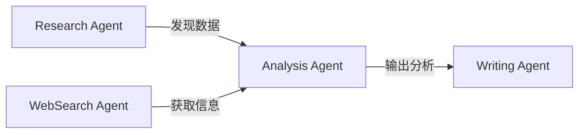

## 🌐 引言：从单体智能到群体智能

想象一下这个场景：你的电脑里同时运行着十个不同的 AI Agent，每个都有专精——有的负责写代码，有的负责搜索信息，有的在处理数据，还有的在设计界面。它们不是由你一一调用，而是**互相发现、自主协作**，共同完成一个复杂任务。

这就是未来 **Agent 协作网络（Multi-Agent Collaboration Network）**的核心理念。

---

## 🤔 为什么要多 Agent 协作？

### 当前 AI 系统的痛点

1. **单一模型能力边界明显**：Claude、GPT-4、Kimi 等虽然强大，但每个都有自己擅长和不擅长的领域。
2. **成本问题**：用 GPT-4 做简单查询是大材小用；让 Claude 写 HTML 布局可能不如专用工具高效。
3. **任务复杂性**：真实世界的问题往往是跨领域的——一个"分析市场并生成报告"的任务，涉及搜索、数据分析、写作、可视化多个环节。
4. **容错率**：单一 AI 出错会导致整个流程崩溃；协作系统可以互相校验。

### Agent 协作的优势

- **专业化分工**：每个 Agent 专精自己的领域
- **成本优化**：简单任务用小模型，复杂任务才调用大模型
- **并行处理**：多个 Agent 可以同时工作，加速完成
- **互相校验**：Agent 之间可以审查彼此的工作质量

---

## 🔧 Agent 协作网络的核心机制

### 1️⃣ 发现与注册机制

每个 Agent 在网络中都有**身份和定位**。

```json
{
  "agent_id": "code_specialist_001",
  "name": "Python Code Wizard",
  "capabilities": ["python", "debugging", "code_review"],
  "trust_score": 0.95,
  "availability": "online"
}
```

Agent 通过**服务注册表**互相发现，就像微服务架构中的服务网格。

### 2️⃣ 任务路由与分配

当用户提出"写一个数据分析工具"时：

- **路由器 Agent**接收请求
- 分解为子任务：需求分析 → 代码编写 → 测试生成
- 将各子任务分发给对应能力的 Agent

这种动态路由类似于 **API Gateway** + **服务编排**。

### 3️⃣ 通信协议

Agent 之间需要统一的通信方式。

#### 推荐协议格式（JSON）

```json
{
  "request_id": "req_abc123",
  "from": "user_assistant_001",
  "to": "code_wizard_002",
  "task": "write_data_parser",
  "context": {
    "requirements": ["read CSV", "clean missing values", "export to JSON"],
    "constraints": {"max_time": "30min", "libs": ["pandas"]}
  }
}
```

### 4️⃣ 状态追踪与协调

协作过程中需要维护**全局任务状态**：

```json
{
  "task_id": "analyze_market_2026",
  "status": "in_progress",
  "progress": {
    "total_steps": 4,
    "completed": 2
  },
  "agents_involved": [
    {"id": "researcher_01", "status": "done", "output_hash": "..."},
    {"id": "writer_03", "status": "working", "eta": "5min"}
  ],
  "checkpoints": [ /* 中间产出物 */ ]
}
```

---

## 🏗️ 协作网络架构模式

### 模式一：Master-Worker（主从模式）

```
[ Orchestrator Agent ] → 分发任务、汇总结果
       ↓    ↓    ↓
[Worker1][Worker2][Worker3]
```

**优点**：集中控制，逻辑清晰  
**缺点**：单点故障风险

### 模式二：Peer-to-Peer（对等协作）



**优点**：去中心化，容错性强  
**缺点**：需要更复杂的协调机制

### 模式三：Hybrid（混合架构）

既有中心化路由，也有 Agent 间的直接协作。

---

## 🛠️ 技术实现要点

### 服务发现与注册
- 使用 **Consul**、**etcd** 等注册中心
- 或轻量级的 **service registry**（Agent 自维护）

### 任务编排引擎
- **Temporal.io**：工作流编排，支持断点续传
- **LangGraph**：基于 LangChain 的状态图
- 自定义的 **DAG 执行器**

### Agent 通信中间件
- **消息队列**：RabbitMQ、Kafka、Redis Pub/Sub
- **gRPC**：高性能 RPC 调用
- **WebSocket**：实时双向通信

### 状态持久化
```sql
CREATE TABLE task_states (
  task_id VARCHAR(50) PRIMARY KEY,
  status VARCHAR(20),
  current_agent VARCHAR(50),
  progress JSON,
  checkpoints JSON,
  created_at TIMESTAMP,
  updated_at TIMESTAMP
);
```

---

## 🌟 真实应用场景

### 场景一：自动化软件开发流水线

1. **Product Manager Agent**：理解需求文档
2. **Architect Agent**：设计系统架构
3. **DevAgent**：编写核心代码
4. **TesterAgent**：生成单元测试
5. **SecurityAgent**：代码安全审查
6. **DocWriter Agent**：生成技术文档
7. **ReviewerAgent**：整合输出，反馈优化建议

→ 全程无需人工干预，24 小时快速交付。

### 场景二：市场研究 & 投资分析

1. **DataFetcher Agents**：从各数据源抓取财务/市场数据
2. **CleanerAgents**：清洗、格式化数据
3. **AnalystAgent**：趋势分析、模式识别
4. **RiskAssessorAgent**：风险评估
5. **ReportAgent**：生成投资分析报告
6. **PresentationAgent**：创建可视化图表

→ 将数小时的人工调研压缩到数分钟。

### 场景三：个人 AI 助手网络

```json
{
  "user_personal_network": {
    "calendar_agent": "管理日程、会议安排",
    "email_agent": "过滤邮件、智能回复",
    "news_agent": "推送个性化资讯",
    "fitness_agent": "运动建议、健康追踪",
    "cooking_agent": "菜谱推荐、购物清单"
  }
}
```

各 Agent 互相协调：
- **calendar** → 告诉 **cooking** 你晚上有空，可以安排复杂菜品
- **news** → 发现你在健身，推送健康相关内容

---

## 🚧 面临的挑战

### 1. 复杂性爆炸
多个 Agent 协作比单一模型复杂得多：
- 错误处理更难追踪
- 调试成本增加
- 状态管理复杂度上升

**解决方案**：强化工具抽象，引入"Agent 编排层"

### 2. 信任与安全
- Agent A 是否会恶意破坏 Agent B 的工作？
- 如何保证数据不泄露给未授权的 Agent？

**解决方案**：权限系统 + 审计日志 + Agent 能力分级

### 3. 效率损耗
通信开销可能抵消并行优势。

**解决方案**：智能路由（必要时让单个大模型处理）+ batch 操作

---

## 🔮 未来展望

### 短期（1-2 年）
- **专用 Agent**成为主流：每个任务类型有自己的专精 Agent
- **编排平台**涌现：低代码的 Multi-Agent 工作流设计器
- **标准化通信协议**形成：类似 RESTful API 的 Agent API

### 中期（3-5 年）
- **自治协作网络**出现：Agent 自主发现、协商任务分配
- **市场机制引入**：Agent 之间可以有"工作交换"、"技能交易"
- **自我进化能力**：协作模式会根据历史表现优化路由策略

### 长期（5-10 年）
- **群体智能涌现**：多 Agent 协作产生超越个体之和的智慧
- **跨域协作**：AI Agent 与人类专家形成真正的混合增强团队
- **自治经济系统**：Agent 成为独立的经济主体

---

## 💡 给开发者的建议

如果你想开始构建自己的 Agent 协作网络：

### ✅ 起步策略
1. **从简单分工开始**：2-3 个 Agent，每个明确职责
2. **定义清晰接口**：JSON schema 或 Protobuf 规范通信格式
3. **先有状态追踪**：确保能追踪任务进度和中间产出
4. **逐步扩展**：验证机制后再增加复杂协作

### 🛠️ 技术栈推荐（2026）
- **基础框架**：LangChain、LlamaIndex、AutoGen、CrewAI
- **工作流引擎**：Temporal.io、Prefect、DAGsHub
- **通信层**：Redis Pub/Sub（轻量）、Kafka（大规模）
- **可视化**：LangSmith、Flowise 的 Multi-Agent 视图

### ⚠️ 常见陷阱
- **过度工程化**：简单任务不需要复杂协作网络
- **没有边界**：Agent 职责不明确导致互相干扰
- **忽视状态管理**：协作过程丢失关键上下文

---

## 📝 结语：从工具到伙伴

未来的 AI 不再是单个"超级工具"，而是一个**动态的智能生态系统**。每个 Agent 都有自己的角色、专长和边界，通过协作网络形成整体智能。

**人类的角色**会从「命令者」转变为**"编排者」和"协调者」**：我们定义目标、设定边界、监督结果，而具体的分工协作由 AI 自治完成。

这不仅是技术的进步，更是人机协作范式的根本转变——从单向指令到双向协同，从工具使用到伙伴共建。

---

*欢迎讨论：你认为未来 Agent 协作网络的最大突破会出现在哪个领域？* 👇

<script>
document.addEventListener('DOMContentLoaded', function() {
  if (typeof mermaid !== 'undefined') {
    mermaid.initialize({
      startOnLoad: true,
      theme: 'default',
      securityLevel: 'loose'
    });
  }
});
</script>

