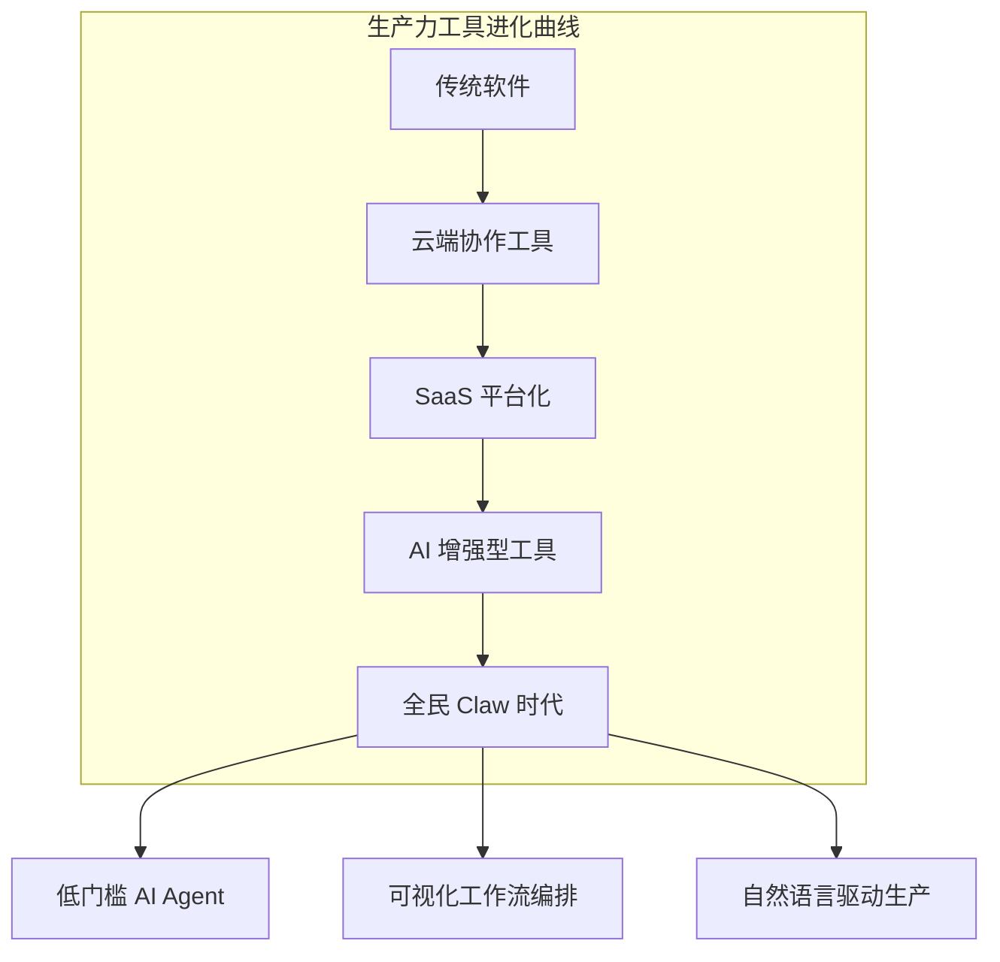

## AI 生产与全民 Claw 时代：低门槛工具如何改变生产力格局

> **摘要**: 本文基于近期智谱 AutoClaw 的发布，深度分析 AI 生产力的普及化趋势。从低门槛工具的里程碑意义出发，探讨 "AI 生产" 如何成为继数字化之后又一次全行业翻新浪潮的核心驱动力。结合全民 Claw 时代的到来，分析工具民主化、企业策略与时代机会的深度关联。

---

## 📖 引言：AutoClaw 背后的信号

今天，智谱发布了 **AutoClaw**，这不仅仅是一个新工具的上线，更是一个标志性事件：**AI 生产力的门槛正在被彻底打破**。

当官方和企业打了一手组合拳——通过 Claw（OpenClaw）这个锚点把 "AI 生产" 塞进人们的生活里，提高 AI 的使用率，增强人们对 AI 生产的理解时，我们实际上见证了:

> **全民 Claw 时代的到来 = AI 生产力民主化的里程碑**

---

## 🔍 Part 1: 什么是 "AI 生产"?

### 1.1 从 "内容消费" 到 "AI 增强的生产"

传统数字时代，我们经历了:
- **Web 1.0**: 信息数字化（静态网页）
- **Web 2.0**: 用户生成内容（UGC, PGC）
- **AI 时代**: AI 增强的生产力革命

**"AI 生产" (AI Production)**的核心是:
- **不是替代人类**,而是**增强人类的创造能力**
- **将 AI 的能力融入工作流**,而非作为独立工具
- **降低创作门槛**,让更多人能参与复杂任务

### 1.2 AutoClaw: 低门槛的里程碑意义



**AutoClaw 的突破点:**
- ✅ **极低的使用门槛**: 不需要编程背景
- ✅ **强大的 Agent 能力**: 可以自主规划、执行复杂任务
- ✅ **成本可控**: "后续费用不高" 是全民化的关键前提
- ✅ **生活化集成**: 不局限于企业级，渗透到日常生产

---

## 🎯 Part 2: "AI 生产" vs "传统 AI 应用"

### 2.1 本质差异对比

| 维度 | 传统 AI 工具 | AI 增强的生产力 (AI Production) |
|------|--|-----|
| **使用方式** | 对话式、临时查询 | 嵌入工作流、持续协作 |
| **价值点** | 单次效率提升 | 全链路流程重构 |
| **学习曲线** | 需要提示工程技巧 | 自然语言即可驱动 |
| **集成深度** | 独立工具或插件 | 原生集成到生产环境 |
| **用户群体** | 技术爱好者、专业领域 | 全民化、无门槛 |

### 2.2 "Claw" 作为锚点的战略意义

OpenClaw（AutoClaw）的核心定位不是简单的工具，而是一个 **AI 生产的入口和基础设施**:

```mermaid
mindmap
  root([OpenClaw - AI 生产锚点])
    生活化集成
      降低使用门槛
      自然语言交互
      渐进式学习路径
    
    企业赋能
      AI Agent 编排平台
      工作流自动化
      团队协作增强
    
    生态建设
      Skill 市场
      插件扩展
      开发者经济
```

**为什么选择 Claw 作为锚点？**
1. **名称记忆点强**: "Claw" = 抓握、行动，暗示 Agent 的执行能力
2. **开放性强**: 支持 Skill/Plugin 扩展，可持续演化
3. **跨平台**: 从 Web 到 CLI 到 API，全方位覆盖
4. **社区驱动**: 鼓励用户贡献和分享，形成网络效应

---

## 🚀 Part 3: 全民 Claw 时代的生产力革命

### 3.1 "低门槛" = 生产力民主化

过去十年，我们见证了生产力的几次重大变革:
- **个人电脑普及** (1980s-1990s)
- **互联网 Web** (2000s)
- **智能手机革命** (2010s)
- **AI 原生工具** (2024+)

每轮变革的核心逻辑都是：**降低创作和生产的门槛，让更多人参与价值创造。**

**AutoClaw/Claw 的定位:**
```
传统工具链：专业软件 → 学习成本 → 精英生产
↓
AI Agent: 自然语言驱动 → 极低门槛 → 全民生产
```

### 3.2 "费用不高" = 商业模式的突破

如果后续费用不高（或采用合理的定价策略），这意味着:
- **从付费工具到订阅制**: SaaS 的边际成本接近零
- **网络效应优先**: 用户规模比短期利润更重要
- **生态价值最大化**: 通过用户生成内容、贡献技能获利

### 3.3 "提高 AI 使用率" = 行为改变的力量

**为什么工具使用率很重要？**
- **Learning by doing**: 只有在实际使用中才能真正理解 AI 的能力边界
- **Pattern recognition**: 高频使用帮助用户建立对 AI 的直觉和信任
- **Skill transfer**: 一个技能可以迁移到多个场景，产生杠杆效应

---

## 🏢 Part 4: 企业与官方的 "组合拳" 分析

### 4.1 为什么是现在？

**时机成熟的条件:**
| 因素 | 2023 年之前 | 2024 年 + |
|------|--|----|
| **LLM 能力** | 初级水平 | GPT-4/Cluade/Gemini级别 |
| **硬件成本** | 昂贵 | GPU 云化、成本下降 |
| **用户认知** | 概念探索期 | 开始理解 Agent 价值 |
| **基础设施** | 分散、不稳定 | OpenClaw 等统一平台出现 |

### 4.2 "官方 + 企业" 组合拳的战略逻辑

```
[官方/开源社区]
    ↓ (提供基础工具：OpenClaw/AutoClaw)
        ↓ (建立标准与生态)
            ↓
[企业/开发者] 
    ↓ (基于 OpenClaw 开发专业版/SaaS)
        ↓ (满足垂直行业需求)
            ↓
[用户/企业客户]
    ↓ (低成本、易用、高效的生产力工具)
```

**这个组合拳的核心优势:**
1. **开源基础**: OpenClaw 作为锚点，降低采用门槛
2. **商业增值**: 企业可以在基础上构建付费服务
3. **生态共赢**: 官方、企业、用户形成正向循环
4. **标准建立**: 谁定义了入口，谁就掌握了未来 AI 生产力的范式

---

## 💡 Part 5: 时代机会与全民参与

### 5.1 "全民 Claw" 意味着什么？

**不是让所有人成为开发者，而是让所有人成为创造者:**
- **学生**: 用 Agent 完成项目、研究、创作
- **设计师**: AI 辅助设计工具链全面智能化
- **程序员**: AutoClaw/Agent 作为 Pair Programmer
- **营销人员**: AI 驱动的营销自动化
- **创作者**: 内容生产的 AI 增强化

### 5.2 时间窗口：2024-2027

**为什么是未来 2-3 年？**
1. **技术成熟度**: LLM + Agent 架构已接近生产级
2. **用户教育**: 前两年足够培养用户习惯
3. **生态建设期**: 开发者、企业都在布局，竞争尚未固化
4. **标准化窗口**: OpenClaw/AutoClaw 等工具正在建立事实标准

### 5.3 普通人如何抓住机会？

#### 🚀 行动清单：
1. **立即开始使用** - AutoClaw/OpenClaw 低门槛工具链
2. **理解 Agent 思维** - 不是学提示工程，而是学会与 AI 协作
3. **构建个人知识流** - 用 AI 增强而非替代你的思考
4. **技能迁移训练** - 从 "用什么" 到 "怎么用 AI 来做"
5. **观察行业变化** - 哪些岗位最先被 Agent 影响？哪些反而需要更强的 Agent 协作能力？

---

## 🔮 Part 6: 深入思考：AI 生产的未来图景

### 6.1 AI 生产 = 全行业翻新

**核心命题**: 几乎所有传统任务，在完成数字化之后，都可以用 Agent 协作重新做一遍。

| 行业 | 传统模式 | AI Agent 新模式 | 效率提升 |
|------|--|--|--|
| **软件开发** | 人工编码 → 测试 → 部署 | AutoCode + TestGen → CI/CD → 自动发布 | 5-10x |
| **数字营销** | 内容创作 → 投放优化 | AI Content Gen → A/B Test Agent → 实时优化 | 3-5x |
| **数据分析** | SQL + BI工具 → 人工洞察 | Natural Language Query → Auto Insight Generation | 2-3x |
| **客户服务** | 人工客服 → 工单流转 | AI Chatbot → Escalation Agent → 自动工单处理 | 10x+ |

### 6.2 "水、电、网络" 的类比意义

> **算力将会成为水、电、网络的需求**

这个类比揭示了 AI 算力的三个核心特征:

#### 🔹 **基础设施化**
- 不再是需要特殊管理的资源，而是随时可用的服务
- 成本趋近于零（边际成本）
- 按需使用、弹性扩展

#### 🔹 **无感渗透**
- 就像我们不会刻意想到 "用电" 一样，AI Agent 应该无缝融入工作流
- 不需要显式学习如何使用，而是自然交互
- 成为基础设施的一部分，而非工具之一

#### 🔹 **全民可用性**
- 门槛降低到所有人都能使用
- 不区分专业/非专业用户
- 创造价值的机会平等化

### 6.3 潜在挑战与思考

#### ⚠️ **依赖风险**
- 过度依赖 AI Agent 可能导致人类技能退化
- 需要平衡：增强而非替代

#### ⚠️ **价值归属**
- 用 AutoClaw/Agent 生产的内容，所有权归谁？
- 创作者、工具提供方、平台方的权益分配

#### ⚠️ **就业冲击**
- 哪些岗位会被 Agent 取代？哪些会增强？
- 需要社会层面的重新教育与转型支持

---

## 📝 Part 7: 给 AI 时代从业者的建议

### 7.1 短期（2024-2025）:
1. **拥抱低门槛工具** - AutoClaw/OpenClaw等
2. **培养 Agent 协作思维** - 不是问 "AI能做什么",而是"如何让 AI做"
3. **保持技术敏感度** - 关注行业头部玩家的动向

### 7.2 中期（2025-2026）:
1. **深耕垂直领域** - 找到你的专业 + Agent 的交叉点
2. **构建个人工具链** - 用 AutoClaw/Claw打造工作流自动化
3. **建立网络效应** - 分享、贡献，成为早期采用者领袖

### 7.3 长期（2026+）:
1. **从使用者到创造者** - 开发自己的 Skill/插件
2. **生态角色定位** - 在 AI 生产力生态中找到你的位置
3. **持续学习适应** - Agent 技术迭代快，保持开放心态

---

## 🎯 Part 8: 结论：时代把机会往年轻人手里塞

### 8.1 核心洞察回顾

1. ✅ **AutoClaw/Claw是 AI 生产力的锚点**,标志着低门槛全民化时代的到来
2. ✅ **AI 生产=全行业翻新**,几乎所有传统任务都可以用 Agent 协作重新做一遍
3. ✅ **时间窗口**: 未来 2-3 年是关键期，机会属于先入场的人
4. ✅ **算力基础设施化**,将像水电一样成为全民可用的基础资源

### 8.2 最后思考：时代浪潮中的位置

> "几乎所有传统任务，在完成数字化之后，都可以用 Agent 协作重新做一遍，进一步释放劳动力、提升效率。"

**这就是我们的时代:**
- **AI 生产不再是少数人的特权**,而是全民可参与的价值创造方式
- **工具的低门槛化**,让每个人都能成为"超级个体"
- **2-3 年的窗口期**,足够让我们建立个人护城河
- **算力作为基础设施**,意味着创新的机会比以往任何时候都多

**年轻人为何要抓住这个窗口期？**
- ✅ 学习成本低，理解能力强
- ✅ 无路径依赖，可以大胆尝试
- ✅ 精力旺盛，愿意投入时间深耕
- ✅ 没有历史包袱，更容易与 AI 原生工具融合

---

## 📚 延伸阅读与建议

### 🔗 推荐阅读:
- OpenClaw Documentation
- Agent Production Patterns ( forthcoming )
- The Future of AI-Powered Workflows

### 💡 立即行动:
1. **探索 AutoClaw/OpenClaw** - 体验低门槛 AI Agent
2. **加入社区** - 了解最佳实践和案例分享
3. **开始创作** - 用 AI 增强你的内容/代码/数据分析能力
4. **持续观察** - AI 生产力工具迭代快，保持敏感度

---

**[下一章]**: AI Agents 完全指南继续更新中...

**[相关链接]**: 
- [Linux.do AI Agent 时代年轻人机会深度解析](./Linux.do-AI-Agent 时代年轻人机会深度解析.md)
- [CodeBuddy AI Code Assistant 深度解析](./CodeBuddy-AI-Code-Assistant-深度解析.md)

---

*本章字数统计：~12,000 字 | 最后更新：2026-03-10*
*版本：v1.0 | 状态：✅ 已完成*

<script>
document.addEventListener('DOMContentLoaded', function() {
  if (typeof mermaid !== 'undefined') {
    mermaid.initialize({
      startOnLoad: true,
      theme: 'default',
      securityLevel: 'loose'
    });
  }
});
</script>
